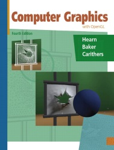
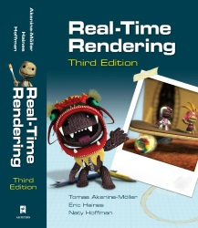
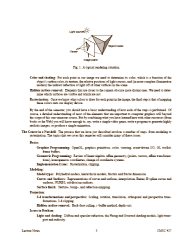
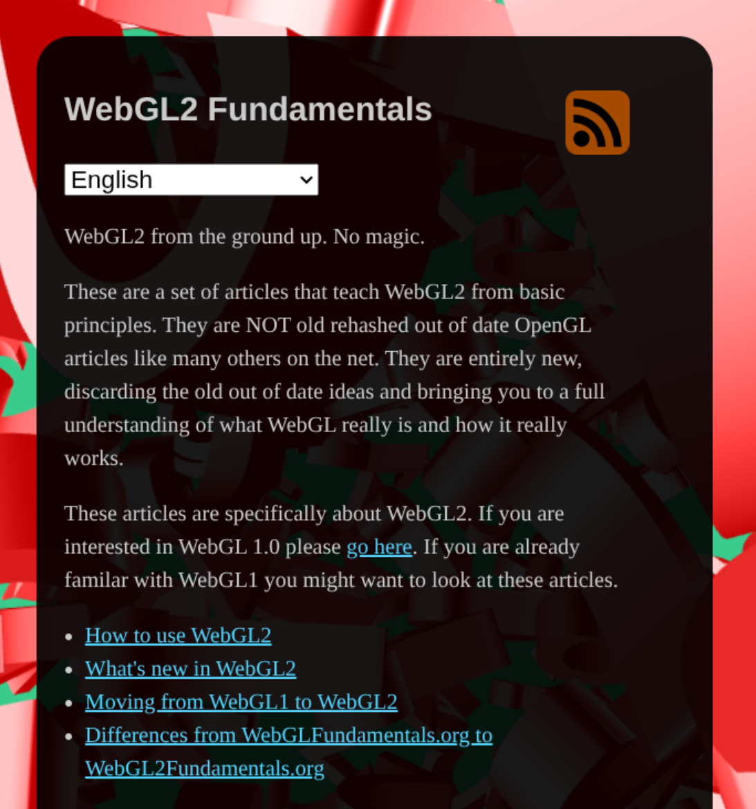

<!-- {"layout": "title", "state": "transition-book"} -->
# Computação Gráfica

## Material de aula do professor **Flávio Coutinho**  <!-- {.portrait style="vertical-align: middle"} --> <!-- {h2:style="color: #333"} -->

---
<!-- {"layout": "regular"} -->
# Atividades Avaliativas

- Listas de **exercício** (22 pontos)
- **Trabalhos**
  - [TP0: Ambiente de Desenvolvimento][tp0] (3 pontos)
  - TP1, grupos \leq 2 (25 pontos)
  - TP2, grupos \leq 2 (25 pontos)
  - TP3: Ray-tracer, duplas (25 pontos, em duas entregas)
    - Primeira parte - colisão: no laboratório
    - Segunda parte - iluminação: no laboratório

[tp0]: https://github.com/fegemo/utf-cg/tree/master/assignments/tp0/README.md
[tp1]: https://github.com/fegemo/cefet-cg/tree/master/assignments/tp1-ping-phong/README.md
[tp2]: https://github.com/fegemo/cefet-cg/tree/master/assignments/tp2-amusement/README.md
[tp3]: https://github.com/fegemo/cefet-cg/blob/master/assignments/tp3/README.md#trabalho-prático-3---ray-tracer
[tp3-collision]: https://github.com/fegemo/cefet-cg/blob/master/assignments/tp3/collision/README.md#trabalho-prático-3---ray-tracer

---
<!-- {"layout": "regular", "hash": "slides"} -->
# Aulas

1. [Introdução à Computação Gráfica](classes/intro/) <!-- {fora-ate-que-fique-grande:.multi-column-list-2} -->
1. [Introdução à Web](https://fegemo.github.io/cefet-web/classes/web-intro/)
1. [Sistemas de Janelas, WebGL e gatos 😸](classes/webgl/)
1. [WebGL Hands-on - Parte 1](classes/webgl-handson/)
1. [WebGL Hands-on - Parte 2](classes/webgl-handson2/)
1. [WebGL Hands-on - Parte 3](classes/webgl-handson3/)
1. [WebGL Hands-on - Parte 4](classes/webgl-handson4/)
1. [Aprofundando em JavaScript](https://fegemo.github.io/cefet-web/classes/js-for-cg/)
1. [Operações Geométricas](classes/geometry/)
1. [Transformações Geométricas](classes/transforms/)
1. [Sistemas de Coordenadas](classes/coordinate-systems/)
<!-- 
1. [O Pipeline Gráfico](classes/pipeline)
1. [Projeção](classes/projection)
1. [Modelagem Hierárquica](classes/hierarchical)
1. [Especificação de vértices e dragões 🐉](classes/vertex-spec)
1. [Iluminação e Sombreamento](classes/lighting)
1. [Modelagem de Objetos](classes/modeling)
1. [Texturas](classes/textures)
1. [Efeitos Visuais](classes/visual-effects)
1. [Ray tracing 1](classes/raytracing)
1. [Ray tracing 2](classes/raytracing2)
1. [Animações](http://fegemo.github.io/cefet-games/classes/animation)
1. [Pipeline Programável](classes/programmable-pipeline) -->

---
<!-- {"layout": "stripe"} -->
# Objetivos

 <!-- {.stripe} -->

1. Conhecer os **fundamentos teóricos e práticos** da computação gráfica.
1. Conhecer as **técnicas de modelagem, representação e visualização** de
  objetos bi e tridimensionais.
1. Conhecer técnicas de **geração de imagens fotorrealísticas**
1. Conhecer e utilizar a biblioteca gráfica **WebGL**

---
<!-- {"layout": "centered-horizontal"} -->
# Trabalhos Anteriores

<iframe src="https://www.youtube.com/embed/videoseries?list=PLNaBD3CnN0--7AFIYx9O1lGYJLDh2dVCt" width="853" height="480" frameborder="0" allow="accelerometer; autoplay; encrypted-media; gyroscope; picture-in-picture" allowfullscreen></iframe>

---
<!-- {"layout": "stripe"} -->
# Interdisciplinaridades

 <!-- {.stripe} -->

- Pré-requisitos
  - Cálculo I
  - Geometria Analítica e Álgebra Vetorial
  - PC I
- Co-requisito
  - Cálculo II

---
<!-- {"layout": "regular"} -->
# Bibliografia Básica

- <!-- {li:.horizontal-list-flex.no-bullet} -->
  <figure class="book">
    <ul class="hardcover_front" class="no-bullet">
      <li class="no-bullet"></li>
      <li class="no-bullet"></li>
    </ul>
    <ul class="page no-bullet">
      <li class="no-bullet"></li>
      <li class="no-bullet"><a class="book-btn" href="http://www.pearsonhighered.com/educator/product/Computer-Graphics-with-Open-GL/9780136053583.page" target="blank">Sobre</a></li>
      <li class="no-bullet"></li>
      <li class="no-bullet"></li>
      <li class="no-bullet"></li>
    </ul>
    <ul class="hardcover_back no-bullet">
      <li class="no-bullet"></li>
      <li class="no-bullet"></li>
    </ul>
    <ul class="book_spine no-bullet">
      <li class="no-bullet"></li>
      <li class="no-bullet"></li>
    </ul>
  </figure>  

  **Título** <!-- {dl:style="flex: 1"} -->
    ~ Computer Graphics with OpenGL, 4th ed.

  **Autores**
    ~ D. Hearn, M. Baker, W. Carithers

  **Editora**
    ~ Prentice Hall, 2010

- <!-- {li:.horizontal-list-flex.no-bullet} -->
  <figure class="book" style="order: 2">
    <ul class="hardcover_front" class="no-bullet">
      <li class="no-bullet"></li>
      <li class="no-bullet"></li>
    </ul>
    <ul class="page no-bullet">
      <li class="no-bullet"></li>
      <li class="no-bullet"><a class="book-btn" href="http://www.realtimerendering.com/book.html" target="blank">Sobre</a></li>
      <li class="no-bullet"></li>
      <li class="no-bullet"></li>
      <li class="no-bullet"></li>
    </ul>
    <ul class="hardcover_back no-bullet">
      <li class="no-bullet"></li>
      <li class="no-bullet"></li>
    </ul>
    <ul class="book_spine no-bullet">
      <li class="no-bullet"></li>
      <li class="no-bullet"></li>
    </ul>
  </figure>

  **Título**  <!-- {dl:style="flex: 1"} -->
    ~ Real-Time Rendering, 3rd ed.

  **Autores**
    ~ T. Akenine-Möller, E. Haines, N. Hoffman

  **Editora**
    ~ Taylor &amp; Francis, 2008

---
<!-- {"layout": "centered-horizontal"} -->
# Bibliografia Complementar 1

  
  

- Notas de aula do Prof. David Mount (bisavô)
- Material complementar, usado no **TP3 - raytracer**
- [Download](attachments/DavidMountsLectureNotes.pdf)

---
<!-- {"layout": "centered-horizontal"} -->
# Bibliografia Complementar 2

  
  

- [WebGL2 Fundamentals.org][webgl2fundamentals]
- Sequência de tutoriais (ótimos) sobre WebGL2

[webgl2fundamentals]: https://webgl2fundamentals.org/
