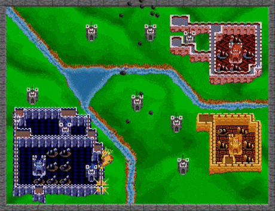

# Trabalho Prático 1 - Defesa de Torres

Todo mundo sabe que não se pode se aproximar de uma torre sem cautela,
sob o risco de levar uma flechada e perder HP. É assim pelo menos desde 1990, 
quando Rampart, um dos precursores do estilo de jogos _Tower Defense_, 
foi lançado.

Neste trabalho, vamos exercitar os conceitos de Computação Gráfica fazendo um 
pequeno jogo de Defesa de Torres usando WebGL (versão 2) e usando um 
repositório no Github para organizar o desenvolvimento e o tornar público.
Veja um exemplo de jogo parecido com o que vamos fazer: 
[The Last Lighthouse][the-last-lighthouse].

## Instruções sobre o jogo

O jogo consiste em uma câmera fixa em um ambiente 2D. No centro,
há uma torre, que possui uma certa quantidade de pontos de vida e deve
ser protegida.

De tempos em tempos, surgem inimigos de fora da tela e que vão andando
em direção ao centro para atacar a torre. Ao se aproximar da torre,
o inimigo a ataca, subtraindo um pouco dos seus pontos de vida. A 
condição de derrota do jogo é atingida quando a torre fica sem pontos
de vida. Nesse caso, o jogo deve mostrar uma mensagem de _"game over"_
(não pode ser `window.alert` hein... estamos de 👀) e possibilitar
o reinício.

A torre, por sua vez, também ataca, lançando um projétil com uma certa
frequência em direção a um inimigo que esteja dentro do seu alcance
(tipicamente o que estiver mais próximo dela). Na versão mais básica, 
o jogo é infinito (sem condição de vitória) e produz uma pontuação 
para o jogador indicando quantos inimigos foram derrotados ou por 
quanto tempo sobreviveu ao ataque. Com o tempo, a frequência de inimigos
deve aumentar (ou algum outro indicador de dificuldade deve aumentar).

Assim como a torre, cada inimigo tem seus pontos de vida e, quando
fica sem, ele é derrotado. Além disso, o jogador pode usar o _mouse_
para dar "dedadas" no inimigo e subtrair alguns pontos de vida também,
ao clicar neles.

O uso de **texturas** nesse trabalho é obrigatório. Utilize-as tanto para
dar vida ao ambiente 2D do campo de visão do jogador quanto estilizar o
personagem e os objetos. Para fins de detecção de colisão, os objetos
podem ser considerados todos retangulares ou circulares para simplificar.

Deve haver uma _head-up display_ (**HUD**) mostrando a vida atual da torre,
bem como a pontuação do jogador.

Após a entrega do trabalho (URLs do jogo publicado e do repositório no Github),
deve haver também um breve vídeo (30s?) mostrando o jogo, hospedado no Youtube,
entregue até 1 semana depois (veja a seção "O que deve ser entregue").

Além de implementar esses itens obrigatórios, você deve também 
**escolher pelo menos 4 das seguintes características** para seu jogo:

- Relativas à **apresentação do jogo e gráficos**:
  1. ⭐ **Texturas animadas**: você pode criar animações de personagens ou 
     cenário. Por exemplo, para inimigo andando, atacando... uma explosão,
     para os projéteis etc
  1. 💣 **Efeitos de partículas** para simular explosão, faíscas etc
  1. ⭐ **Telas**: faça um jogo completo, ou seja, implemente telas de  
     _splash screen_, menu inicial, créditos, opções, _game over_, etc
  1. 🌟 **Sons**: Colocar efeitos sonoros e música de fundo no seu jogo
  1. **Tela cheia**: faça com que seja possível colocar em tela cheia
     e que a razão de aspecto do jogo seja sempre mantida, 
     independente das dimensões da janela (_windowed_ ou _full screen_), 
     mas que o jogo ocupe a maior área possível da janela e ficando centralizado
  1. **Trailer**: em vez de um vídeo simples, faça um vídeo mais
     rebuscado e chamativo, potencialmente um pouco maior, com um pouco de
     edição
- Relativas aos **inimigos**:
  1. ⭐ **Inimigos diferentes**: faça inimigos visual e mecanicamente 
     diferentes, como com velocidades distintas, frequência de ataque, dano etc
  1. **Inimigos em ondas**: crie o conceito de ondas de inimigos (fases)
     para que o jogador possa conciliar momentos de maior tensão ou
     maior relaxamento (no intervalinho entre ondas). As ondas podem ser 
     "fases curadas" e finitas, ou infinitas (com aumento de dificuldade)
  1. **Colisão entre inimigos**: tome o cuidado para evitar que "um inimigo 
     entre no outro", verificando se estão colidindo ao atualizar suas posições
  1. 🍔 **Caminhos dos inimigos**: em vez de sempre vir de fora da tela para o 
     centro, crie um caminho (sequência de _waypoints_) que os inimigos 
     percorrem até chegar à torre principal (como a maioria dos 
     _tower defense_ fazem)
- Relativas aos **recursos do jogador**:
  1. ⭐ **Novas torres**: deixe o jogador construir novas torres
  1. ⭐ **Torres diferentes**: além de haver mais de uma torre, permita ao
     jogador escolher dentre diferentes tipos, como por exemplo 
     uma "torre de gelo" que deixa o inimigo mais lento, ou uma 
     "torre canhão" que atinge uma área e pode causar dano em vários
     inimigos com cada tiro 
  1. ⭐ **Progressão da torre**: permita ao jogador melhorar a(s) torre(s) 
     eventualmente, por exemplo, aumentando sua cadência, ou seu
     alcance, ou seu dano etc. Uma estratégia interessante é a adotada
     por jogos "roguelike" ou "roguelite", que é a ideia de oferecer
     umas 3x opções de _upgrade_ aleatórios ao jogador cada vez que
     ele tiver a oportunidade de melhorar uma torre (veja o exemplo do
     [The Last Lighthouse][the-last-lighthouse])
  1. _**Power-ups**_: implemente alguns meios do jogador aumentar suas
     chances de sobrevivência. Por exemplo, pode haver uma chance para quando um 
     inimigo for derrotado, ele "drop" ("deixe cair") um _power-up_ que pode ser
     coletado com o _mouse_. Pode ser um escudo de proteção que dure 
     alguns segundos, ou um aumento temporário de dano, ou uma bomba 
     que oblitera todos os inimigos na proximidade. Use a criatividade
  1. 🍔 **Herói**: além da(s) torre(s), o jogador poderá controlar 
     (mouse? teclado?) um pequeno personagem que anda pelo cenário e ataca 
     os inimigos próximos de forma automática (como se fosse uma torre móvel)
  1. **Moedas**: crie uma moeda que o jogador adquire, de alguma forma, e que
     pode ser usada para: (a) melhorias na(s) torre(s), ou (b) criar novas
     torres, ou (c) para melhorias do herói, ou para outro motivo interessante
- **Implementação criativa**: qualquer implementação que não fuja
    muito do pedido, mas que traga elementos novos e interessantes para o
    seu jogo é bem-vinda!

[the-last-lighthouse]: https://www.crazygames.com/game/the-last-lighthouse

Legenda dos ícones:
- ⭐ Esforço médio porém muito importante
- 🌟 Esforço baixo
- 💣 Esforço alto, melhor correr senão explode
- 🍔 Esforço médio mas professor adoraria ver implementado

### Um lembrete importante

Preocupe-se **primeiro em implementar as funcionalidades básicas do trabalho!**
Deixe o embelezamento do trabalho e a implementação das funcionalidades extras
para somente quando você já possuir a base lógica do trabalho construída
e funcionando.

## O que deve ser entregue

Até a data de entrega do trabalho (vide sistema acadêmico), você deve enviar 
links para o repositório Github e para o jogo publicado em um fórum de entrega
da disciplina com o seguinte conteúdo:

- Repositório: https://github.com/SEU-USUARIO/REPOSITORIO
- Jogo: https://SEU-USUARIO.github.io/REPOSITORIO

O repositório deve conter:
1. O código fonte, com os recursos (imagens, sons) usados
1. Arquivo `README.md` contendo 5 seções: 
   - (a) **O Jogo**: brevíssima descrição do jogo 
   - (b) **Criador(es)**: nome(s) e contato para empresas contratarem você(s)
   - (c) **Media kit**: 1-3 screenshots ilustrando o jogo
   - (d) **Opcionais**: lista de itens opcionais implementados
     - copiar/colar o texto desses itens do enunciado
     - ⚠️ esquecer isto pode acarretar em notas mais baixas porque ao corrigir
       o trabalho eu não percebi o item
   - (e) **Créditos**: links para quem criou os recursos de terceiros usados 
     (eg, músicas, efeitos sonoros, imagens etc)

ℹ️ **Importante**: até 1 semana depois, você deve postar o link para o vídeo
(~30s) em resposta ao post de entrega no sistema acadêmico.

## Avaliação

O(s) aluno(s) deve(m) ser o(s) autor(es) do código (e não de _prompts_). 
O trabalho será avaliado pelo professor seguindo os critérios:

1. **Qualidade do resultado** final
   - Quanto mais o jogador se divertir, melhor
1. **O esforço de programação** do aluno
   - Quanto mais opcionais implementados, melhor
   - Escrever _prompt_ para gerar código não conta como esforço: 
     ativa o modo LLM¹
   - Checklist dos obrigatórios:
     - Torre que atira
     - Condição de derrota com mensagem de _game over_
     - Inimigos surgindo, andando, atacando torre e sendo derrotados
     - Clique "dedada" nos inimigos
     - HUD com vida da torre e pontuação
     - Loop de reinício do jogo
     - Uso de texturas
1. A distribuição de **_commits_ ao longo do tempo** segundo o repositório
   - Trabalhos iniciados muito próximo da entrega: ativa o modo LLM¹
   - Se for em grupo, todos participantes devem ter _commits_ relevantes
1. Qualidade do **código-fonte**
   - Há indicadores de código gerado por LLM. Fuja deles para não
     ativar o modo LLM¹
1. Entrega do **vídeo** de ~30s (1 semana depois)
   - Faça um vídeo curto, não precisa ter um trabalhão

### ¹Correção Modo LLM

Em caso de **⚠️suspeita⚠️ de uso excessivo de código gerado por LLMs**, o professor
irá corrigir o trabalho usando uma LLM também. Afinal, não é justo ele ter
mais trabalho para corrigir do que o aluno para fazer a aplicação.

