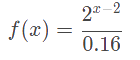

# Trabalho Prático 2 - Zeppelin

Neste trabalho, vamos criar um zeppelin sobrevoando uma pequena cidade...
ou um [DeLorean](https://pt.wikipedia.org/wiki/Back_to_the_Future) sobrevoando
a futurista Hill Valley. Ou um OVNI sobrevoando uma fazenda para
abduzir vaquinhas.

Nosso objetivo é praticar os conceitos de projeção perspectiva,
iluminação dinâmica, modelagem hierárquica, sombreamento, modelagem e
efeitos visuais vistos em sala de aula. E também nos divertir.

Esse trabalho pode ser feito em dupla, e como funcionalidade básica,
valendo 70% da nota, deve ter os seguintes itens:

- **Vídeo** curto (30s-60s), que pode ser entregue 1 semana depois
- **Mundo**:
  1. Deve haver um plano e sobre ele os objetos que formarão o cenário
     (eg, casas, ruas, prédios, árvores)
     - Esses objetos podem ser desenhados usando sólidos feitos por você, da TWGL.js ou
       podem ser arquivos `.obj` importados
     - Devem haver pelo 03 tipos de objetos diferentes compondo o cenário e
       você deve espalhá-los "de maneira harmônica"
  1. Deve haver um objeto central que estará sobrevoando a cidade. Ele
     deve ser desenhado de forma **hierárquica** e deve ser constituído de
     pelo menos 3 partes:
     - uma parte compondo o corpo do objeto (eg, câmara de ar do zeppelin,
       carroceria do carro ou chassi do disco voador - sim, eles têm chassi)
     - uma cabine que possibilite visão para o mundo externo
     - um objeto que tenha uma rotação contínua em torno do próprio eixo
       (eg, hélices, rodas, anéis concêntricos anti-gravitacionais)
  1. O objeto principal deve ser **controlado por meio do teclado**, de
     forma a mudar a direção de voo, pelo menos no plano (x, z)
- **Câmera**:
  1. Use projeção perspectiva 
  1. Devem haver 2 câmeras e o usuário pode alternar entre elas via as teclas
     <kbd>1</kbd> e <kbd>2</kbd>:
     1. Visão de cima, enxergando todos os elementos da cidade e o zeppelin,
        acompanhando o zeppelin, a uma distância X
     1. Visões laterais do zeppelin, com a camera posicionada fora dele,
        um pouco acima, olhando de leve para baixo, possibilitando visualizar
        o objeto (a) de frente, (b) por trás, (c) da direita e (d) da esquerda,
        sempre a uma distância X do zeppelin
        - Ao pressionar <kbd>C</kbd>, essa segunda câmera deve alternar entre
          (a), (b), (c) e (d). Ou então, use as teclas 1,2,3,4,5
- **Gráficos**:
  1. Você deve usar um modelo de iluminação dinâmica, como o de Phong
     - Basta que sua cena tenha 1 fonte de luz direcional e que os 
       objetos possuam materiais diferentes
   1. Deve ser possível ativar/desativar o modelo de iluminação a partir de uma
      tecla (eg, <kbd>L</kbd>)
   1. Todos (ou a grande maioria) dos objetos devem conter texturas,
      com materiais devidamente configurados. A menos que você opte por fazer
      um estilo _low-poly_ bonitão

Para se obter o restante dos pontos do trabalho (ou até mesmo mais pontos
extras, até um limite de 125% da pontuação original) funcionalidades adicionais
podem/devem ser implementadas no jogo. Essas funcionalidades serão avaliadas
conforme a **dificuldade da implementação**, o **efeito obtido** com ela no
trabalho e a **qualidade da implementação**. Exemplos de funcionalidades
extras com suas respectivas pontuações **máximas**:

- Relativas ao **Mundo**:
  1. **Relevo usando textura (10%)**: você pode usar uma
     textura em escala de cinza representando o relevo do chão: um ponto branco,
     representa altura 100% e um ponto preto representa altura 0. Esta é uma
     técnica de uso de texturas chamada _height map_. Veja um
     [exemplo de _height map_][height-map] na aula sobre texturas
  1. **_Skybox, skyphere ou skydome_ (até 10%)**: se considerarmos
     que nosso mundo está definido dentro de um cubo (_skybox_), podemos
     colocar uma imagem de textura em cada face interna (são 6) que
     represente o horizonte naquela direção. Veja
     [exemplos de texturas de _skyboxes_][skybox] e nossa aula sobre
     [efeitos visuais][visual-fx]. Repare que o cubo do _skybox_ acompanha
     a posição, ou seja, não é possível se aproximar de uma parede, muito
     menos sair do cubo
  1. **Modelos no formato .obj (até 10%)**: em vez de usar os
     sólidos próprios ou da TWGL.js, modele um objeto \*simples\* usando um 
     _software_ CAD, salve-o num formato \*simples\* (_e.g._, `.obj`) e 
     carregue-o no seu programa. Há alguns tutoriais disponíveis nas _interwebs_ sobre
     como abrir um arquivo `.obj`, ler a informação sobre os vértices e
     desenhá-los... aqui estão alguns: [tutorial 1][obj-tut-1],
     [tutorial 2][obj-tut-2], [tutorial 3][obj-tut-3]
     - Apenas carregar modelos prontos (6%)
     - Modelar e carregar modelos (10%)
  1. **Fontes de luz pontuais ou _spotlight_ (4%)**: coloque fontes de luz em
     alguns objetos do cenário (eg, postes, holofotes, faróis, _outdoors_ de LED)
     - Atenção: cuidado para não "sobrecarregar" o _shader_ com cálculos de
       iluminação por usar muitas fontes de luz. Se precisar de várias,
       pode ser interessante ligar/desligar algumas fontes de acordo com o
       que está dentro do _frustum_ (câmera)
  1. **Objetos animados (até 10%)**: crie objetos que têm algum tipo de
     movimentação autônoma (carros, aviões, moinhos)
     - Aqui vale ressaltar que cabe usar algoritmos de inteligência
       artificial para determinação de caminhos dos objetos (eg, Dijkstra, A*).
       Implementações mais rebuscadas atingem os 10%
  1. **Mais tipos de objetos (até 8%)**: em vez de compor o cenário com apenas
     03 tipos de objetos, crie uns 7 tipos diferentes (ou seja, +2% por novo
     tipo, limitado a 4 novos tipos)
  1. **Moitas de grama (até 6%)**: use _sprites_ ou _billboards_ para fazer
     muitas moitas de grama ao longo do espaço. Desafio: usar técnicas para
     otimizar o desempenho, dado o grande volume de objetos
     - **Vento (+6%)**: faça elas se mexerem com o vento. Por exemplo, 
       um _shear_ com uma intensidade dada, em um certo momento, por uma textura
       que contém ruído branco (eg, _perlin noise_)
- Relativas ao **Gráfico**:
  1. :star2: **Dia/noite (até 10%)**: você pode fazer o tempo passar ao longo do dia
     e fazer com que isso reflita na forma como o cenário é renderizado. Isso
     pode ser feito configurando-se a fonte de luz direcional com cores
     diferentes, dependendo da hora do dia, por exemplo
     - Além disso, você pode fazer com que certas coisas só aconteçam de
       dia ou de noite
     - Se tiver um _skybox_, você deve alterá-lo para refletir os horários
       diferentes
  1. **Efeitos de partículas (até 8%)**: para simular fenômenos como fogo,
     fumaça, água etc. Falaremos disso na aula de [efeitos visuais][visual-fx]
  1. **Neblina (_fog_) (4%)**: funcionalidade acrescentada por
     comando do teclado (<kbd>N</kbd>), podendo ser habilitada e
     desabilitada durante a execução, para ocultar o limite do plano distante
  1. **Efeitos de pós-processamento (5%)**: implemente uma etapa de pós-processamento
     de cada quadro para melhorar a qualidade da imagem aplicando borragem, ou
     vinheta, ou alguma outra técnica que faça sentido visualmente (eg., bloom,
     detecção de bordas para criar contornos, etc.)
  1. :bomb: **_Normal mapping_ (8%)**: use a técnica de _normal mapping_ para
     fazer com algum objeto tenha suas normais dadas por uma textura e, assim,
     ganhe um efeito de profundidade quando iluminado
  1. :bomb: **Sombras (12%)**: faça objetos gerarem sombras usando alguma 
     técnica (_hack simplão_: 2%, _shadow maps_ ou _shadow volumes_: 12%) 
- Relativas ao **Zeppelin**:  
  1. **Cabine com vidros (4%)**: em vez de "deixar a janela aberta", use
     um material semelhante a um vidro semitransparente para a cabine do
     zeppelin
     - Todo objeto semitransparente precisa ser desenhado por último (ie, ser
       enviado pro _pipeline_ depois dos objetos opacos)
  1. **Faça o zeppelin pousar (4%)**: determine uma região em que o zeppelin
     poderá pousar. Ele deverá estar posicionado logo acima de uma região
     específica - um zeppeliporto - e pousar (com animação para a descida)
     ao pressionar uma tecla
- Relativas à **Câmera**:
  1. **Terceira câmera (5%)**: posicionada dentro da cabine, possibilitando
     uma observação panorâmica da cidade, e que pode ser alterada via
     setinhas do teclado (<kbd>➡️</kbd> e <kbd>⬅️</kbd>), fazendo com que a
     câmera, sem sair de onde está, altere para onde ela está olhando
- Outros adicionais:
  1. :star: **Música (3%)**: você pode incluir uma música de fundo para
     seu sistema estelar (ou de outra coisa)
  1. **Usar a THREE.js (-70%)**: a THREE.js pode ser usada, mas torna necessário
     conquistar os pontinhos por meio dos adicionais (parte-se de 0% e vai somando...)
  1. **Usar a TWGL.js (0%)**: neste trabalho está liberado
     usar a biblioteca
  1. **Qualquer outra idéia (??%)** que torne a sua cidade mais interessante ou
     agradável aos sentidos. Essas idéias precisam ser documentadas e
     explicadas no `README.md` do repositório e no
     formulário de envio de extras implementados

Legenda dos ícones:
  - :star:: item sugerido por ser interessante ou super simplão.
  - :bomb:: item com maior complexidade de implementação - não
    comece por estes!!
  - :bomb::bomb: muitos já trilharam essa rota e não retornaram

## Instruções gerais

O seu código deve estar comentado e, principalmente, organizado: ao
construí-lo, pense que outra pessoa lerá o código e você não estará lá para
explicar seu raciocínio. Portanto, organize-o! Também não é necessário
comentar o código inteiro, mas o faça quando sentir necessidade de uma
explicação adicional à sua lógica.

Seu trabalho pode ser feito **individual ou em duplas** e deve ser produzido
integralmente por você/dupla. Se recursos de terceiros forem usados
(e.g., imagens, músicas, efeitos sonoros), coloque links para elas na
documentação (`README.md`). A discussão e troca de ideias com os 
colegas é bem-vinda e estimulada, mas cada aluno/dupla deve ter 
seu próprio trabalho.

Trabalhos muito semelhantes receberão nota 0, independente de quem
copiou quem. E claro, trabalhos semelhantes aos de outras pessoas ou
retirados da Internet, também receberão nota 0. Uso de código gerado
por LLMs será punido com o multiplicador de notas, que varia de -0 a 0. 
Além da nota redonda, eles serão encaminhados ao colegiado para apreciação.

Outros descuidos também o farão **perder pontos no trabalho**, como:

- Seu trabalho não executa: nota 0;
- Seu trabalho é uma cópia (como já mencionado): nota 0;
- Você não implementou os itens obrigatórios;
- Ausência de algum item obrigatório no que deve ser entregue (descritos
  a seguir);
- Baixa legibilidade/organização do código;
- Baixa qualidade da implementação;
- Entregar fora do prazo. Cada dia de atraso reduz o valor máximo de nota
  de acordo com a equação abaixo, de modo que `x` representa o número de
  dias de atraso e `f(x)` equivale à penalidade percentual da nota:

  
  - Isso implica que 1 ou 2 dias de atraso são pouco penalizados
  - E após 5 dias de atraso, o trabalho vale 0
  - _Seeing is believing_:
    https://www.google.com.br/search?q=y%3D(2%5E(x-2)%2F0.16)%2Cy%3D100

## O que deve ser entregue

Você deve entregar um link para seu trabalho publicado na Web, em um repositório
no Github, por exemplo, assim: https://SEU-USUARIO.github.io/REPOSITORIO

O repositório deve conter:
1. O código fonte e todos os arquivos necessários para execução
1. Três screenshots de diferentes cenas/situações de seu jogo;
1. Arquivo `README.md` contendo (a) brevíssima descrição do jogo, (b) nomes
   dos autores e (c) a lista de itens adicionais implementados em seu 
   jogo
5. Um link para um vídeo curto (30 a 60s) no YouTube mostrando as opções
   implementadas. Faça um vídeo curto, não precisa ter um trabalhão!
   - Vídeo pode ser entregue até uma semana depois do prazo do TP2

Qualquer dúvida, entre em contato comigo. Ou acrescente a sua interpretação no
arquivo README e mãos à obra.

[lighting-directional]: http://fegemo.github.io/utf-cg/classes/lighting/#37
[obj-tut-1]: http://www.opengl-tutorial.org/beginners-tutorials/tutorial-7-model-loading/
[obj-tut-2]: http://netization.blogspot.in/2014/10/loading-obj-files-in-opengl.html
[obj-tut-3]: https://tutorialsplay.com/opengl/2014/09/17/lesson-9-loading-wavefront-obj-3d-models/
[visual-fx]: http://fegemo.github.io/utf-cg/classes/visual-effects/#4
[height-map]: http://fegemo.github.io/utf-cg/classes/textures/#43
[skybox]: https://www.google.com.br/search?q=skybox&safe=off&hl=pt-BR&source=lnms&tbm=isch&sa=X&ei=jMM_VenRNKuasQSCwYDABw&ved=0CAgQ_AUoAg&biw=1366&bih=599
[lighting]: http://fegemo.github.io/utf-cg/classes/lighting/#26
