<!-- {"layout": "title"} -->
# Sistemas de Coordenadas
## Mudança de Base, Composição e Orientação

---
<!-- {"layout": "centered"} -->
# Roteiro

1. Orientação
1. Composição de transformações
1. Mudança de sistema de coordenadas

---
<!-- {"layout": "regular"} -->
# Orientação (1/2)

- Orientação de 2 pontos em 1D <!-- {.bullet} -->
  - <span class="math">P_1 < P_2</span>, <span class="math">P_1 = P_2</span> ou <span class="math">P_1 > P_2</span>
- Orientação de 3 pontos em 2D <!-- {.bullet} -->
  - O percurso <span class="math">P_1, P_2, P_3</span>  é feito no sentido dos ponteiros do relógio, no
    sentido contrário ou são colineares

    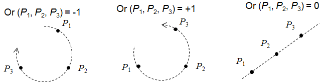

---
<!-- {"layout": "regular"} -->
## Orientação (2/2)

- Orientação de 4 pontos em 3D
  - O percurso <span class="math">P_1, P_2, P_3, P_4</span>  está definido segundo a regra da mão direita,
    mão esquerda ou são coplanares

    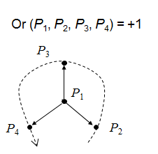 <!-- {.centered} -->

---
<!-- {"layout": "regular"} -->
## Computando a orientação

- A orientação de <span class="math">n+1</span> pontos em um espaço
  <span class="math">n</span>-dimensional é dado pelo **sinal
  do determinante da matriz** cujas colunas são as coordenadas homogêneas
  dos pontos **com o 1 vindo primeiro**

  <span class="math" style="font-size: 0.8em;">
    Or_2(P_1,P_2,P_3)=sign\left(\begin{vmatrix} 1 & 1 & 1 \\ x_1 & x_2 & x_3 \\ y_1 & y_2 & y_3\end{vmatrix}\right)
  </span>
  <div class="math push-right" style="font-size: 0.8em">
    Or_3(P_1,P_2,P_3,P_4)=sign\left(\begin{vmatrix} 1 & 1 & 1 & 1 \\ x_1 & x_2 & x_3 & x_4 \\ y_1 & y_2 & y_3 & y_4 \\ z_1 & z_2 & z_3 & z_4\end{vmatrix}\right)
  </div>

---
<!-- { "layout": "section-header" } -->
# Composição de Transformações

1. Entender como combinar transformações
1. Qual a ordem usar?

---
<!-- { "layout": "regular" } -->
# Composição de transformações

- Frequentemente é necessário fazer várias transformações
  geométricas para posicionar objetos
  - Exemplo: combinação de rotações e translações
- A **ordem com que transformações** são aplicadas <u>importa</u>...
  - ...porque a multiplicação de matrizes <u>não é comutativa</u>

---
<!-- { "layout": "regular" } -->
# Compondo transformações

- Há 02 formas para compor transformações. Sejam:
  - <span class="math">A</span> a matriz _model_ que já tínhamos <small>(inicialmente, <span class="math">I_{4x4}</span>)</small>
  - <span class="math">B</span> a matriz com a nova transformação <small>(gerada e.g. via `translate`)</small>
  - <span class="math">A'</span> a matriz _model_ resultante <small>(da multiplicação das duas)</small>
- (1) **<u>Pós</u>-multiplicação**: <!-- {strong:.alternate-color} --> nova matriz à <u>direita</u> da existente
  - <span class="math">A' = A \times B</span>
- (2) **<u>Pré</u>-multiplicação**: nova matriz à <u>esquerda</u> da existente
  - <span class="math">A' = B \times A</span>

Recomendo usar **pós**-multiplicação <!-- {strong:style="color: #7b9c02"} --> e, 
assim, <u>ler as matrizes da esquerda para a direita</u>. <!-- {p:.note.info} -->

---
<!-- {"layout": "2-column-content", "slideClass": "compact-code-more left-aligned-equations", "embeddedStyles": ".left-aligned-equations .katex-display>.katex { text-align: left; }"} -->
# **Exemplo**: <u>pós</u>-multiplicação <!-- {strong:.alternate-color} -->

1. ```javascript
   const u = cena.unicornio
   u.model = identity()
   u.model = mult(u.model, rotate(30))      // R(30)
   u.model = mult(u.model, translate(2, 0)) // T(2,0)
   u.model = mult(u.model, scale(0.5))      // S(0.5)
   gl.uniformMatrix3fv(mLoc, false, u.model)
   desenhaUnicornio() // 🦄
   ```
   <!-- {ol:.no-margin.no-bullet style="padding-left: 0;"} -->
   <!-- {li:style="margin-bottom: 1rem;"} -->
1. <!-- {li:style="margin-bottom: 1rem;"} -->
   <div class="math bullet" style="font-size: 14px;">M = \begin{vmatrix}1 & 0 & 0 \\0 & 1 & 0 \\0 & 0 & 1\end{vmatrix} \times \begin{vmatrix}0.87 & -0.5 & 0 \\0.5 & 0.87 & 0 \\0 & 0 & 1\end{vmatrix} \times \begin{vmatrix}1 & 0 & 2 \\0 & 1 & 0 \\0 & 0 & 1\end{vmatrix} \times \begin{vmatrix}0.5 & 0 & 0 \\0 & 0.5 & 0 \\0 & 0 & 1\end{vmatrix}</div>
1. <div class="math bullet" style="font-size: 14px;">M = \begin{vmatrix}0.43 & -0.25 & 1.73 \\0.25 & 0.43 & 1 \\0 & 0 & 1\end{vmatrix}</div>

- Suponha 3 transformações:
  1. <span class="math">R(30)</span>: rotaciona 30°
  1. <span class="math">T(2,0)</span>: translada 2u eixo x
  1. <span class="math">S(0.5)</span>: escala por 0,5
- <span class="math">M = I \times R \times T \times S</span>
- Devemos considerar que estamos transformando o sistema de coordenadas
  ("cursor onde desenhar"), e não os objetos

---
<!-- {"layout": "2-column-content", "slideClass": "compact-code-more"} -->
# <u>Pós</u>-multiplicação: sistema **local** <!-- {strong:.alternate-color} -->

- ```javascript
  u.model = identity()
  u.model = mult(u.model, rotate(30))
  u.model = mult(u.model, translate(2, 0))
  u.model = mult(u.model, scale(0.5))
  desenhaUnicornio()
    // v3 (0,2)----(2,2) v2
    //      |        |
    //      |        |
    // v0 (0,0)----(2,0) v1
  ```
  Tudo que é feito altera a posição e orientação do
  sistema de coordenadas local <!-- {ul:.no-bullet style="padding: 0;"} -->
- <div class="math" style="font-size: 14px;">M = \begin{vmatrix}0.43 & -0.25 & 1.73 \\0.25 & 0.43 & 1 \\0 & 0 & 1\end{vmatrix}</div>

1. <figure class="picture-steps clean">
     
     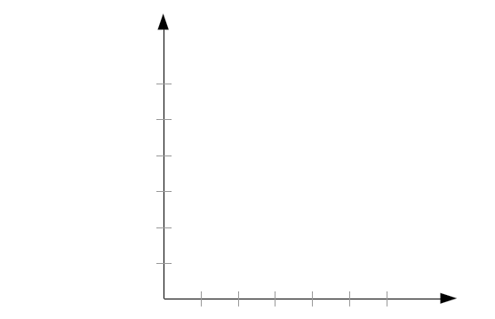
     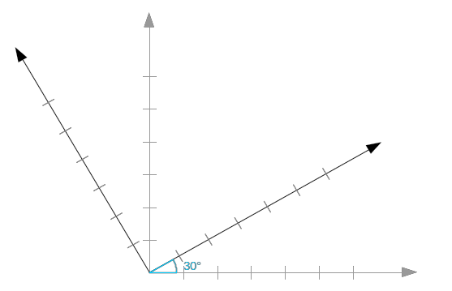
     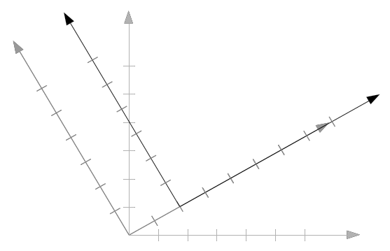
     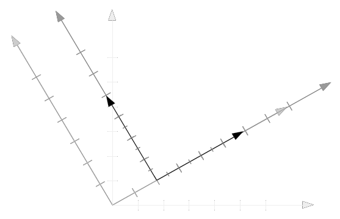
     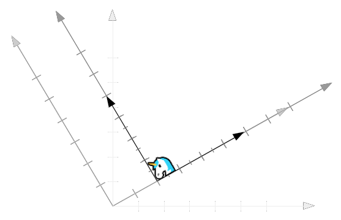
   </figure>
1. <!-- {ol:.no-bullet.bulleted.no-margin.left-aligned-equations style="padding-left: 0"} -->
   Supondo 4 vértices indo de 0 a 2 em <span class="math">x, y</span>:
   - <div class="math" style="font-size: 14px; margin-bottom: 0.25rem;">M \times v_0 = \begin{vmatrix}0.43 & -0.25 & 1.73 \\0.25 & 0.43 & 1 \\0 & 0 & 1\end{vmatrix} \times \begin{vmatrix}0 \\ 0 \\ 1\end{vmatrix} = \begin{vmatrix}1.73 \\ 1 \\ 1\end{vmatrix}</div>
   - <div class="math" style="font-size: 14px; margin-bottom: 0.25rem;">M \times v_1 = \begin{vmatrix}0.43 & -0.25 & 1.73 \\0.25 & 0.43 & 1 \\0 & 0 & 1\end{vmatrix} \times \begin{vmatrix}2 \\ 0 \\ 1\end{vmatrix} = \begin{vmatrix}2.6 \\ 1.5 \\ 1\end{vmatrix}</div>

---
<!-- {"layout": "2-column-content-zigzag", "slideClass": "compact-code-more"} -->
# **Pós** <!-- {.alternate-color} --> vs **pré**-multiplicação

```javascript
// pós-multiplicação
u.model = identity()
u.model = mult(u.model, rotate(30))
u.model = mult(u.model, translate(2, 0))
u.model = mult(u.model, scale(0.5))
```

```javascript
// pré-multiplicação
u.model = identity()
u.model = mult(rotate(30), u.model)
u.model = mult(translate(2, 0), u.model)
u.model = mult(scale(0.5), u.model)
```

<div class="math">\begin{align*}M&=I\times R\times T\times S\\
M&=\begin{vmatrix}0.43 & -0.25 & 1.73 \\0.25 & 0.43 & 1 \\0 & 0 & 1\end{vmatrix}\end{align*}</div>
<div class="math">\begin{align*}M&=S\times T\times R\times I\\
M&=\begin{vmatrix}0.43 & -0.25 & 1 \\0.25 & 0.43 & 0 \\0 & 0 & 1\end{vmatrix}\end{align*}</div>


---
<!-- {"layout": "2-column-content", "slideClass": "compact-code-more"} -->
## <u>Pré</u>-multiplicação: sistema **global**

- ```javascript
  u.model = identity()
  u.model = mult(rotate(30), u.model)
  u.model = mult(translate(2, 0), u.model)
  u.model = mult(scale(0.5), u.model)
  desenhaUnicornio()
  ```
  Tudo que é feito é relativo à origem e a base do sistema
  de coordenadas global (do mundo) <!-- {ul:.no-bullet} -->


1. <!-- {ol:.no-bullet} -->
   <figure class="picture-steps clean">
   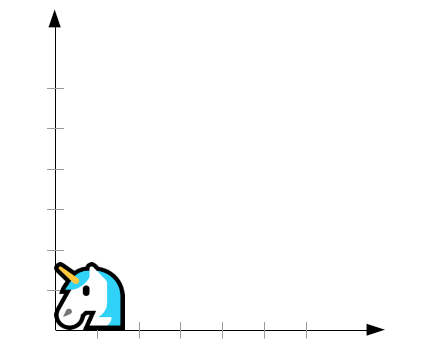
   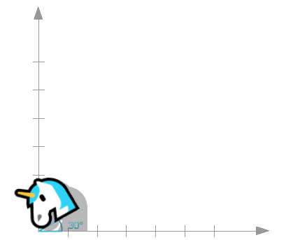
   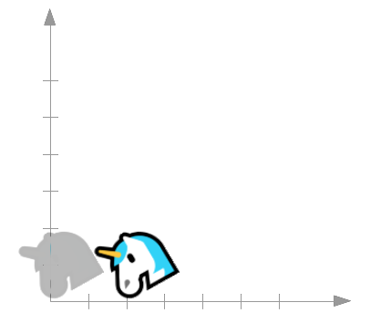
   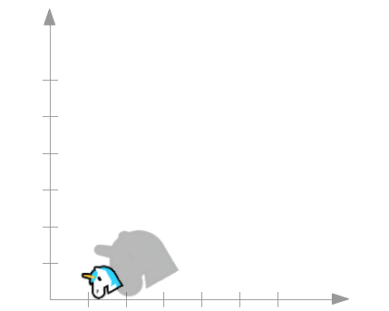
   </figure>
   <figure class="picture-steps clean" style="display: inline-block">
   
   </figure>

---
<!-- { "layout": "centered-horizontal" } -->
# Exemplo

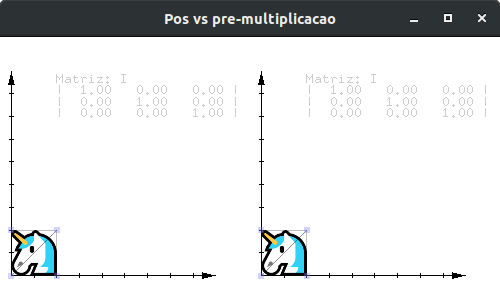 <!-- {.block.bordered.centered style="border-radius: 8px;"} --> <!-- {p:.full-width.center-aligned} -->

[pós vs pré-multiplicação](codeblocks:pos-pre-multiplicacao/CodeBlocks/pos-pre-multiplicacao.cbp)

---
<!-- { "layout": "regular" } -->
# Qual forma devo usar?

- As duas formas funcionam, então é uma questão de decisão
- Os dois métodos darão a sequência de transformação na ordem inversa do outro
- Normalmente é mais fácil controlar o objeto pensando nas
  transformações como **alterando o sistema de coordenadas local**
  - O OpenGL antigo funcionava com **pós-multiplicação** e pode ser mais fácil
    pensar nas transformações assim <!-- {strong:.alternate-color} -->

---
<!-- { "layout": "regular" } -->
# Resumindo

1. Pense nas transformações como movimentação de sistemas de coordenadas
1. Chame as funções de transformação nessa ordem
1. A matriz de acumulação (_model_) multiplicará os vértices dos objetos
1. Exemplo: [Composição de Transformações](codeblocks:composicao-transformacoes/CodeBlocks/composicao-transformacoes.cbp)

---
<!-- {"layout": "section-header"} -->
# Mudança de Sistema de Coordenadas

---
<!-- {"layout": "regular"} -->
# Sistema de coordenadas (**revisão**)

- Um sistema de coordenadas para <span class="math">R^n</span> é definido por um ponto (origem) e <span class="math">n</span> vetores
- Por exemplo: Seja um sistema de coordenadas para <span class="math">R^2</span> definido pelo ponto <span class="math">O</span> e
  os vetores <span class="math">\vec{x}</span> e <span class="math">\vec{y}</span>. Então,
  - Um <u>ponto</u> <span class="math">P</span> é dado por coordenadas <span class="math">(x_P, y_P)</span> tais que

    <div class="math">P = x_P . \vec{x} + y_P . \vec{y} + O</div>
  - Um <u>vetor</u> <span class="math">\vec{v}</span> é dado por coordenadas <span class="math">(x_v, y_v)</span> tais que

    <div class="math">\vec{v} = x_v . \vec{x} + y_v . \vec{y}</div>

---
<!-- {"layout": "regular"} -->
# Mudança de sistema <small>(em <span class="math">R^2</span>)</small>

Dados dois sistemas, o <span class="math">O</span>/<span class="math">\vec{x}</span>/<span class="math">\vec{y}</span>
e o <span class="math">Q</span>/<span class="math">\vec{t}</span>/<span class="math">\vec{u}</span>, como computar
as coordenadas de P dadas em um sistema no outro? <!-- {style="margin-bottom: 0;"} -->

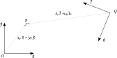 <!-- {style="max-height: 400px;"} --> <!-- {p:.centered} -->

---
<!-- {"layout": "centered-horizontal"} -->
# Mudança: um problema prático

- 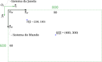 <!-- {ul:.no-margin.no-padding.no-bullet.layout-split-2.bullet style="align-items: center; gap: 1rem;"} -->
- <!-- {li:.bulleted} -->
  ```javascript
  // sistema da janela:
  gl.viewport(0, 0, 800, 600)
  // sistema do mundo:
  ortho(0, 80, 60, 0, -1, 1)
  //    l,  r,  b, t,  n, f
  ```
  1. Crie `janelaParaMundo(x,y)`
  1. Crie `mundoParaJanela(x,y)`
  1. E mudanças mais "difíceis"?

---
<!-- {"layout": "regular"} -->
# Mudança de sistema "genérico" <small>(1/2)</small>

- Problema: dadas as coordenadas do ponto <span class="math">P</span> no sistema <span class="math">Q</span>/<span class="math">\vec{t}</span>/<span class="math">\vec{u}</span> <span class="math">(t_P, u_P)</span>, como encontrar as coordenadas de <span class="math">P</span> no sistema <span class="math">O</span>/<span class="math">\vec{x}</span>/<span class="math">\vec{y}</span> <span class="math">(x_P, y_P)</span>?

<ul class="steps-base-change">
  <li>Defina <span class="math">P</span> como um ponto no sistema <span class="math">Q</span>/<span class="math">\vec{t}</span>/<span class="math">\vec{u}</span></li>
  <li>Defina as componentes do sistema <span class="math">Q</span>/<span class="math">\vec{t}</span>/<span class="math">\vec{u}</span> no sistema <span class="math">O</span>/<span class="math">\vec{x}</span>/<span class="math">\vec{y}</span></li>
  <li>Substitua <span class="math">\vec{t}</span>, <span class="math">\vec{u}</span> e <span class="math">Q</span> na equação do passo 1 e fatore a fórmula para isolar as componentes de <span class="math">O</span>/<span class="math">\vec{x}</span>/<span class="math">\vec{y}</span></li>
  <li>Você achou <span class="math">P = (x_P, y_P)</span> :)</li>
</ul>

---
<!-- {"layout": "regular"} -->
# Algebricamente...

<style>
.steps-base-change {
  display: flex;
  flex-wrap: wrap;
  list-style-type: none;
  counter-reset: step;
}
.steps-base-change > li::before {
  counter-increment: step;
  content: "Passo " counter(step);
  counter-increment: step;
  content: "Passo " counter(step);
  font-size: 0.6em;
  background: orange;
  border-radius: 0.25em;
  padding: 0em 0.5em;
  color: white;
  box-shadow: 2px 2px 3px rgba(0,0,0,0.25);
  display: block;
  width: 4em;
  line-height: 2em;
}
.steps-base-change > li:nth-of-type(1),
.steps-base-change > li:nth-of-type(2) {
  justify-content: space-between;
  width: 50%;
}
.steps-base-change > li:nth-of-type(3),
.steps-base-change > li:nth-of-type(4) {
  width: 100%;
}
.steps-base-change > li:nth-of-type(2) {
  text-align: left;
}
</style>

<ul class="steps-base-change left-aligned-equations">
  <li>
    <span class="math bullet">P[Q]=t_P \vec{t} + u_P \vec{u} + Q</span>
  </li>
  <li>
    <div class="math bullet no-margin">
    \begin{align*}
      \textcolor{#d29c3a}{Q[O]}&=x_Q \vec{x} + y_Q \vec{y} + O\\
      \textcolor{#5a5ad8}{\vec{t}[O]}&=x_t \vec{x} + y_t \vec{y}\\
      \textcolor{#45ab45}{\vec{u}[O]}&=x_u \vec{x} + y_u \vec{y}
    \end{align*}
    </div>
  </li>
  <li>
    <span class="math bullet">P[Q]=t_P \textcolor{#5a5ad8}{\left(x_t \vec{x} + y_t \vec{y}\right)} + u_P \textcolor{#45ab45}{\left(x_u \vec{x} + y_u \vec{y}\right)} + \textcolor{#d29c3a}{\left(x_Q \vec{x} + y_Q \vec{y} + O\right)}</span>
    <span class="math bullet" style="display: block">P[Q]=\vec{x} \left(t_P x_t + u_P x_u + x_Q\right) + \vec{y} \left(t_P y_t + u_P y_u + y_Q\right) + O</span>
  </li>
  <li style="margin-top: 1rem;">
    <div class="math bullet no-margin">
    \begin{align*}
      x_P&=t_P x_t + u_P x_u + x_Q\\
      y_P&=t_P y_t + u_P y_u + y_Q
    \end{align*}
    </div>
  </li>
</ul>

---
<!-- {"layout": "regular"} -->
# Mudança de sistema <small>(2/2)</small>

- <!-- {ul:.bulleted} -->
  <div class="math" style="float: right;">
    \begin{bmatrix}x_P \\ y_P\end{bmatrix}=
    \begin{bmatrix}x_t&x_u \\ y_y&y_u\end{bmatrix}\times
    \begin{bmatrix}t_P \\ u_P\end{bmatrix}+
    \begin{bmatrix}x_Q \\ y_Q\end{bmatrix}
  </div>
  A equação anterior, vista <strong>de forma matricial</strong>: ↘️
- Usando **coordenadas homogêneas**, podemos usar
  **apenas uma multiplicação** de matriz com vetor: ⬇️

  <div class="math">
    \begin{bmatrix}x_P \\ y_P \\ 1\end{bmatrix}=
    \begin{bmatrix}x_t&x_u&x_Q \\ y_t&y_u&y_Q \\ 0&0&1\end{bmatrix}\times
    \begin{bmatrix}t_P \\ u_P \\ 1\end{bmatrix}
  </div>

Ou seja, dadas as coordenadas de um ponto ou vetor em um sistema
<span class="math">Q/\vec{t}/\vec{u}</span>, podemos **achar suas coordenadas
em um sistema <span class="math">O/\vec{x}/\vec{y}</span>
<u>multiplicando-as por uma matriz</u>** <!-- {p:.note.info.bullet} -->

---
<!-- {"layout": "regular"} -->
# E no sentido contrário?

- Se quiser passar uma coordenada do sistema
<span class="math">O/\vec{x}/\vec{y}</span> para
<span class="math">Q/\vec{t}/\vec{u}</span>, basta **resolver o
problema inverso**:

  <div class="math">
    \begin{bmatrix}t_P \\ u_P \\ 1\end{bmatrix}=
    \begin{bmatrix}x_t&x_u&x_Q \\ y_t&y_u&y_Q \\ 0&0&1\end{bmatrix}^{-1}\times
    \begin{bmatrix}x_P \\ y_P \\ 1\end{bmatrix}
  </div>

---
<!-- {"layout": "regular", "slideClass": "left-aligned-equations"} -->
# Exemplo concreto

- Calcule as coordenadas de <span class="math">P</span> no sistema
  <span class="math">O/\vec{x}/\vec{y}</span>.
- Considere que:
  - <span class="math">P[Q] = (2.5, 1)</span>
  - Sistema <span class="math">Q/\vec{t}/\vec{u}</span> dado em
    <span class="math">O/\vec{x}/\vec{y}</span>:
    - <!-- {ul^0:.no-bullet} -->
      <div class="math no-margin">
        \begin{align*}
          Q[O]&= (3.5, 1.25)\\
          \vec{t}[O]&= (-1, 0.25)\\
          \vec{u}[O]&= (-0.25, -1)\\
        \end{align*}
      </div>

---
<!-- {"layout": "regular", "state": "show-active-slide-and-previous"} -->
# Resolvendo o exercício

- <!-- {ul:.bulleted} -->
  Preenchendo a matriz de mudança de sistemas de coordenadas:
  <div class="math">
    \begin{bmatrix}x_P \\ y_P \\ 1\end{bmatrix}=
    \begin{bmatrix}x_t&x_u&x_Q \\ y_t&y_u&y_Q \\ 0&0&1\end{bmatrix}\times
    \begin{bmatrix}t_P \\ u_P \\ 1\end{bmatrix}
  </div>
- Materializando:
  <div class="math">\begin{bmatrix}x_P \\ y_P \\ 1\end{bmatrix}=\begin{bmatrix}-1&-0.25&3.5 \\ 0.25&-1&1.25 \\ 0&0&1\end{bmatrix} \times \begin{bmatrix}2.5 \\ 1 \\ 1\end{bmatrix}</div>
- Resultado: <span class="math">P[O] = (0.75, 0.875)</span>

---
<!-- {"layout": "centered"} -->
# Referências

1. Lições 6 e 7 das anotações do prof. David Mount
