<!-- {"layout": "title"} -->
# Renderização Multipasso

---
<!-- {"layout": "centered"} -->
# Roteiro

1. [Pós-processamento](#pos-processamento)
1. [Efeitos complexos](#efeitos-complexos)
1. [Sombreamento tardio](#sombreamento-tardio)

---
<!-- { "layout": "section-header", "slideClass": "pos-processamento", "hash": "pos-processamento" } -->
# Pós-processamento <!-- {style="font-size: 3rem"} -->

- Conceito
- Efeitos simples

---
<!-- { "layout": "regular" } -->
# Renderização multipasso

- O pipeline gráfico é o processo que gera imagens a partir da descrição geométrica da cena:
  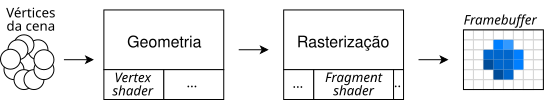 <!-- {.centered style="margin-bottom: 1em;"} -->
- É possível "renderizar para uma textura", em vez de escrever
  no _framebuffer_ padrão
- Sendo assim, é possível desenhar _offscreen_, gerando uma textura em memória,
  depois renderizar normalmente usando esse resultado. Possibilidades:
  1. **Espelhos/retrovisor**: <!-- {strong:.alternate-color} -->
     1. Põe câmera dentro do espelho <!-- {ol^0:.multi-column-list-2} -->
     1. Desenha para textura
     1. Volta câmera
     1. Desenha usando a textura no espelho
  1. Efeitos de **pós-processamento**


---
<!-- { "layout": "regular", "slideClass": "compact-code-more" } -->
# Pós-processamento

- É a renderização em 2 passos, com o segundo aprimorando o primeiro: <!-- {ul:.bulleted.layout-split-2} -->
  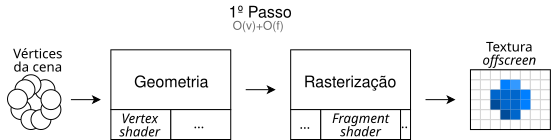 <!-- {.centered} -->
  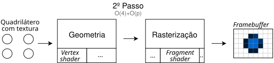 <!-- {.centered} -->
- Em WebGL, podemos desenhar em um FBO, depois para o _framebuffer_ padrão
  ```javascript
  function desenha() {
      // 1º passo: renderização normal,
      // mas para o FBO
      fbo.begin()
      desenhaCenario()
      desenhaPersonagem()
      fbo.end()
      
      // 2º passo: efeito de pós-processamento,
      // usando shader específico,
      // gerando framebuffer padrão
      gl.useProgram(shaderPosProcessamento)
      gl.clear(GL_COLOR_BUFFER_BIT)
      gl.bindTexture(fbo.getTexture())
      desenhaQuadrilatero()
  }
  ```

*[FBO]: Framebuffer object

---
<!-- { "layout": "regular" } -->
# Efeitos de pós-processamento

1.  <!-- {style="height: 150px"} -->
   ## Transformações radiométricas
   - ➡️ Inverter cores <!-- {ul:style="order:2; text-align: center; padding: 0;"} -->
   - ➡️ Escala de cinza
   - ➡️ Vignette
1. 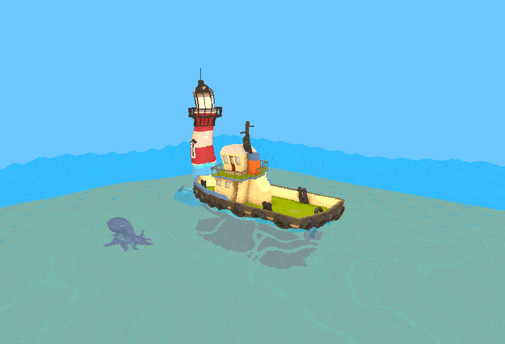 <!-- {style="height: 150px"} -->
   ## Transformações geométricas
   - ➡️ Turbilhão <!-- {ul:style="order:2; text-align: center; padding: 0;"} -->
   - ➡️ Deslocamento
   - ➡️ Afim por partes
1. 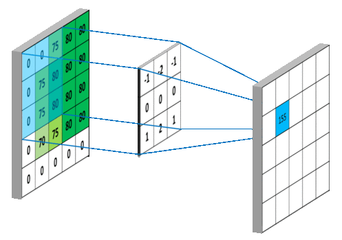 <!-- {style="height: 150px; border: 1px solid silver; margin: 0;"} -->
   ## Convoluções
   - ➡️ Borrão <!-- {ul:style="order:2; text-align: center; padding: 0;"} -->
   - ➡️ Aguçamento
   - ➡️ Detecção de bordas <!-- {ol:.card-list} -->

---
<!-- { "layout": "regular" } -->
# Transformações **radiométricas** (de cor)

- Alteram a cor dos pixels da imagem: <span class="math">Cor_{nova}=T_r(Cor)</span> <!-- {ul:.no-margin} -->

Inverter cores: <!-- {dl:.full-width.no-margin.bulleted} -->
  ~ <span class="math">Cor_{nova}=1-Cor</span>

Escala de cinza:
  ~ <span class="math">Cor_{nova}=(tom,tom,tom)</span>
    <div class="layout-split-2 full-width" style="justify-content: space-around">
      <span class="math" style="font-size: 0.75em">tom=0.33\textcolor{ff8888}{r}+0.33\textcolor{33bb33}{g}+0.33\textcolor{8888ff}{b}</span> ou 
      <span class="math" style="font-size: 0.75em">tom=0.2989\textcolor{ff8888}{r}+0.5879\textcolor{33bb33}{g}+0.1140\textcolor{8888ff}{b}</span>
    </div>

Preto e branco:
  ~ <div class="math" style="font-size: 0.75em">Cor_{nova}=\begin{cases}1&\text{se }tom\geq0.5\\0&\text{do contrário}\end{cases}</div>

Sépia:
  ~ <span class="math">Cor_{nova}=M_{sepia}\times C</span>
    <div class="math" style="font-size: 0.75em;">M_{sepia}=\begin{bmatrix}0.393&0.769&0.189\\0.349&0.686&0.168\\0272&0.534&0.131\end{bmatrix}</div>


*[RGB]: Red, green e blue*

---
<!-- { "layout": "regular" } -->
# Transformações **geométricas**

- Altera a posição dos pixels da imagem: <span class="math">Cor_{P}=Cor_{T^{-1}_g\(P\)}</span>, em que <!-- {ul:.no-margin} -->
  - <span class="math">T_g\(P\)</span> transforma as coordenadas de um pixel
  - <span class="math">T^{-1}_g\(P\)</span> é a inversa dessa transformação <!-- {ul:.no-margin} -->

Deslocamento: <!-- {dl:.full-width.bulleted.no-margin} -->
  ~  <!-- {.push-right style="max-width: 200px"} -->
    <div class="math" style="font-size: 0.75em">P(t)=\begin{bmatrix}P_i+\sin(t)\\P_j+\cos(t)\end{bmatrix}</div>

Rotação:
  ~ <div class="math" style="font-size: 0.75em">R(\theta)=\begin{bmatrix}\cos(\theta)&-\sin(\theta)\\\sin(\theta)&\cos(\theta)\end{bmatrix},R^{-1}(\theta)=\begin{bmatrix}\cos(-\theta)&-\sin(-\theta)\\\sin(-\theta)&\cos(-\theta)\end{bmatrix}</div>
  ~ <div class="math" style="font-size: 0.75em">P=R^{-1}(P)</div>
  ~ <div class="math" style="font-size: 0.75em">Cor_P=Cor_{R^{-1}(P)}</div>

Afim p/ partes:
  ~ [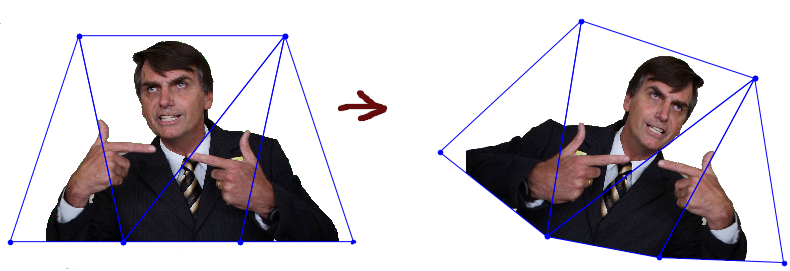](../../images/piecewise-affine.png) <!-- {.push-right style="max-width: 300px"} --> <!-- {a:target="_blank"} --> trabalho [_chroma key_][chroma-key] <!-- {target="_blank"} -->

[chroma-key]: https://github.com/fegemo/chroma-key/blob/master/verdade.ipynb

---
<!-- { "layout": "regular" } -->
# Convoluções (1/2)

-  <!-- {.push-right style="cursor: pointer; max-height: 290px" onclick="this.src=this.src.endsWith('gif')?(this.src.substr(0,this.src.length-3)+'png'):(this.src.substr(0,this.src.length-3)+'gif')"} -->
  Considera-se a vizinhança para definir cor do pixel: <div class="math no-margin">C_{nova}=K*C</div>
  - <span class="math">K</span> é o filtro (_kernel_, pesos) da convolução
- Por exemplo, vizinhança 3x3 com _kernel_<div class="math" style="font-size: 0.75em">K=\color{gray}\begin{bmatrix}-1&-2&-1\\\ 0&0&0\\\ 1&2&1\end{bmatrix}</div> 
  Primeiro pixel:
  <div class="math" style="font-size: 0.75em">C_{nova}=\underbrace{\textcolor{gray}{-1}\times0\textcolor{gray}{-2}\times0\textcolor{gray}{-1}\times\textcolor{99d954}{75}}_\text{1ª linha}\hspace{0.5cm}\underbrace{+\textcolor{gray}{0}\times0+\textcolor{gray}{0}\times\textcolor{99d954}{75}+\textcolor{gray}{0}\times\textcolor{51b956}{80}}_\text{2ª linha}\hspace{0.5cm}\underbrace{+\textcolor{gray}{1}\times0+\textcolor{gray}{2}\times\textcolor{99d954}{75}+\textcolor{gray}{1}\times\textcolor{51b956}{80}}_\text{3ª linha}=155</div>


---
<!-- { "layout": "regular" } -->
# Convoluções (2/2)

Borrão: <!-- {dl:.full-width} --> <!-- {dd:style="margin-bottom:0"} -->
  ~  <!-- {.push-right style="max-height: 90px"} -->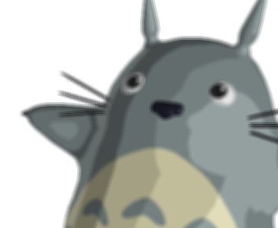 <!-- {.push-right style="max-height: 90px"} -->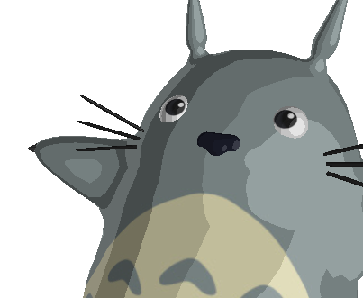 <!-- {.push-right style="max-height: 90px"} -->
    <div style="display: flex; align-items: center">
    <div class="math" style="font-size: 0.75em; margin-right: 0.75em;">\begin{bmatrix}1&1&1\\ 1&1&1 \\ 1&1&1\end{bmatrix}/9</div> ou <div class="math" style="font-size: 0.75em; margin-left: 0.25em;">\begin{bmatrix}1&2&1\\ 2&4&2\\ 1&2&1\end{bmatrix}/16</div>
    </div>

Aguçamento: <!-- {dd:style="margin-bottom:0"} -->
  ~ 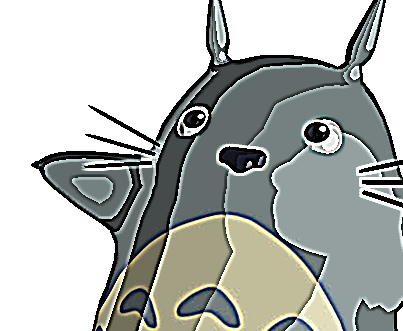 <!-- {.push-right style="max-height: 90px"} --> <!-- {.push-right style="max-height: 90px"} -->
    <div class="math" style="font-size: 0.75em">\begin{bmatrix}-1&-1&-1\\ -1&9&-1 \\ -1&-1&-1\end{bmatrix}</div>

Detec. de bordas:  <!-- {dd:style="margin-bottom:0"} -->
  ~ 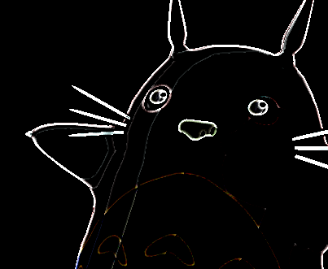 <!-- {.push-right style="max-height: 90px"} --> <!-- {.push-right style="max-height: 90px"} -->
    <div class="math" style="font-size: 0.75em">\begin{bmatrix}1&1&1\\ 1&-9&1 \\ 1&1&1\end{bmatrix}</div>

---
<!-- { "layout": "regular" } -->
# Discussão de desempenho

-  <!-- {.push-right} -->
   <!-- {.push-right.clear} -->
  Aumento de memória (insignificante)
- Aumento no tempo de renderização
  - O segundo passo (adicional) passa rapidinho pelo _vertex shader_ e gasta menos tempo que o primeiro no _fragment shader_
    - <span class="math">fragmentos > pixels</span>

---
<!-- { "layout": "section-header", "slideClass": "efeitos-complexos", "hash": "efeitos-complexos" } -->
# Efeitos complexos

- Exemplos:
  - _Depth of field_
  - _Bloom_
  - Oclusão ambiente

---
<!-- { "layout": "regular" } -->
# Tipos de efeitos complexos

- 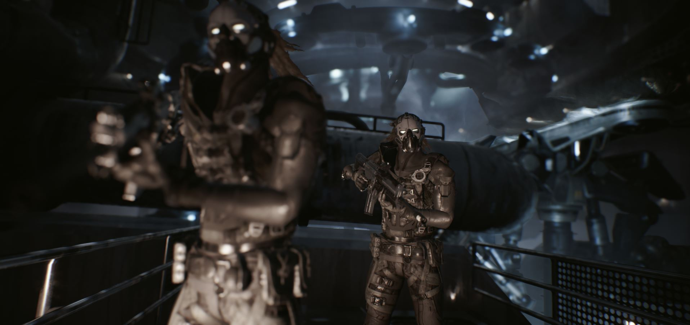
  ## _Depth of field_
- 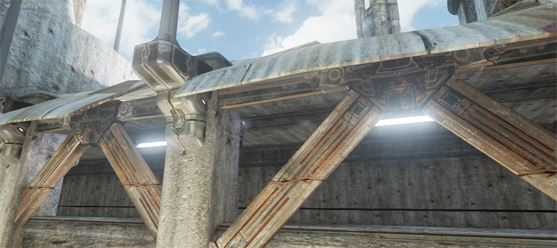
  ## _Bloom_
- 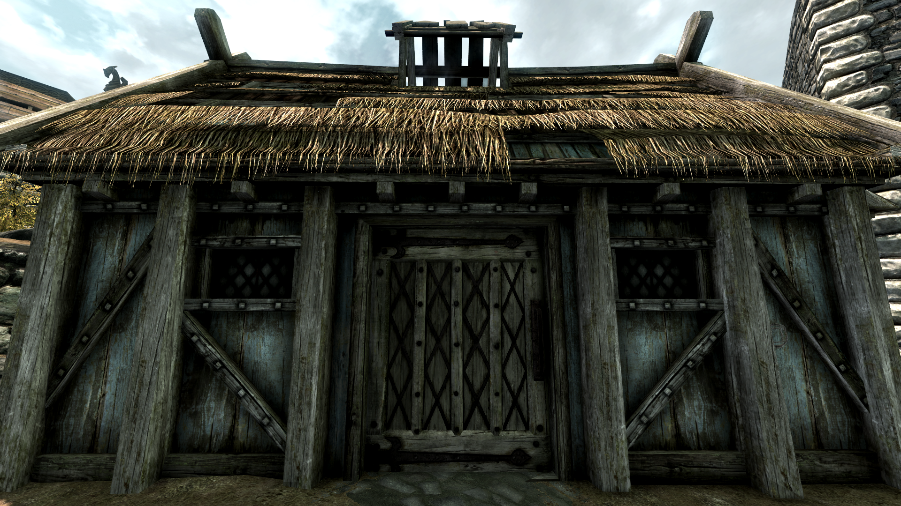
  ## Oclusão ambiente <!-- {ul:.card-list.no-margin} -->

1. 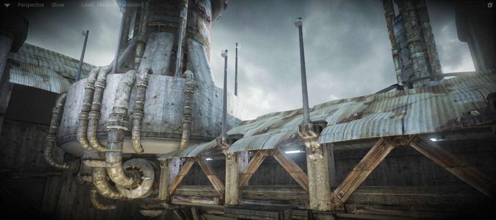
   ## _Vignette_
1. 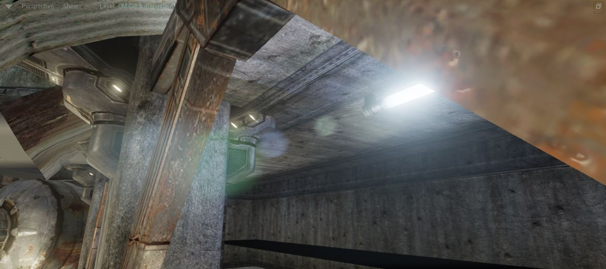
   ## _Lens flare_
1. 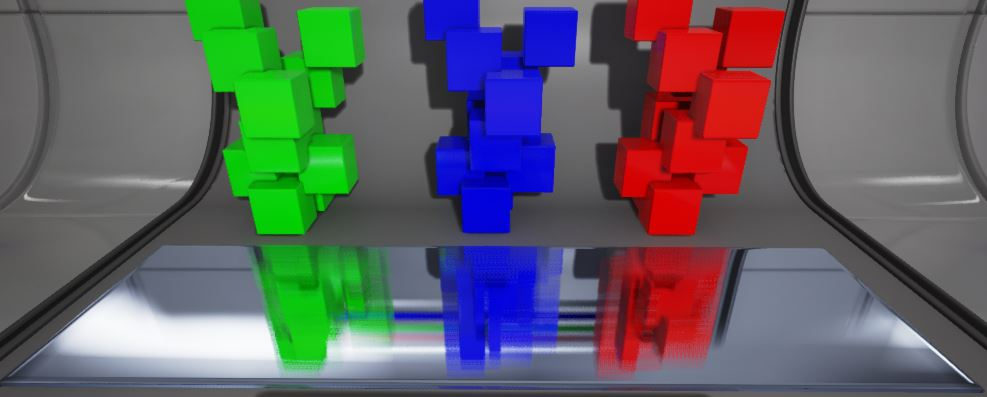
   ## SSR <!-- {ol:.card-list.no-margin} -->

*[SSR]: Screen space reflections*

---
<!-- { "layout": "regular" } -->
# Efeito _depth of field_

::: comparative .centered width: 800px; height: 377px;
 <!-- {.full-width} -->
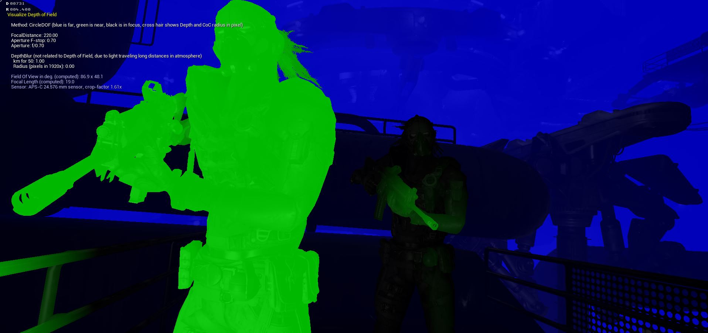
<figcaption><span class="push-left">Resultado</span><span class="push-right">Profundidade</span></figcaption>
:::

- **Ideia**: coisas além ou anteriores ao ponto focal aparecem borradas. Processo: <!-- {li:style="margin-left: 2em;} -->
  1. Usar o _depth buffer_ do primeiro passo no segundo
  1. Borrar apenas os fragmentos que estiverem além ou 
     antes do plano focal

---
<!-- { "layout": "regular" } -->
# Efeito _bloom_

- **Ideia**: objetos muito claros ao redor de outros muito escuros  <!-- {li:style="padding-right: 1em"} -->
  provocam um brilho intenso. Processo:
  1. Selecionar pixels claros
  1. Reduzir imagem
  1. Borrar com filtro grande
  1. Expandir para tam. normal
  1. Somar borrada à original
- Exemplo: <!-- {ul:.layout-split-2} --> <!-- {li:.no-padding.no-bullet style="min-width: 600px"} -->
  ::: comparative .centered width: 557px; height: 248px;
  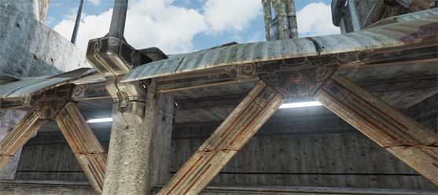
  
  <figcaption><span class="push-left">Pouco bloom</span><span class="push-right">Muito bloom</span></figcaption>
  :::

---
<!-- { "layout": "regular" } -->
# _Ambient occlusion_ (1/3)

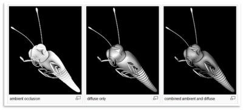 <!-- {p:.centered} -->

- A **oclusão ambiente** aprimora o realismo ao considerar a atenuação da luz
  devido a sua obstrução (_occlusion_)
  - Tenta-se aproximar o caminho da irradiação da luz
- Oclusão ambiente é um método de iluminação global, _i.e._, a iluminação
  em um ponto dada em função da geometria da cena

---
<!-- { "layout": "regular" } -->
# _Ambient occlusion_ (2/3)

- _Ambient Occlusion_ é normalmente calculada lançando raios em
  várias direções a partir da superfície
  - Raios que chegam ao "vazio" ou "céu" aumentam o brilho da superfície
  - Raios que acertam outros objetos não contribuem para iluminação
- 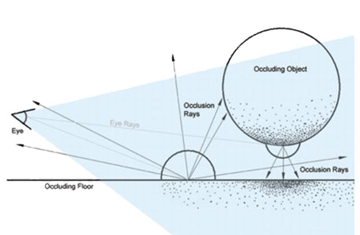 <!-- {.push-right} -->
  Resultado: **pontos rodeados por outros objetos ficam mais escuros** do que
  pontos com pouca geometria próxima

---
<!-- { "layout": "regular" } -->
# _**Screen Space** Ambient Occlusion_ (SSAO 3/3)

- Em tempo real, podemos apenas tentar aproximar o _ambient occlusion_
- SSAO é uma técnica
  de aproximação (introduzida pelo Crysis) que faz uso da profundidade
  (_z-buffer_) da cena renderizada
  - Compara a profundidade do fragmento corrente com a profundidade de alguns
    vizinhos para determinar se está obstruído ou não
  - O fragmento corrente está obstruído se a amostra está mais próxima do olho
    do que os fragmentos vizinhos
- Exemplo de [SSAO no Skyrim](https://www.youtube.com/watch?v=aStBEcs38TQ)

*[SSAO]: Screen Space Ambient Occlusion*

---
<!-- { "layout": "centered" } -->
::: comparative .centered width: 1000px; height: 562.5px
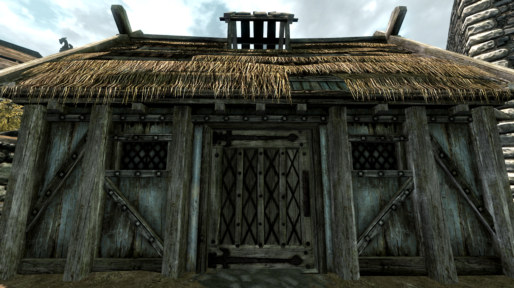 <!-- {style="max-width: 1000px"} -->
 <!-- {style="max-width: 1000px"} -->
<figcaption><span class="push-left">Sem SSAO</span><span class="push-right">Com SSAO</span></figcaption>
:::

---
<!-- { "layout": "section-header", "slideClass": "sombreamento-tardio", "hash": "sombreamento-tardio" } -->
# Sombreamento Tardio

- Ou _Deferred Shading_, _Deferred Rendering_
- É uma forma diferente de usar o _pipeline_ gráfico para gerar imagens

---
<!-- { "layout": "regular" } -->
# Um problema com o _pipeline_ tradicional

- Na renderização tradicional (_forward rendering_), a geometria é enviada
  ao _pipeline_, que (a) calcula suas posições e (b) a colore
- Um potencial problema é o **alto custo**
  <span class="math">O(geometria + fragmentos \times luzes)</span> associado à porção
  relacionada à **iluminação (b)**

::: figure .layout-split-2
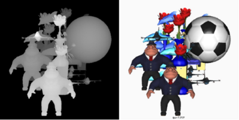 <!-- {p:.centered} -->
- Um pixel pode conter muitos fragmentos (de um objeto atrás do outro)
- A iluminação é feita para todos os fragmentos da cena
  - Mesmo aqueles que não contribuirão para o pixel
:::

---
<!-- { "layout": "regular" } -->
# Sombreamento Tardio (_Deferred Shading_)

- Renderização (ou Iluminação, ou Sombreamento) Tardia é a ideia de 
  **separar a renderização da geometria de sua colorização** (iluminação)
  - É um _hack_ inteligentão do _pipeline_
- Acontece em 2 passos:
  1. Renderização (sem cálculo de iluminação) da cena em 4+ texturas
  1. Combinação dessas texturas com as fontes de luz para gerar a imagem final
- Exemplo de cena com 1000 vértices:
  - (1) 1000 vértices vão para o _pipeline_ e a geometria é rasterizada,
    cálculo de iluminação, para texturas
    - Esse _frame buffer_ "profundo" se chama _g-buffer_
  - (2) as texturas são enviadas ao _pipeline_ em um segundo passo de
    renderização e o _fragment shader_ as combina, gerando a imagem final

---
<!-- { "layout": "centered-horizontal" } -->
# 1º passo: geração do _g-buffer_ <!-- {h1:style="transform: scale(0.8)"} -->

::: figure
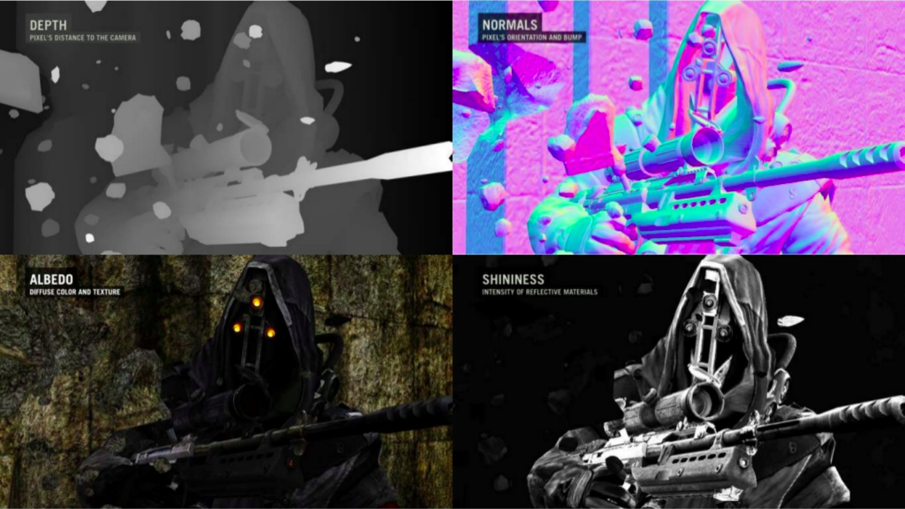 <!-- {style="height: 445px"} -->
<figcaption>Killzone 2 (Guerrilla Games, 2009)</figcaption>
:::

---
<!-- { "layout": "centered-horizontal", "state": "show-active-slide-and-previous" } -->
# 2º passo: combinação _g-buffer_ e iluminação <!-- {h1:style="transform: scale(0.8)"} -->
 
::: figure
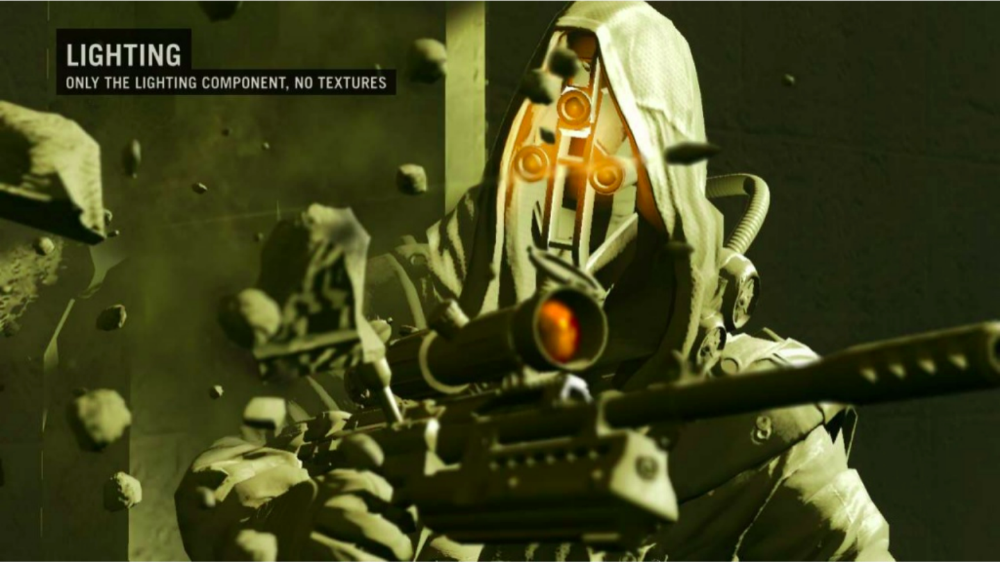 <!-- {style="height: 445px"} -->
:::

---
<!-- { "layout": "regular" } -->
# Vantagens e Desvantagens

- 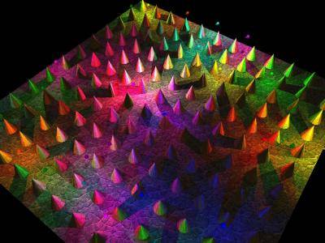 <!-- {.push-right} -->
  Uma grande vantagem é a possibilidade de usar um **número muito maior de
  fontes de luz**
  - A complexidade é<br><span class="math">O(geometria + pixels \times luzes)</span>
  - Apenas os pixels afetados por uma fonte de luz precisam ter sua iluminação
    calculada para ela
- Desvantagens:
  - Difícil lidar com objetos transparentes
    - Nesse caso, usa-se abordagem híbrida (_forward + deferred_)
---
<!-- { "layout": "centered", "backdrop": "trine-many-lights", "fullPageElement": "#trine-2-video", "playMediaOnActivation": {"selector": "#trine-2-video", "delay": "400" } } -->
<!-- # Trine 2 {style="color: white"} -->
  
<video src="../../videos/trine-2.webm" width="100%" loop="0" id="trine-2-video"></video>


---
<!-- { "layout": "centered" } -->
# Referências

- Livro _Game Engine Architecture, Second Edition_
  - Capítulo 10: _The Rendering Engine_
- Livro _Real-Time Rendering, Third Edition_
  - Capítulo 10: _Image-Based Rendering_
  - Capítulo 14: _Acceleration Algorithms_
- Efeito _bloom_: [_how to do good bloom for HDR rendering_][bloom]


[bloom]: http://harkal.sylphis3d.com/2006/05/20/how-to-do-good-bloom-for-hdr-rendering/
