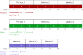
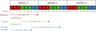
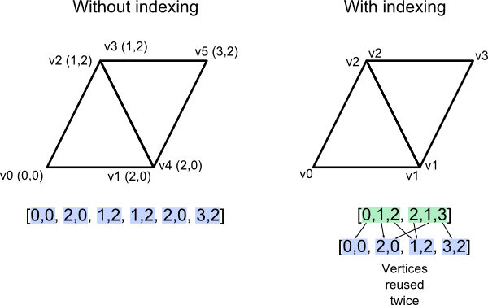
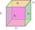

<!-- {"layout": "title"} -->
# Otimização de Primitivas
## Fazendo código rapidão

---
<!-- {"layout": "centered"} -->
# Hoje veremos...

1. Reaproveitando VBOs e VAOs
1. VBO intercalado
1. Índices de vértices (IBO)
1. _Instance drawing_ 
1. _Uniform blocks_


*[VBO]: Vertex Buffer Object 
*[VBOs]: Vertex Buffer Objects 
*[VAO]: Vertex Array Object 
*[VAOs]: Vertex Array Objects
*[IBO]: Index Buffer Object 

---
<!-- {"layout": "regular"} -->
# Reaproveitando VBOs e VAOs <small>(1/2)

- <!-- {ul:.push-code-right.compact-code-more} -->
  ```javascript
  function cubo(programa) {
    const h = 0.5
    const vertices = [
      // face de cima (y=+1)
      -h, h, h,   h, h, h,   h, h, -h,    -h, h, -h,
      // face de baixo (y=-1)...
    ]
    const normais = [
      // ...
    ]
    // ...

    return {      // retorna:
      vao,        // 1) VAO criado
      draw(gl) {  // 2) função que desenha
        gl.drawArrays(...)
      }
  }
  ```
  Definindo objetos na origem e usando transformações de modelo:
  - Reaproveitamos seus VBOs
- E podemos usar um único VAO para todos objetos que seguem essa especificação
  também
  - Trocar o VAO atual com `gl.bindVertexArray(vao)` é baratinho
  - Mas dá pra otimizar <u>um pouco</u> reaproveitando o mesmo VAO

*[VBO]: Vertex Buffer Object 
*[VBOs]: Vertex Buffer Objects 
*[VAO]: Vertex Array Object 
*[VAOs]: Vertex Array Objects

---
<!-- {"layout": "regular", "slideClass": "compact-code-more"} -->
# Reaproveitando VBOs e VAOs <small>(2/2)

1. <!-- {ol:.no-bullet.no-margin.no-padding.three-column-code} -->
   ```javascript
   const cena = {
     geometria: {
       cubo: cubo(),
       esfera: esfera(),
     },
     objetos: [
       {
         tipo: 'cubo',
         tamanho: [5, 1, 1],
         centro: [10, 0, 1],
         cor: [.3, .1, 1]
       },
       {
         tipo: 'cubo',
         tamanho: [2, 1, 6],
         centro: [0, 3, 1],
         cor: [.5, 0, 1]
       },
       {
         tipo: 'esfera',
         tamanho: [1, 1, 1],
         centro: [1, 2, 1],
         cor: [0, 1, .6]
       }
     ]
   }
   ```

- Separamos o armazenamento da geometria (VBOs e VAOs) dos objetos 
  que as utilizarão
  ```javascript
  // Na desenhaCena():
  const todosCubos = cena.objetos.filter(o => tipo === 'cubo')
  gl.bindVertexArray(cena.geometria.cubo.vao)
  for (let cube of todosCubos) {
    // configura as uniforms deste cubo
    // ...
    cena.geometria.cubo.draw(gl)
  }
  const todasEsferas = //...
  ```

---
<!-- {"layout": "section-header"} -->
# VBO intercalado
## _Vertex layout_
- 1x VBO por atributo (como já fazemos)
- 1x VBO com todos 🆕

---
<!-- {"layout": "regular", "backdrop": "white-noise"} -->
# O que são: `offset` e `stride`? <!-- {h1:.bullet} -->

```javascript
gl.vertexAttribPointer(
  location,     // localização (índice do atributo)
  dimensions,   // quantas dimensões (2, 3 ou 4)
  dataType,     // gl.FLOAT, gl.DOUBLE etc.
  normalized,   // se deve normalizar, caso int->float/double
  stride,       // ⬅️ salto por vértice
  offset        // ⬅️ salto inicial
)
```
Temos usado `0` para os dois <!-- {p:.centered.bullet style="margin-block: 0.5rem;"} -->

Vamos ver um exemplo com 3 VBOs <!-- {p.centered.bullet style="margin-block: 0;"} -->

---
<!-- {"layout": "regular"} -->
# 1x VBO para cada atributo

- <!-- {ul:.no-margin.no-padding.layout-split-2.compact-code-more style="gap: 2rem;"} -->
  <!-- {li:.no-bullet} -->
  
  <!-- {style="width: 500px;"} -->
- `stride=0`: o _array_ está compactado
  - Mesmo que `stride=12` para posição e cor
  - `offset=0`: começar do início
    - Ambos informados em _bytes_
  ```javascript
  // definindo a cena... VBO de posição
  const vboPosicao = gl.createBuffer()
  gl.bindBuffer(gl.ARRAY_BUFFER, vboPosicao)
  gl.bufferData(gl.ARRAY_BUFFER, coords, 
                              gl.STATIC_DRAW)
  gl.enableVertexAttribArray(coordsLoc)
  gl.vertexAttribPointer(coordsLoc, 3, 
                        gl.FLOAT, false, 0, 0)
                        //              ⬆️ ⬆️
  // agora, VBO de cor
  // ...
  ```

---
<!-- {"layout": "main-point"} -->
# Podemos otimizar...

Em vez de 1x VBO por atributo, podemos usar 1 só para todos

Ganhamos em: <!-- {p:.no-margin} -->
- Localidade de referência espacial <!-- {ul:.no-margin} -->
- Especialmente para objetos grandes

---
<!-- {"layout": "regular"} -->
# 1x **VBO intercalado**

- <!-- {ul:.no-margin.no-padding.compact-code-more.layout-split-2 style="gap: 1rem;"} -->
  Todos dados de cada vértice **ficam contíguos**
  - Exemplo:
    1. coordenadas <!-- {ol:.layout-split-3 style="gap: 3rem;"} -->
    1. cor
    1. coord. text.
  ```javascript
  const unicoVBO = gl.createBuffer()
  gl.bindBuffer(gl.ARRAY_BUFFER, unicoVBO)
  gl.bufferData(new Float32Array([
    // coords     // cor      // coord. tex.
    -1, -1, 0,    1, 0, 0,    0, 0,
     1, -1, 0,    0, 1, 0,    1, 0,
     1,  1, 0,    0, 0, 1,    1, 1,
    -1,  1, 0,    1, 1, 1,    0, 1
  ]))
  // habilitamos 3 atributos e os definimos
  gl.enableVertexAttribArray(coordLoc)
  gl.enableVertexAttribArray(corLoc)
  gl.enableVertexAttribArray(texLoc)
  // continua...                          aqui:↗️
  ```
- <!-- {li:.no-bullet} -->
  
  <!-- {style="width: 500px;"} -->
  ```javascript
  // atributo de coordenadas
  gl.vertexAttribPointer(coordLoc, 3, gl.FLOAT,
                      false, 32, 0)
                  // stride ↗️   ↖️ offset
  // atributo de cor
  gl.vertexAttribPointer(corLoc, 3, gl.FLOAT,
                      false, 32, 12)
  // atributo de coordenada de textura
  gl.vertexAttribPointer(texLoc, 3, gl.FLOAT,
                      false, 32, 24)
  ```

---
<!-- {"layout": "regular"} -->
# Múltiplos VBOs ↙️ vs ↘️ VBO intercalado <!-- {h1:.full-width.center-aligned} -->

- <!-- {ul:.no-bullet.no-margin.no-padding.layout-split-2 style="gap: 1rem; height: auto;"} -->
  
  <!-- {style="width: 500px;"} -->
- 
  <!-- {.bullet style="width: 500px;"} -->

Quando há muitos vértices, o _shader_ pode buscar todos atributos de uma vez
<br>e **aproveitar o _cache_** <small>(localidade de referência espacial + temporal)</small>
<!-- {p:.note.info.centered.bullet style="font-size: 0.7em; margin-block: 0.5rem;"} -->

---
<!-- {"layout": "section-header"} -->
# Índices de Vértices
## Evitando repetir dados

---
<!-- {"layout": "centered-horizontal"} -->
# Sem índices ↙️ &nbsp; vs &nbsp; ↘️ com índices

 <!-- {.bullet style="width: 450px; margin-top: 3rem;"} -->

Repetimos coordenadas sempre que há uma aresta dividida por 2+ triângulos.
<!-- {p:.center-aligned.full-width.bullet} -->

---
<!-- {"layout": "regular", "slideClass": "compact-code-more"} -->
# Especificando índices com IBO

- São 2 passos:
  1. Além dos VBOs, especificamos um _buffer_ com índices <!-- {li:.bullet} -->
     - Em vez de `ARRAY_BUFFER`, ele é do tipo `ELEMENT_ARRAY_BUFFER` <!-- {li:.bullet} -->
       ```javascript
       const indices = new Uint16Array([0, 1, 2, 2, 1, 3])
       const ibo = gl.createBuffer()
       gl.bindBuffer(gl.ELEMENT_ARRAY_BUFFER, ibo)
       gl.bufferData(gl.ELEMENT_ARRAY_BUFFER, indices, gl.STATIC_DRAW)
       ```
  1. Ao desenhar, chamamos <s>`gl.drawArrays()`</s> `gl.drawElements()`: <!-- {li:.bullet} -->
     ```javascript
     // desenha VAO atual, mas usando índices (consultado o IBO)
     gl.drawElements(
       primitiva,         // normalmente, gl.TRIANGLES
       indices.length,    // quantos índices
       gl.UNSIGNED_SHORT, // tipo de dados (Uint16Array)
       offset             // normalmente 0
     )
     ```

*[IBO]: Index Buffer Object
*[VBOs]: Vertex Buffer Objects

---
<!-- {"layout": "regular"} -->
# Desenhando um cubo

- <!-- {ul:.bulleted.full-width} -->
   <!-- {.push-right} -->
  Um cubo possui 8 vértices únicos
- Mas com `gl.TRIANGLES` cada coordenada repete pelo menos 3x
- Vamos reaproveitar usando _Index Buffer Objects_ (IBOs):
  > IBO é um _buffer_ que contém índices para os vértices da primitiva <!-- {blockquote:style="width: 500px; margin-left: 5rem;"} -->
- Bora montar um para um cubo!
  - Usando `gl.TRIANGLES`, precisamos de 36 índices (<span class="math">6f\times 2tri\times 3índ</span>)
    1. Primeiro: do jeito "errado" (apenas 8 coordenadas)
    1. Depois: do jeito certo (24 coordenadas)

*[IBO]: Index Buffer Object
*[IBOs]: Index Buffer Objects

---
<!-- {"layout": "regular", "slideClass": "compact-code-more two-column-code cubo-errado",
"styles": "../../styles/classes/indexed-cube.css"} -->
# Cubo com índices: jeito errado

- ```javascript
  const h = 0.5
  const coords = [
    // os de cima
    -h,  h, -h,
     h,  h, -h,
     h,  h,  h,
    -h,  h,  h,
    // os de baixo
    -h, -h, -h,
     h, -h, -h,
     h, -h,  h,
    -h, -h,  h
  ]

  const normals = [
    0,  1, 0, // ⬆️
    0,  1, 0,
    0,  1, 0,
    0,  1, 0,
    0, -1, 0, // ⬇️
    0, -1, 0,
    0, -1, 0,
    0, -1, 0
  ]
  const indices = [
    // cima
    0,1,2,  2,3,0,
    // baixo
    4,5,6,  6,7,4,
    // esquerda
    5,7,4,  4,0,5,
    // dieita
    6,5,1,  1,2,6,
    // frente
    7,6,2,  2,3,7,
    // costas
    5,4,0,  0,1,5
  ]
  ```
  <!-- {ul:.no-bullet.no-padding.no-margin.full-width.layout-split-2 style="gap: 1rem;"} -->
- <!-- {li:style="flex: 1;"} -->
  <div class="indexed-cube-container">
    <div class="indexed-cube">
      <div class="face face-front">Frente</div>
      <div class="face face-right">Direita</div>
      <div class="face face-back">Costas</div>
      <div class="face face-left">Esquerda</div>
      <div class="face face-top">Cima
        <span class="vertex l-b" data-normal="(0, 1, 0)"></span>
        <span class="vertex r-b" data-normal="(0, 1, 0)"></span>
        <span class="vertex r-t" data-normal="(0, 1, 0)"></span>
        <span class="vertex l-t" data-normal="(0, 1, 0)"></span>
      </div>
      <div class="face face-bottom">Baixo
        <span class="vertex l-b" data-normal="(0, -1, 0)"></span>
        <span class="vertex r-b" data-normal="(0, -1, 0)"></span>
        <span class="vertex r-t" data-normal="(0, -1, 0)"></span>
        <span class="vertex l-t" data-normal="(0, -1, 0)"></span>
      </div>
    </div>
  </div>
  <ul style="margin-top: 5rem;">
    <li><strong>Problema:</strong> normais apenas cima/baixo</li>
    <li>Vamos precisar ter vértices/normais o suficiente</li>
  </ul>

---
<!-- {"layout": "regular", "slideClass": "compact-code-more two-column-code cubo-errado",
"styles": "../../styles/classes/indexed-cube.css"} -->
# Cubo com índices: jeito certo 🌟

- ```javascript
  const h = 0.5
  const coords = [
    // os de cima
    -h,  h, -h,
     h,  h, -h,
     h,  h,  h,
    -h,  h,  h,
    // os de baixo
    -h, -h, -h,
     h, -h, -h,
     h, -h,  h,
    -h, -h,  h,
    // esquerda... 
    // dir, f, tr
    //  *️⃣ *️⃣ *️⃣
  ]

  const normals = [
     0,  1, 0, // ⬆️
     0,  1, 0,
     0,  1, 0,
     0,  1, 0,
     0, -1, 0, // ⬇️
     0, -1, 0,
     0, -1, 0,
     0, -1, 0,
    -1,  0, 0, // ⬅️
    // ....       *️⃣
  ]
  const indices = [
    // cima
    0,1,2,  2,3,0,
    // baixo
    4,5,6,  6,7,4,
    // esquerda *️⃣
    8,9,10,10,11,8,
    // direita  *️⃣
    // ...
  ]
  ```
  <!-- {ul:.no-bullet.no-padding.no-margin.full-width.layout-split-2 style="gap: 1rem;"} -->
- <!-- {li:style="flex: 1;"} -->
  <div class="indexed-cube-container">
    <div class="indexed-cube correct">
      <div class="face face-front">Frente
        <span class="vertex l-b" data-normal="(0, 0, 1)"></span>
        <span class="vertex r-b" data-normal="(0, 0, 1)"></span>
        <span class="vertex r-t" data-normal="(0, 0, 1)"></span>
        <span class="vertex l-t" data-normal="(0, 0, 1)"></span>
      </div>
      <div class="face face-right">Direita
        <span class="vertex l-b" data-normal="(1, 0, 0)"></span>
        <span class="vertex r-b" data-normal="(1, 0, 0)"></span>
        <span class="vertex r-t" data-normal="(1, 0, 0)"></span>
        <span class="vertex l-t" data-normal="(1, 0, 0)"></span>
      </div>
      <div class="face face-back">Costas
        <span class="vertex l-b" data-normal="(0, 0, -1)"></span>
        <span class="vertex r-b" data-normal="(0, 0, -1)"></span>
        <span class="vertex r-t" data-normal="(0, 0, -1)"></span>
        <span class="vertex l-t" data-normal="(0, 0, -1)"></span>      
      </div>
      <div class="face face-left">Esquerda
        <span class="vertex l-b" data-normal="(-1, 0, 0)"></span>
        <span class="vertex r-b" data-normal="(-1, 0, 0)"></span>
        <span class="vertex r-t" data-normal="(-1, 0, 0)"></span>
        <span class="vertex l-t" data-normal="(-1, 0, 0)"></span>
      </div>
      <div class="face face-top">Cima
        <span class="vertex l-b" data-normal="(0, 1, 0)"></span>
        <span class="vertex r-b" data-normal="(0, 1, 0)"></span>
        <span class="vertex r-t" data-normal="(0, 1, 0)"></span>
        <span class="vertex l-t" data-normal="(0, 1, 0)"></span>
      </div>
      <div class="face face-bottom">Baixo 
        <span class="vertex l-b" data-normal="(0, -1, 0)"></span>
        <span class="vertex r-b" data-normal="(0, -1, 0)"></span>
        <span class="vertex r-t" data-normal="(0, -1, 0)"></span>
        <span class="vertex l-t" data-normal="(0, -1, 0)"></span>
      </div>
    </div>
  </div>
  <ul style="margin-top: 5rem;">
    <li><strong>Resolvido:</strong> normais individuais, de acordo com face</li>
  </ul>


---
<!-- {"layout": "section-header", "hash": "instance-drawing"} -->
# _Instance Drawing_

---
<!-- {"layout": "regular", "slideClass": "compact-code-more"} -->
# Motivação

- <!-- {ul:.push-code-right} -->
  ```javascript
  // ativa o VAO da moita
  gl.bindVertexArray(cena.geometria.moita)
  for (let moita of cena.objetos) {
      // ativa texturas, define uniforms etc.
      preparaMoita(moita) 
      cena.geometria.moita.draw(gl)
  }
  ```
  Sempre tentamos reduzir o número de chamadas de desenho
- Quando há um número enorme de objetos iguais em situações diferentes:
  <!-- {li:.bullet} -->
  - A função `preparaMoita(moita)` precisa fazer muitas chamadas à API: <!-- {li:.bullet} -->
    1. Várias `gl.uniform` <!-- {ol:.multi-column-list-3} -->
    1. `gl.bindTexture`
    1. `gl.activeTexture` etc.
  - Podemos otimizar com **desenho de instâncias**! <!-- {li:.bullet} -->
    - Útil para muitos objetos com a mesma geometria
      1. Moitas de grama <!-- {ol:.multi-column-list-4} -->
      1. Arbustos
      1. Folhagens
      1. Partículas etc.

---
<!-- {"layout": "regular"} -->
# Desenho de Instâncias

- São 4 passos: <!-- {ul:.bulleted} -->
  1. Substituímos `uniform` por atributo `in` no _shader_
     - Por exemplo, para a cor, **posição** <!-- {.alternate-color} --> ou tamanho
  1. Configuramos o atributo passando os valores para cada objeto
     - `gl.vertexAttribPointer`
  1. Configuramos a cada quantos vértices o _shader_ deve buscar o próximo valor
     - 🆕 `gl.vertexAttribDivisor`
  1. Desenhamos:
     - <s>`gl.drawArrays`</s> ➡️ `gl.drawArraysInstanced` 
     - <s>`gl.drawElements`</s> ➡️ `gl.drawElementsInstanced`
- Vamos ver um exemplo, para a **posição** <!-- {.alternate-color} --> da moita...

---
<!-- {"layout": "regular", "slideClass": "compact-code-more", "style": "padding-bottom: 0;"} -->
# Desenho de Instância: 3x moitas

- <!-- {ul:.no-padding.no-margin.no-bullet.layout-split-2 style="gap: 1rem;"} -->
  `vertex.glsl`
  ```diff
  #version 300 es

  in vec3 a_coords
  // 1. substituir uniform por in
  + in vec3 a_positionInWorld
  - uniform vec3 u_positionInWorld

  void main() {
  -   gl_Position = u_positionInWorld * a_coords
  +   gl_Position = a_positionInWorld * a_coords
  }
  ```
- `main.js`
  ```javascript
  // 2.a. VBO com a posição de cada moita (3x instâncias)
  const moitaVBO = criaVBO([20,0,0,  30,0,0,  40,0,0])
  // 2.b. configura atributo
  gl.vertexAttribPointer(piwLoc, 3, gl.FLOAT, false, 0, 0)
  // 3. configura quantas instâncias terão o mesmo valor 🆕
  gl.vertexAttribDivisor(piwLoc, 1)
  
  // 4. desenha usando "versão instanced"
  gl.drawArraysInstanced(gl.TRIANGLE_FAN, 0, 
    4,  // vértices por instância
    3   // instâncias
  )
  ```

::: sample instanced-drawing .centered width: 100%; min-height: 150px;
:::


---
<!-- {"layout": "centered"} -->
# Tópicos não abordados

- `gl.bufferSubData(...)` para atualizar apenas um pedaço de um VBO
- Uniform Buffer Object (UBO)
  - Bom quando há uniformes demais e elas estão estruturadas
- Múltiplos _render targets_
  - Desenhar em vários FBOs de uma vez para otimizar _deferred shading_
  
*[UBO]: Uniform Buffer Object
