<!-- {"layout": "title"} -->
# Otimização de Cenas

---
<!-- {"layout": "centered"} -->
# Roteiro

1. [Grafo de cena](#grafo-de-cena)
1. [Descarte de objetos](#descarte-de-objetos)
1. [_Level of Detail_](#level-of-detail)

---
<!-- { "layout": "section-header", "slideClass": "grafo-de-cena", "slideHash": "grafo-de-cena" } -->
# Grafo de Cena

---
<!-- { "layout": "regular" } -->
# Uma cena de jogo (1/2)

::: figure .centered
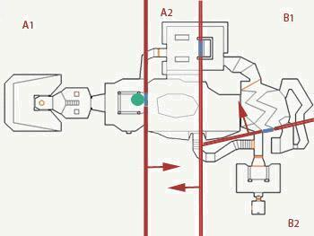
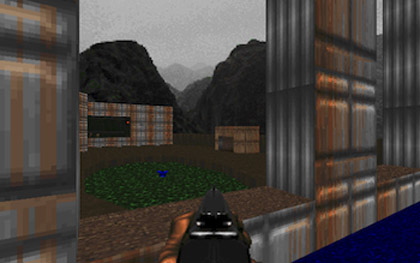
:::

- **Mundos** de jogo podem ser **bem grandes**
- A **maior parte da cena** tipicamente está **fora do _frustum_** da câmera

---
<!-- { "layout": "regular" } -->
# Uma cena de jogo (2/2)

- Deixar que a **GPU recorte** a cena <u>toda</u> pode ser **custoso**
  - Devemos tentar **enviar para renderização** apenas os objetos que podem
    **estar no _frustum_**
  - Precisamos de uma **estrutura de dados** para armazenar os objetos da cena:
    1. De forma estruturada e organizada
    1. **Armazenando informação espacial** dos objetos para otimizar a
      renderização
- Podemos usar um **grafo de cena** (tipicamente uma árvore) para tornar fácil
  **descartar partes da cena** que estejam **fora do _frustum_**

---
<!-- { "layout": "regular" } -->
# Grafo de Cena

- 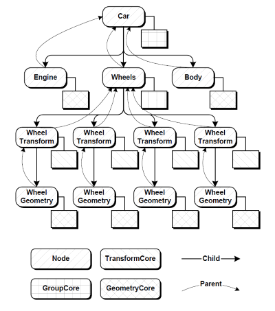 <!-- {.push-right} -->
  Segundo Akenine-Müller, é uma:

  Estrutura em árvore, "orientada ao usuário", que armazena
  a geometria da cena, mas também texturas, transformações, níveis de
  detalhamento, fontes de luz etc. <!-- {.note.info style="max-width: 50%"} -->
- Para desenhar a cena, basta percorrer a árvore chamando `this.renderiza()` em
  cada nó.

---
<!-- { "layout": "regular" } -->
# Grafo de Cena **na Unity**

::: figure .centered
 <!-- {.push-left} -->
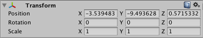 <!-- {.push-right} -->
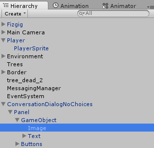 <!-- {.push-right} -->
:::

---
<!-- { "layout": "regular" } -->
# <u>Otimização</u>: **_Frustum Culling_**

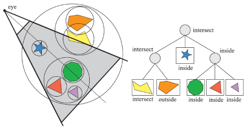 <!-- {p:.centered} -->

- Particiona-se o espaço (_e.g._, _grid_, _octree_) ou a cena
  (_e.g._, BVH) de forma amostral
- Testa-se cada partição contra o _frustum_ (de forma barata)
- É possível podar a árvore usando a informação espacial

*[BSP]: Binary Space Partitioning*
*[BVH]: Bounding Volume Hierarchy*

---
<!-- { "layout": "regular", "fullPageElement": "#video-frustum-culling" } -->
<iframe src="https://www.youtube.com/embed/fNa_Gh5gFWY" frameborder="0" allowfullscreen id="video-frustum-culling"></iframe>

---
<!-- { "layout": "regular" } -->
# <u>Otimização</u>: **_Occlusion Culling_**

::: figure .centered
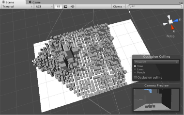
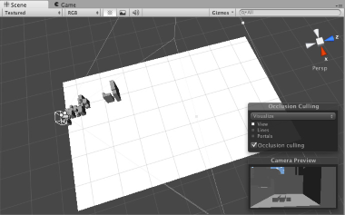
:::

- Ideia: **não desenhar** objetos que estão **atrás de outros** (que são opacos)
- Implementação no espaço: (a) de imagem (projeção), (b) de objeto, (c) de raio
- Recentemente: **_occlusion queries_** feitas no **_hardware_**
  - Rasteriza objeto _off-screen_ e compara com o _z-buffer_

---
<!-- { "layout": "regular" } -->
# Escolhendo Grafo de Cena + Otimização

- A escolha da estrutura de dados e técnica(s) de otimização dependem
  do "problema" (normalmente, do estilo de jogo). Por exemplo:
  1. **Jogo de luta**: dois personagens lutando em um ringue com ambiente
    estático (exclua Mortal Kombat aqui)
    - Não é necessário otimizar
  1. **Jogo de RTS**: terreno aproximadamente plano, com visão aérea
    - Grafo de cena com uma _quadtree_, fazendo _frustum culling_
  1. **Jogo com câmera FP**: cenário com alta densidade de objetos grandes
    - Grafo de cena com _octree_, fazendo _frustum_ + _occlusion culling_
  1. **Jogo com câmera FP**: cenário mais esparso
    - Grafo de cena com _octree_, fazendo _frustum culling_ apenas

---
<!-- { "layout": "section-header", "slideClass": "level-of-detail" } -->
# _Level of Detail_ (LOD)

---
<!-- { "layout": "regular" } -->
# Nível de Detalhamento (LOD)

- 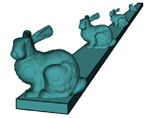 <!-- {.push-right} -->
  _Level of detail_ involve reduzir a complexidade de um objeto a ser
  renderizado ao passo que ele se distancia da câmera ou outra métrica:
  - importância,
  - velocidade relativa ao espaço da câmera, etc.
- Usando LOD, usamos mais memória (RAM) em troca de menos
  trabalho no _pipeline_ gráfico (menos vértices) sendo
  transformados/iluminados
- A qualidade visual reduzida do modelo tipicamente não é notada porque
  o efeito é reduzido pela distância ou velocidade

---
<!-- { "layout": "regular" } -->
# Tipos de LOD

- 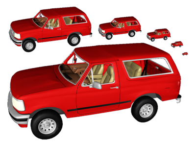 <!-- {.push-right} -->
  **Discreto**:
  - Construir um número finito de modelos com número de polígonos
  variando
- **Contínuo**:
  - Codificar um espectro contínuo de detalhes de baixo a alto
- **Dependente da visualização**:
  - Ajustar detalhes do modelo de acordo com o _viewpoint_

---
<!-- { "layout": "regular" } -->
# LOD **Discreto**

- Abordagem mais simples:
  - Em tempo de execução, apenas o modelo adequado é selecionado e renderizado
- Pros:
  - Funciona bem com as GPUs atuais (_display list_)
  - Mais rápido que LOD contínuo (modo imediatista)
- Cons:
  - Possibilidade de _popping_ durante a troca de nível

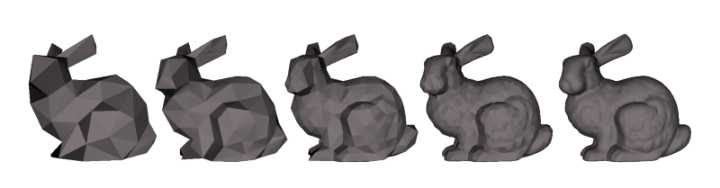 <!-- {p:.centered} -->

---
<!-- { "layout": "regular" } -->
# Problema: _popping_

<iframe width="640" height="360" src="https://www.youtube.com/embed/KfeFcZDjCRg?rel=0" frameborder="0" allowfullscreen class="centered"></iframe>

- Exemplo do jogo Arma 2 (2009)

---
<!-- { "layout": "regular" } -->
# LOD **Contínuo**

- O LOD discreto constrói um número finito de visões
  estáticas do objeto
- O LOD contínuo constrói **uma estrutura de dados a partir da qual extrai-se
  um modelo no nível desejado** em tempo de execução
  - Usa-se, para tanto, os **_shaders_ de geometria e tecelagem**
- Pros:
  - Maior fidelidade ao modelo
  - Melhor granularidade
- Cons:
  - Mais caro

---
<!-- { "layout": "regular" } -->
# LOD Contínuo: Exemplo

<iframe width="480" height="360" src="https://www.youtube.com/embed/2IMyQUTv9Vk?rel=0" frameborder="0" allowfullscreen class="centered"></iframe>

---
<!-- { "layout": "regular" } -->
# LOD **Dependente da Visualização**

- 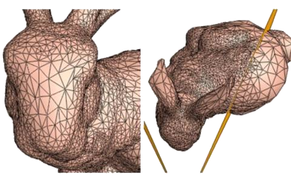 <!-- {.push-right} -->
  É um tipo especial de LOD contínuo que considera o ângulo de visualização
- O algoritmo aloca polígonos onde são mais necessários baseado na câmera
- Pros:
  - Objetos grandes são bem melhor amostrados onde estão sendo visualizados

---
<!-- { "layout": "regular" } -->
# LOD **Dependente da Visualização**: Exemplo

<iframe width="640" height="360" src="https://www.youtube.com/embed/Gmp-WbfF8b8?rel=0" frameborder="0" allowfullscreen class="centered"></iframe>

- Liktor et al (2014): [_Fractional Reyes-Style Adaptive Tessellation for Continuous Level of Detail_](http://cg.ivd.kit.edu/FracSplit.php)

---
<!-- { "layout": "regular" } -->
# LOD de **Texturas: _Mipmapping_**

- 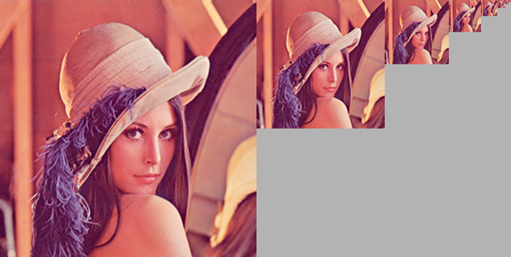 <!-- {.push-right} -->
  A técnica de _mipmapping_ de texturas também é LOD
  - **Reduz _aliasing_** causado por filtragem de redução pobre quando
    **uma textura grande é aplicada a uma região pequena da tela**
- [Exemplo de CG](http://fegemo.github.io/cefet-cg/classes/textures/#33)
