<!-- {"layout": "title"} -->
# Projeção

---
<!-- {"layout": "centered"} -->
# Objetivos

1. Entender a transformação de uma cena em 3D para 2D
1. Conhecer as matrizes de projeção ortogonal e perspectiva
1. Entender o posicionamento de câmera

---
<!-- {"layout": "regular", "embedSVG": "img[src$='.svg']", "embeddedStyles": ".pipeline-fases .aplicacao, .pipeline-fases .rasterizacao { fill: #ddd !important; stroke: #333 !important;} .geometria .etapa1, .geometria .etapa2, .geometria .etapa4, .geometria .etapa5 {fill: #ddd !important; stroke: #333 !important;}"} -->
# Relembrando o pipeline gráfico

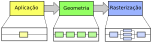 <!-- {p:.centered} --> <!-- {.pipeline-fases} -->

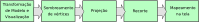 <!-- {p:.centered} --> <!-- {.geometria} -->

---
<!-- {"layout": "regular"} -->
## Projeção **em Computação Gráfica**

- Transformações de projeção são aquelas capazes de representar pontos
  ou objetos a partir de um espaço tridimensional (uma cena) em um plano
  bidimensional (uma imagem).
- Trata-se de (i) transformar o volume de visualização no volume
  de visualização canônico (cubo com raio 1) e (ii) guardar as coordenadas
  <span class="math">z</span> dos vértices no _z-buffer_
  ::: figure .layout-split-2.no-margin
  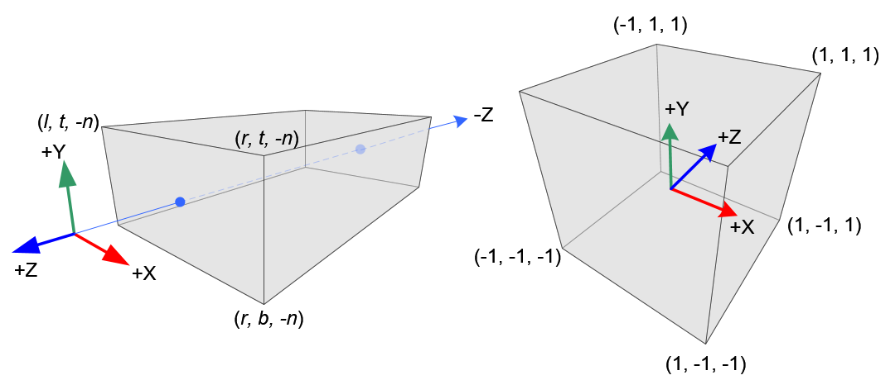 <!-- {style="max-height: 150px"} -->
  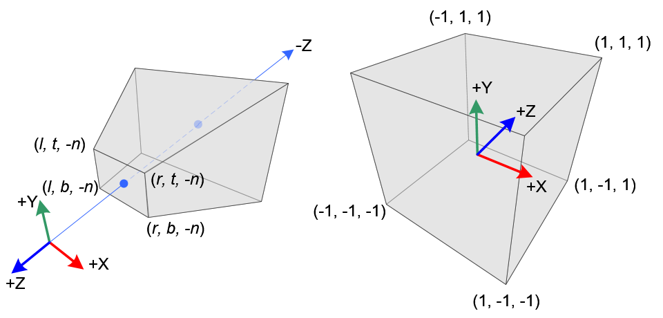 <!-- {style="max-height: 150px"} -->
  :::
- Essa transformação é feita por meio de **uma matriz que vai multiplicar as
  coordenadas dos vértices**, assim como as outras transformações que vimos

---
<!-- {"layout": "regular"} -->
## Elementos da projeção

1. 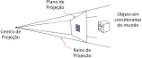 <!-- {.push-right style="max-height: 130px"} -->
   **Plano de projeção**: <!-- {ol:.full-width.no-margin} -->
   - Definido pelo sistema de coordenadas da câmera
1. **Raios de projeção**:
   - Ligam um ponto no espaço 3D à imagem 2D representada no plano de projeção
1. **Centro de projeção**:
   - Ponto fixo na cena de onde todos os raios de projeção surgem

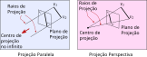 <!-- {style="max-height: 200px;"} --> <!-- {p:.centered} -->

---
<!-- {"layout": "regular"} -->
# Projeção Paralela

- 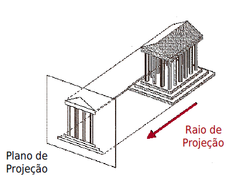 <!-- {.push-right.bordered style="width: 250px; border-radius: 4px; box-shadow: 4px 4px 4px #0003;"} -->
  Centro de projeção se encontra no infinito
- Raios de projeção são paralelos entre si
- Tamanho relativo em cada eixo é preservado
- Linhas paralelas permanecem paralelas
- Existem subtipos de projeção paralela em que o ângulo de incidência dos raios
  de projeção varia

---
<!-- {"layout": "centered-horizontal"} -->
# Projeção Paralela, Ortogonal

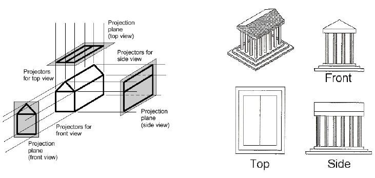 <!-- {.bordered style="width: 500px; border-radius: 4px; box-shadow: 4px 4px 4px #0003;"} -->

- Projeção ortogonal
  - Ângulo dos raios no plano de projeção = 90º

---
<!-- {"layout": "regular"} -->
# Matriz de Projeção Ortogonal

::: figure .layout-split-2.no-margin.bullet height: auto;
```javascript
function ortho(l, //left: canto esquerdo
               r, //right: canto direito
               b, //bottom: baixo
               t, //top: lado de cima
               n, //near: plano próximo
               f) //far: plano distante
```

<div class="math" style="flex: 1; margin-top: 1.5em;">\begin{bmatrix} \frac{2}{r-l} & 0 & 0 & -\frac{r+l}{r-l} \\ 0 & \frac{2}{t-b} & 0 & -\frac{t+b}{t-b} \\ 0 & 0 & \frac{-2}{f-n} & -\frac{f+n}{f-n} \\ 0 & 0 & 0 & 1 \end{bmatrix}</div>
:::

- Olhando para a matriz ↗️, que transformações compõem uma projeção ortográfica?
  - Translação (vetor deslocamento) e escala (diagonal principal) <!-- {li:.bullet} -->
  - Afinal, estamos convertendo uma caixa (mundo) em outra (NDC) <!-- {li:.bullet} -->

*[NDC]: Normalized Device Coordinates

---
<!-- {"layout": "regular", "embeddedStyles": ".hello-world-code pre { margin-top: 0;}"} -->
# Exemplo: projeção no _hello world_

::: figure .layout-split-3.hello-world-code.compact-code
```javascript
// define a projeção
let p = ortho(0,100, 0,100, -1,1)
gl.uniformMatrix4fv(pLoc,false, p)
// ...
// define objeto e desenha
let vertices = [
  20, 20, 0, // v0
  80, 20, 0, // v1
  80, 80, 0, // v2
  20, 80, 0  // v3
]
gl.drawArrays(gl.TRIANGLE_FAN,0,4)
```
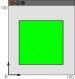 <!-- {style="margin: 0 1em;"} -->

::: figure .no-margin flex: 1; display: flex; flex-direction: column; justify-content: flex-start; font-size: 15px;
<div class="math bullet">\begin{bmatrix} \frac{2}{r-l} & 0 & 0 & -\frac{r+l}{r-l} \\ 0 & \frac{2}{t-b} & 0 & -\frac{t+b}{t-b} \\ 0 & 0 & \frac{-2}{f-n} & -\frac{f+n}{f-n} \\ 0 & 0 & 0 & 1 \end{bmatrix}=</div>
<div class="math bullet">\begin{bmatrix} \frac{2}{100} & 0 & 0 & -\frac{100}{100} \\ 0 & \frac{2}{100} & 0 & -\frac{100}{100} \\ 0 & 0 & \frac{-2}{2} & -\frac{0}{2} \\ 0 & 0 & 0 & 1 \end{bmatrix}=</div>
<div class="math bullet">\begin{bmatrix} 0.02 & 0 & 0 & -1 \\ 0 & 0.02 & 0 & -1 \\ 0 & 0 & -1 & 0 \\ 0 & 0 & 0 & 1 \end{bmatrix}</div>
:::

---
<!-- {"layout": "centered", "state": "show-active-slide-and-previous"} -->

::: figure .picture-steps.clean.opacity-only padding: 0; align-self: center; font-size: 16px;
<div class="math figure-step bullet">v^\prime = M \times v</div>
<div class="math figure-step bullet">\begin{bmatrix} v^\prime_x \\ v^\prime_y \\ v^\prime_z \\ 1 \end{bmatrix} = \begin{bmatrix} 0.02 & 0 & 0 & -1 \\ 0 & 0.02 & 0 & -1 \\ 0 & 0 & -1 & 0 \\ 0 & 0 & 0 & 1 \end{bmatrix} \times \begin{bmatrix} v_x \\ v_y \\ v_z \\ 1 \end{bmatrix}</div>
<div class="math figure-step bullet">\begin{bmatrix} v^\prime_x \\ v^\prime_y \\ v^\prime_z \\ 1 \end{bmatrix} = \begin{bmatrix} 0.02 & 0 & 0 & -1 \\ 0 & 0.02 & 0 & -1 \\ 0 & 0 & -1 & 0 \\ 0 & 0 & 0 & 1 \end{bmatrix} \times \begin{bmatrix} 20 \\ 20 \\ 0 \\ 1 \end{bmatrix}</div>
<div class="math figure-step bullet">\begin{bmatrix} -0.6 \\ -0.6 \\ 0 \\ 1 \end{bmatrix} = \begin{bmatrix} 0.02 & 0 & 0 & -1 \\ 0 & 0.02 & 0 & -1 \\ 0 & 0 & -1 & 0 \\ 0 & 0 & 0 & 1 \end{bmatrix} \times \begin{bmatrix} 20 \\ 20 \\ 0 \\ 1 \end{bmatrix}</div>
:::

::: figure . align-self: center; font-size: 14px; margin: 3em 0 0 16em
<div class="math bullet push-left">v^\prime_0 = \begin{bmatrix} -0.6 \\ -0.6 \\ 0 \\ 1 \end{bmatrix}</div>
<div class="math bullet push-left">v^\prime_1 = \begin{bmatrix}  0.6 \\ -0.6 \\ 0 \\ 1 \end{bmatrix}</div>
<div class="math bullet push-left">v^\prime_2 = \begin{bmatrix}  0.6 \\  0.6 \\ 0 \\ 1 \end{bmatrix}</div>
<div class="math bullet push-left">v^\prime_3 = \begin{bmatrix} -0.6 \\  0.6 \\ 0 \\ 1 \end{bmatrix}</div>
:::


---
<!-- {"layout": "regular"} -->
# Projeção "Padrão"

- Se você **não definir uma projeção**, em qual espaço estamos?
  - É como se estivéssemos multiplicando pela matriz identidade (com 1 exceção)
- Isso é equivalente a `ortho(-1, 1, -1, 1, -1, 1)` (_exceto pelo -1/1 de `n/f`_):
  ::: figure .no-margin display: flex; flex-direction: row; justify-content; center
  <div class="math">\begin{bmatrix} \frac{2}{r-l} & 0 & 0 & -\frac{r+l}{r-l} \\ 0 & \frac{2}{t-b} & 0 & -\frac{t+b}{t-b} \\ 0 & 0 & \frac{-2}{f-n} & -\frac{f+n}{f-n} \\ 0 & 0 & 0 & 1 \end{bmatrix}=</div>
  <div class="math">\begin{bmatrix} \frac{2}{1+1} & 0 & 0 & -\frac{1-1}{1+1} \\ 0 & \frac{2}{1+1} & 0 & -\frac{1-1}{1+1} \\ 0 & 0 & \frac{-2}{1+1} & -\frac{1-1}{1+1} \\ 0 & 0 & 0 & 1 \end{bmatrix}=</div>
  <div class="math">\begin{bmatrix} 1 & 0 & 0 & 0 \\ 0 & 1 & 0 & 0 \\ 0 & 0 & -1 & 0 \\ 0 & 0 & 0 & 1 \end{bmatrix}</div>
  :::

---
<!-- {"layout": "regular"} -->
# E esse **z negativo**?

::: figure .full-width display:flex; justify-content: space-around;
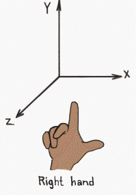 <!-- {.rounded style="max-height: 230px;"} -->
 <!-- {.rounded style="max-height: 230px;"} -->
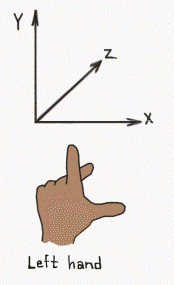 <!-- {.rounded style="max-height: 230px;"} -->
:::

↖️ É útil definir objetos no sistema _**right**-handed_,<br> <!-- {p:.center-aligned.full-width} -->
mas o WebGL tem seu espaço NDC no formato _**left**-handed_ ↗️

---
<!-- {"layout": "regular"} -->
# Projeção Ortogonal: recapitulando

- Leva os vértices do sistema de coordenadas "do mundo" para NDC
- Equivale a uma composição:
  1. Translação: leva a origem para ter (0, 0, 0) ao centro
  1. Escala: multiplica tamanho para que fique entre [-1, 1] nas três dimensões 
  1. Reflexão de <span class="math">z</span>: mão direita ➡️ mão esquerda

::: figure .no-margin.full-width display: flex; flex-direction: row; justify-content; center; font-size: 0.7em;
<div class="math centered">\begin{bmatrix} \frac{2}{r-l} & 0 & 0 & -\frac{r+l}{r-l} \\ 0 & \frac{2}{t-b} & 0 & -\frac{t+b}{t-b} 
\\ 0 & 0 & \frac{-2}{f-n} & -\frac{f+n}{f-n} \\ 0 & 0 & 0 & 1 \end{bmatrix}=T(-\frac{r+l}{r-l},-\frac{t+b}{t-b},-\frac{f+n}{f-n})\times S(\frac{2}{r-l},\frac{2}{t-b},\frac{2}{f-n})\times Re(1, 1, -1)</div>
:::

*[NDC]: Normalized Device Coordinates

---
# Projeção Paralela, Isométrica

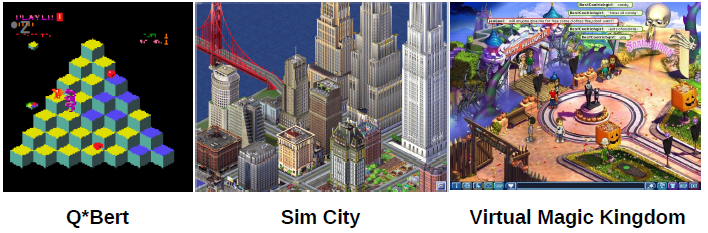 <!-- {.bordered style="border-radius: 4px; box-shadow: 4px 4px 4px #0003;"} -->

- A cena é orientada em 45º relativo ao plano de projeção
- Também podemos usar `ortho`, mas vamos precisar "movimentar a câmera"
  usando `lookAt` (veremos logo mais)

---
<!-- {"layout": "regular"} -->
# Projeção Perspectiva

- 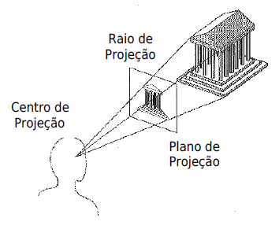 <!-- {.push-right.bordered style="border-radius: 4px; box-shadow: 4px 4px 4px #0003;"} -->
  A projeção perspectiva mapeia os pontos no plano de projeção **ao longo dos
  raios de projeção que emanam de um centro de projeção**
- Características:
  1. Objetos **mais próximos** ao plano de projeção **são maiores**
  1. **Linhas paralelas** se encontram em **pontos de fuga**
  1. Aparência semelhante ao modelo do nosso olho

---
<!-- {"layout": "centered-horizontal"} -->
# Mesmo objeto, projeções diferentes

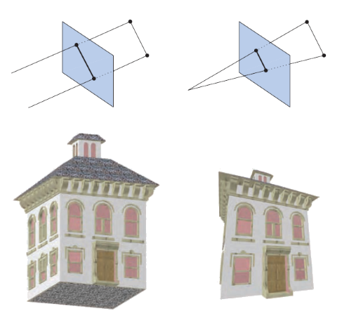

---
# Objetos 3D

Façamos uma breve digressão...

---
<!-- {"layout": "regular"} -->
# O pulo ~~do gato~~ da raposa

- Um objeto tridimensional é formado por várias faces (polígonos) adjacentes
  que podem estar no mesmo plano ou não
- <!-- {li:.no-bullet.center-aligned} -->
  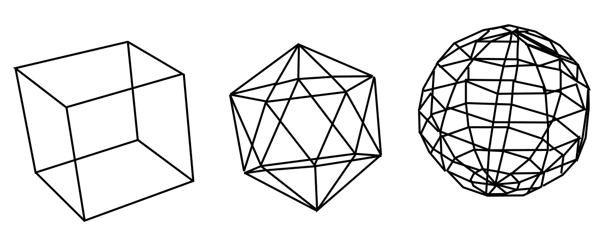 <!-- {style="max-height: 220px;"} -->
  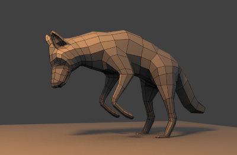 <!-- {style="max-height: 220px;"} -->

---
<!-- {"layout": "regular"} -->
# Exemplo de objetos 3D

Para desenhar um cubo em vez de um quadrado, basta desenhar 6 faces em
vez de 1

::: figure .layout-split-3 height: auto; align-items: flex-start;
- <!-- {ul:.no-bullet.no-padding.no-margin.bullet} -->
  
- **Atenção**: vértices ↗️<br>definidos no sentido CCW indicam a frente. <!-- {li:.bullet.note.warning style="font-size: 0.7em; max-width: 250px; margin-inline: auto;"} -->

```javascript
let vertices = [
  //cima (y=+1)
  -1,  1,  1,
   1,  1,  1,
   1,  1, -1,
  -1,  1, -1,
  //baixo (y=-1)
  -1, -1,  1,
  -1, -1, -1,
  // ...
]
```
- <!-- {ul:.no-margin style="max-width: 480px;"} -->
  `gl.TRIANGLES` requer 36 vértices:<div class="math">6f \times 2tri \times 3v</div>
  - Alguns vértices repetem
- Podemos **economizar usando índices**: <!-- {li:.bullet} -->
  - Definimos apenas os não repetidos
  - Além do VBO, criamos um IBO
  - Ao desenhar, <s>`gl.drawArrays`</s> vira `gl.drawElements`
- Veremos isso em outra aula... <!-- {li:.bullet} -->
:::

*[CCW]: Counter Clockwise 
*[VBO]: Vertex Buffer Object
*[IBO]: Index Buffer Object

---
<!-- {"layout": "regular", "backdrop": "white-noise"} -->
# Roubando com o FreeGLUT

- O FreeGLUT possui algumas funções para desenho de objetos tridimensionais: <!-- {ul:.full-width} -->
  1. `glutSolidTeapot, glutWireTeapot`

     `Solid` <!-- {dl:.dl-6.push-right.no-margin} -->
       ~ desenha polígonos preenchidos

     `Wire`
       ~ desenha apenas contornos

     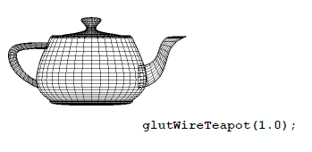 <!-- {.push-left} -->

- [Referência das funções](https://www.opengl.org/resources/libraries/glut/spec3/node80.html) <!-- {li:style="clear: both"} -->

---
<!-- {"layout": "regular", "backdrop": "white-noise"} -->
# Formas 3D do FreeGLUT

::: figure .layout-split-2.full-width
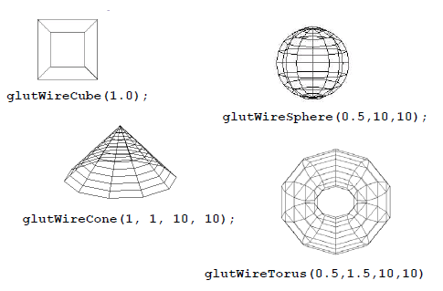 <!-- {.flex-equal} -->
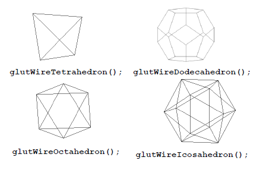 <!-- {.flex-equal} -->

---
<!-- {"layout": "regular"} -->
# Roubando com a TWGL.js

::: sample geometry-twgl .centered width: 800px; height: 450px;
:::

---
<!-- {"layout": "regular"} -->
# Roubando com a THREE.js

::: sample geometry-threejs .centered width: 800px; height: 450px;
:::

---
# Projeção Perspectiva

- Voltando ao tema de hoje...

---
<!-- {"layout": "tall-figure-right"} -->
# Exemplo [ortho-vs-perspective][exemplo-ortho-vs-perspective] <!-- {a:target="_blank"} -->

::: figure
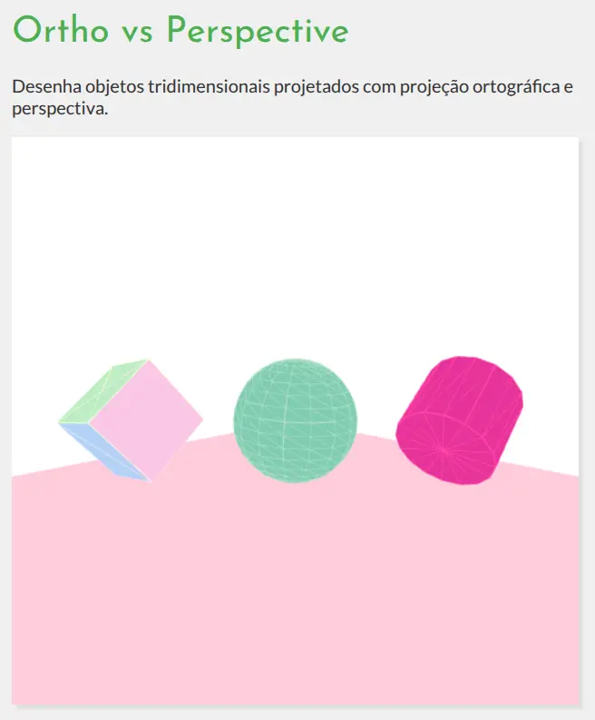 <!-- {.bordered style="width: 300px;border-radius: 8px;"} -->
:::

- Pressionar <kbd>P</kbd> para alternar de
  projeção perspectiva para ortogonal e <kbd>W</kbd> para ativar/desativar
  o modo de arame
- Cena:
  1. cubo, esfera e cilindro girando 
  1. chão: cubo achatado

[exemplo-ortho-vs-perspective]: https://fegemo.github.io/utf-cg-exemplos-webgl/ortho-vs-perspective/


---
<!-- {"layout": "regular"} -->
# Projeção Perspectiva

-  <!-- {.push-right} -->
  Precisamos que **objetos distantes** apareçam **menores**...
- Vamos usar um truque: a **divisão perspectiva**:
  - Dividir as coordenadas <span class="math">\{x,y\}</span> por <span class="math">z</span>
- <!-- {li:.bulleted} -->
  **Exemplo**: <!-- {.alternate-color} --> segmento de reta horizontal de tamanho 10, <span class="math">P=(10, 1, z)</span> até <span class="math">Q=(20,1,z)</span>
  - Quando <span class="math">\textcolor{#b9811c}{z=1}</span>, 
    - <span class="math left-aligned">\text{tamanho}=abs(10/\textcolor{#b9811c}{1}-20/\textcolor{#d29c3a}{1})=10</span>
  - Agora, quando <span class="math">\textcolor{#5a5ad8}{z=2}</span>
    - <span class="math left-aligned">\text{tamanho}=abs(10/\textcolor{#5a5ad8}{2}-20/\textcolor{#5a5ad8}{2})=5</span>
  - E se <span class="math">\textcolor{#45ab45}{z=3}</span>
    - <span class="math left-aligned">\text{tamanho}=abs(10/\textcolor{#45ab45}{3}-20/\textcolor{#45ab45}{3})=3.33</span>
- O que aconteceu? <!-- {li:.bullet} -->


---
<!-- {"layout": "regular"} -->
# Divisão Perspectiva

- É uma ideia para reduzirmos o tamanho de objetos distantes
- **Truque**: copiar <span class="math">z\rightarrow w</span> e dividir pela coordenada homogênea <span class="math">w</span>: <!-- {li:.bullet.bulleted} -->
  - Após o _vertex shader_, WebGL modifica as coordenadas emitidas via `gl_Position` de forma a dividir <span class="math">\{x,y,z\}</span> por <span class="math">w</span> 
    automaticamente: <div class="math">(x',y',z')=(x/w, y/w, z/w)</div>
    - Quando <span class="math">w=1</span> (nosso caso até então), nada muda
    - Se <span class="math">w>1</span>, objetos com <span class="math">w</span> grandes ficam menores
- Podemos copiar o valor de <span class="math">z</span> para <span class="math">w</span> com uma matriz! Mas como? <!-- {li:.bullet} -->
  - Na verdade, copiamos <span class="math">-z</span> <!-- {li:.bullet} -->


---
<!-- {"layout": "regular"} -->
# Explorando a coordenada <span class="math">w</span>

<!-- ::: sample perspective-division . width: 450px; height: 300px;
::: -->
<iframe src="../../samples/perspective-division/index.html" width="100%" height="300" seamless scrolling="no" frameBorder="0"></iframe>

- <!-- {ul:.no-margin.no-padding.full-width.no-bullet.layout-split-2 style="gap: 1rem; height: auto;"} -->
  ::: div .note.exercise font-size: 0.7em;
  **Exercício 1:** mão direita ➡️ esquerda.<br>
  **Exercício 2:** copiar <span class="math">-z</span> para <span class="math">w</span>.<br>
  **Exercício 3:** desconsiderar o valor de <span class="math">w</span> do vértice.
  :::
- <!-- {li:style="max-width: 50%;"} -->
  ::: div .note.info font-size: 0.7em;
  **Importante:** a projeção perspectiva não é uma transformação afim. Portanto,
  não podemos nos prender à interpretação da matriz como 3 vetores da base + origem.
  :::

---
<!-- {"layout": "regular"} -->
# Matriz Perspectiva

- 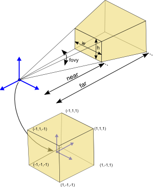 <!-- {.push-right style="width: 225px;"} -->
  Definimos a matriz perspectiva posicionada em <span class="math">(0,0,0)</span> e "olhando" para o eixo <span class="math">-z</span> (negativo)
  <div class="math push-right smaller-text">\begin{bmatrix} \frac{fov}{aspect} & 0 & 0 & 0 \\ 0 & fov & 0 & 0 \\ 0 & 0 & \frac{n+f}{n-f} & \frac{2fn}{n-f} \\ 0 & 0 & -1 & 0 \end{bmatrix}</div> 

  1. <span class="math">aspect=w/h</span>
  1. Ângulo <span class="math">\theta</span> de visão Y
     - <span class="math">fov=\cot(\frac{\theta}{2})</span>
  1. Dist. plano próximo: <span class="math">n > 0</span>
  1. Dist. plano distante: <span class="math">f > n</span> <!-- {li:.bullet} -->

**Cotangente <span class="math">\cot(\theta)</span>**: pode ser calculada como 
<span class="math">\frac{\cos(\theta)}{\sin(\theta)}</span>, ou 
<span class="math">\frac{1}{\tan(\theta)}</span>, ou 
<strong><span class="math">\tan(\frac{\pi}{2} - \theta)</span></strong>.
<!-- {p:.note.info.bullet style="font-size: 0.7em; margin-inline: auto;"} -->

---
<!-- {"layout": "centered", "state": "show-active-slide-and-previous"} -->

<iframe src="https://webglfundamentals.org/webgl/frustum-diagram.html" seamless width="400" height="600" scrolling="no" class="bordered" style="align-self: center; box-shadow: 4px 4px 4px #3333; scale: 1; translate: 50px 0; box-shadow: 4px 4px 4px #3333;" frameBorder="0"></iframe>

---
<!-- {"layout": "regular-block", "slideClass": "compact-code-more"} -->
# Usando `perspective(fovY, aspect, near, far)`

<div class="math push-right smaller-text">
\begin{bmatrix} \frac{fov}{aspect} & 0 & 0 & 0 \\ 0 & fov & 0 & 0 \\ 0 & 0 & \frac{n+f}{n-f} & \frac{2fn}{n-f} \\ 0 & 0 & -1 & 0 \end{bmatrix}
</div>

- <!-- {ul:.full-width} -->
  Campo de visão em Y (_field of view_ ou fovY)
  - Em geral usamos algo entre 60º e 90º
  - Jogando na TV: fov maior
  - Jogando perto: fov menor 
- Razão de aspecto
  - Usar a mesma do canvas
    ```javascript
    const aspect = gl.canvas.width / gl.canvas.height
    ```
- Planos próximo e distante
  - Sempre positivos, por exemplo, [1, 2000]

*[fov]: Field of View
*[fovY]: Field of View Y

---
<!-- {"layout": "centered"} -->
# O que é retratado?

- A matriz `perspective` que propomos:
  1. está posicionada na origem
  1. observa o eixo <span class="math">-z</span>
  1. retrata objetos que estiverem entre <span class="math">[-near, -far]</span>
     <!-- {li:.bullet} -->
- Mas e se quisermos olhar para outra direção, ou mover? <!-- {li:.bullet.bulleted} -->
  - Podemos fazer uma **transformação de visualização** <!-- {.alternate-color} -->

---
<!-- {"layout": "2-column-content"} -->
# Move **Câmera** ou Move **Mundo**? <!-- {h1:.center-aligned} --> <!-- {strong:.alternate-color} -->

::: figure .center-aligned
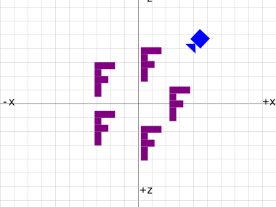 <!-- {.bordered} -->
Transformação de **câmera**<br>
(+fácil de definir)
:::

::: figure .center-aligned
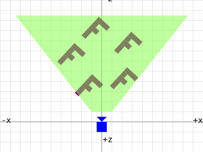 <!-- {.bordered} -->
Transformação de **visualização** <!-- {.alternate-color} --><br>
(inversa da câmera)
:::

---
<!-- {"layout": "2-column-highlight-and-list", "slideClass": "compact-code-more"} -->
# Move **Câmera**, depois **inverte**<!-- {strong:.alternate-color} -->

::: figure . width: auto;
 <!-- {.bordered.block style="width: 200px"} -->
 <!-- {.bordered.block style="width: 200px"} -->
:::

- <!-- {ul:style="width: auto;"} -->
  WebGL não tem conceito de câmera, portanto:
  - **Movemos a câmera**, depois **invertemos para mover o mundo** <!-- {.alternate-color} -->
- `vertex.glsl`
  ```glsl
  void main() {
    gl_Position = projection * view * model * position;
  }
  ```
  `main.js`
  ```javascript
  // atualiza cena
  angulo += 0.1 * Math.PI
  const rotacao = rotateZ(angulo)
  const translacao = translate(0, 0, raio)
  const cameraMatrix = mult(rotacao, translacaco)
  const viewMatrix = inverse(camera) // ⬅️ transforma mundo de acordo com câmera
  // desenha
  gl.uniformMatrix4fv(viewLoc, false, view)
  ```

---
<!-- {"layout": "regular"} -->
# Posicionando a **câmera**

- Movimentos simples com a câmera (como fizemos), é fácil
- Mas há outros casos, mais difíceis, como acompanhar um objeto
- 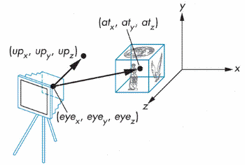 <!-- {.push-right.bordered style="border-radius: 8px; box-shadow: 4px 4px 4px #3333;"} -->
  Há uma forma geral que chamamos de `lookAt`. Definimos:
  1. Ponto onde câmera está: <small style="opacity: 0.6"><span class="math">eye</span> ou <span class="math">P</span></small>
  1. Ponto para onde está olhando: <small style="opacity: 0.6"><span class="math">at</span> ou <span class="math">T</span></small>
  1. Vetor "cima" (do mundo): <small style="opacity: 0.6"><span class="math">\vec{up}</span></small>
- A partir disso, vamos gerar a **transformação da câmera**, depois 
  **invertemos**<!-- {.alternate-color} --> para gerar **da visualização**
  <!-- {.alternate-color} -->

---
<!-- {"layout": "regular", "slideClass": "operacao-lookat", "embeddedStyles": ".operacao-lookat iframe { width: 300px; height: 200px; overflow: hidden;} .operacao-lookat .katex-display { margin: 0; }"} -->
# Operação: `lookAt(position, target, up)`

- <!-- {ul:.full-width} -->
  Precisamos montar uma matriz que indica o sistema de coordenadas da câmera
  1. ::: figure .push-right margin: 0;
     <div class="math bullet">
     \begin{bmatrix}
     \textcolor{#ff4949}{\hat{x}.x}&\textcolor{#45ab45}{\hat{y}.x}&\textcolor{#5a5ad8}{\hat{z}.x}&P.x\\
     \textcolor{#ff4949}{\hat{x}.y}&\textcolor{#45ab45}{\hat{y}.y}&\textcolor{#5a5ad8}{\hat{z}.y}&P.y\\
     \textcolor{#ff4949}{\hat{x}.z}&\textcolor{#45ab45}{\hat{y}.z}&\textcolor{#5a5ad8}{\hat{z}.z}&P.z\\
     0&0&0&1
     \end{bmatrix}
     </div>
     :::
     Eixo <span class="math">\vec{z}=-(T-P), \textcolor{#5a5ad8}{\hat{z}}=\frac{\vec{z}}{\left|z\right|}</span>
     - Cresce para trás
  1. Eixo <span class="math">\vec{x}=\vec{up}\times\hat{z}, \textcolor{#ff4949}{\hat{x}}=\frac{\vec{x}}{\left|\vec{x}\right|}</span>
  1. Eixo <span class="math">\textcolor{#45ab45}{\hat{y}}=\hat{z}\times\hat{x}</span>

1. <!-- {ol:.layout-split-3.full-width.centered.no-bullet.no-margin.no-padding style="gap: 1rem; height: auto;"} -->
   <iframe src="https://webgl2fundamentals.org/webgl/lessons/resources/cross-product-diagram.html?mode=0" seamless frameBorder="0" scrolling="no" class="bordered"></iframe>
1. <iframe src="https://webgl2fundamentals.org/webgl/lessons/resources/cross-product-diagram.html?mode=1" seamless frameBorder="0" scrolling="no" class="bordered"></iframe>
1. <iframe src="https://webgl2fundamentals.org/webgl/lessons/resources/cross-product-diagram.html?mode=2" seamless frameBorder="0" scrolling="no" class="bordered"></iframe>

---
<!-- {"layout": "regular", "slideClass": "compact-code-more matriz-lookat-e-assinatura", "embeddedStyles": ".matriz-lookat-e-assinatura .push-code-left pre { margin-right: 1.5rem;}"} -->
# Matriz `lookAt` e assinatura

- <!-- {ul:.no-margin.bullet.no-bullet.no-padding.full-width.layout-split-2 style="gap: 1rem;"} -->
  ```javascript
  //     position, target
  function lookAt(P, T, up=[0,1,0]) {
    const z = normalize(subtract(P, T))
    const x = normalize(cross(up, z))
    const y = cross(z, x)

    return new Float32Array([ // col-major:
      x[0], x[1], x[2], 0,    // 1ª coluna
      y[0], y[1], y[2], 0,    // 2ª
      z[0], z[1], z[2], 0,    // 3ª
      P[0], P[1], P[2], 1     // 4ª
    ])
  }
  ```
  - <!-- {li:.bullet.note.info style="margin-top: 1rem; max-width: 380px;font-size: 0.7em"} -->
    **Em JavaScript** temos o **operador _spread:_**
    ```javascript
    return new Float32Array([
      ...x, 0,
      ...y, 0,
      ...z, 0,
      ...P, 1
    ])
    ```
- <div class="math">
    lookAt(P,T,\vec{up})=\begin{bmatrix}
     \textcolor{#ff4949}{\hat{x}.x}&\textcolor{#45ab45}{\hat{y}.x}&\textcolor{#5a5ad8}{\hat{z}.x}&P.x\\
     \textcolor{#ff4949}{\hat{x}.y}&\textcolor{#45ab45}{\hat{y}.y}&\textcolor{#5a5ad8}{\hat{z}.y}&P.y\\
     \textcolor{#ff4949}{\hat{x}.z}&\textcolor{#45ab45}{\hat{y}.z}&\textcolor{#5a5ad8}{\hat{z}.z}&P.z\\
     0&0&0&1
    \end{bmatrix}
  </div>
  
  - <!-- {li:.bullet} -->
    Exemplo de uso:
    - ```javascript
      const camera = {
        posicao: [30, 50, 1],
        alvo: [0, 0, 0]
      }
      const cameraMatrix = lookAt(
        camera.posicao,
        camera.alvo,
        [0, 1, 0])
      const viewMatrix = inverse(cameraMatrix)
      gl.uniformMatrix4fv(viewLoc, false, viewMatrix)
      ```

---
<!-- {"layout": "regular-block"} -->
# Sobre a nomenclatura de `lookAt` <!-- {.bullet} -->

<iframe src="https://webgl2fundamentals.org/webgl/webgl-3d-camera-look-at-heads.html"
width="420", height="340" seamless frameBorder="0" scrolling="no" class="bullet push-right bordered" style="box-shadow: 4px 4px 4px #3333"></iframe>

- Algumas bibliotecas de matriz consideram que `lookAt` deve retornar 
  a **matriz de visualização** <!-- {.alternate-color} --> (eg, glmatrix, <code>[lookAt][gl-matrix-look-at]</code>)
- Outras (eg, TWGL.js <code>[lookAt][twgl-js-look-at]</code>), fazem como nós e retornam a **matriz da câmera**, daí precisamos 
  **inverter** <!-- {.alternate-color} -->
- <!-- {.no-bullet.note.info style="width: calc(100% - 1rem - 420px); margin-top: 1rem;"} -->
  É mais útil que ela retorne a **matriz da câmera**, porque podemos utilizá-la
  para outros objetos que precisem `lookAt` alguma coisa ↗️

[gl-matrix-look-at]: https://glmatrix.net/docs/module-mat4.html#.lookAt
[twgl-js-look-at]: https://twgljs.org/docs/module-twgl_m4.html#.lookAt

---
<!-- {"layout": "regular", "slideClass": "compact-code-more"} -->
# Enviando matrizes ao _shader_

- A forma mais flexível é enviar: `projection`, `view` e `model`
- Contudo, se todos os vértices estão sob a mesma `view` e mesma `projection`,
  cada vértice fará `projection x view` repetitivamente
- Portanto, podemos fazer apenas 1x na CPU:
  1. <!-- {ol:.no-padding.no-margin.layout-split-2.no-bullet style="gap: 1rem;"} -->
     `main.js`
     ```javascript
     const projectionView = mult(projection, view)
     gl.uniformMatrix4fv(projViewLoc, false, projectionView)
     ```
  1. `vertex.glsl`
     ```glsl
     uniform mat4 u_projectionView;
     //...
     mat4 toNDC = u_projectionView * u_model;
     gl_Position = toNDC * vec4(a_coords, 1.0);
     ```
- Reflita sobre qual a melhor forma para sua aplicação

<!-- # Trabalho Prático 2 \o/

_A wild TP2 appears..._


## TP2: Masmorras e Dragões

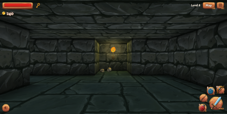
  -- _"**Guilherme (mestre):** Igor, você acabou de entrar em uma sala e nela tem
  uma cama e um criado mudo. O que vai fazer?"_<br>
  -- _"**Igor (jogador):** vou bater no criado mudo até ele me falar aonde
  tenho que ir"_<br>
  _"Rimos muito e encerramos a sessão de jogo naquele dia..."_

- Enunciado **QUASE** no Moodle (ou [na página do curso](https://github.com/fegemo/cefet-cg/blob/master/assignments/tp2-dandd/README.md)). -->

---
# Referências

- [FAQ sobre visualização em OpenGL](https://www.opengl.org/archives/resources/faq/technical/viewing.htm#view0030) (excelente leitura)
- Capítulo 3 do livro Real-Time Rendering
- Lições 5 e 8 das anotações do prof. David Mount
