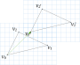
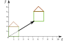
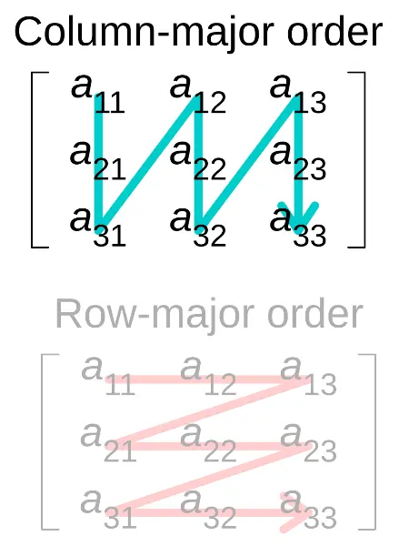
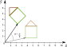
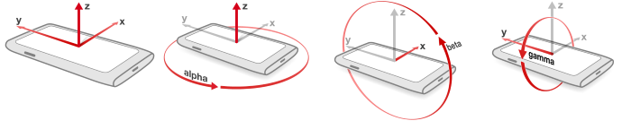
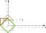
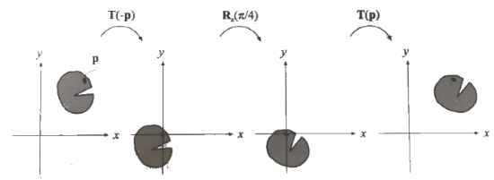
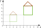
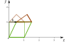

<!-- {"layout": "title"} -->
# Transformações Geométricas
## Translação, Escala, Rotação e mais

---
# Roteiro

1. Introdução a transformações
1. Translação
1. Rotação
1. Escala
1. Inclinação

---
<!-- {"layout": "section-header", "slideClass": "intro-transformacoes"} -->
# Introdução a transformações

---
<!-- {"layout": "regular"} -->
# Teoria geométrica das transformações

- Transformação é uma função que 
  **mapeia pontos de um espaço em outros pontos** do mesmo espaço
- Se uma transformação é linear, então:
  - Se um conjunto de pontos está contido em uma reta, depois de
    transformados eles também estarão contidos sobre uma reta
  - Se um ponto <span class="math">P</span> guarda uma relação de distância
    com dois outros pontos <span class="math">Q</span> e
    <span class="math">R</span>, então essa relação de distância é mantida

---
<!-- {"layout": "regular", "slideClass": "compact-code-more"} -->
# Transformações na prática (em WebGL)

- Desenhamos quaisquer objetos em WebGL **descrevendo seus vértices**:
  ```javascript
  const vertices = new Float32Array([
    x1, y1, z1,
    x2, y2, z2,
  ])
  ```
- Podemos modificar as coordenadas dos vértices **sem alterar seu VBO** 
  de forma a:
  -  <!-- {.push-right style="width: 320px"} -->
    Rotacioná-los
  - **Movimentá-los**
  - Alterarmos seu tamanho
  - Outras transformações
    - Espelhamento ou reflexão
    - Inclinação (_shearing_)

---
<!-- {"layout": "regular"} -->
# **Forma geral** de ponto ou vetor

- Na geometria afim, vimos que podemos representar um ponto ou um vetor na
  forma:
  <div class="math">R = \alpha_0 F.\vec{e_0} + \alpha_1 F.\vec{e_1} + \alpha_2 F.\vec{e_2} + \alpha_3 F.O</div>

  - Em que <u><span class="math">R</span> é um ponto ou um vetor</u>
    representado em termos do sistema de coordenadas <span class="math">F</span>, **<span class="math">\alpha_3</span>** é <span class="math">0</span>
      para vetores ou <span class="math">1</span> para pontos 
      (é a **coordenada homogênea**)
  - No sistema de coordenadas cartesiano, escrevemos
    <span class="math">R</span> como:
    <div class="math">R = \alpha_x \vec{x} + \alpha_y \vec{y} + \alpha_z \vec{z} + \alpha_w</div>
- <div class="math" style="float:right;">R = \begin{bmatrix}\alpha_x & \alpha_y & \alpha_z & \alpha_w\end{bmatrix}^T</div>
  Mais sucintamente, dizemos que:

---
<!-- {"layout": "regular"} -->
# Forma matricial de ponto ou vetor

- Podemos representar um ponto ou vetor <span class="math">R</span> na
  forma matricial:
  <div class="math">R = \alpha_0 F.\vec{e_0} + \alpha_1 F.\vec{e_1} + \alpha_2 F.\vec{e_2} + \alpha_3 F.O</div>
  <figure class="picture-steps clean">
    <div class="bullet full-width">
    <div class="math" style="padding-top: 1px;">R = \begin{bmatrix} F.\vec{e_0} & F.\vec{e_1} & F.\vec{e_2} & F.O \end{bmatrix} \times \begin{bmatrix} \alpha_0 \\ \alpha_1 \\ \alpha_2 \\ \alpha_3 \end{bmatrix}</div>
    Cada coluna da matriz é um vetor (as 3 primeiras) ou a origem de uma base (a última)
    </div>
    <div class="bullet full-width">
    <div class="math">R = \begin{bmatrix} F.\vec{e_0}[0] & F.\vec{e_1}[0] & F.\vec{e_2}[0] & F.O[0] \\ F.\vec{e_0}[1] & F.\vec{e_1}[1] & F.\vec{e_2}[1] & F.O[1] \\ F.\vec{e_0}[2] & F.\vec{e_1}[2] & F.\vec{e_2}[2] & F.O[2] \\ 0 & 0 & 0 & 1 \end{bmatrix} \times
    \begin{bmatrix} \alpha_0 \\ \alpha_1 \\ \alpha_2 \\ \alpha_3 \end{bmatrix}</div>
    ...expandindo a matriz, mostrando as coordenadas de cada vetor da base/ponto de origem...
    </div>
    <div class="bullet full-width">
    <div class="math">R = \begin{bmatrix} 1 & 0 & 0 & 0 \\ 0 & 1 & 0 & 0 \\ 0 & 0 & 1 & 0 \\ 0 & 0 & 0 & 1 \end{bmatrix} \times
    \begin{bmatrix} \alpha_0 \\ \alpha_1 \\ \alpha_2 \\ \alpha_3 \end{bmatrix}</div>
    Exemplo: a base cartesiana, com origem em (0,0,0)
    </div>
  </figure>

---
<!-- {"layout": "regular"} -->
# Uma função de <span class="math">T</span>ransformação

- Das propriedades da geometria afim, podemos propor 
  **uma função <span class="math">T</span>** que, se aplicada 
  a cada componente da equação anterior, **se mantém uma equação afim**:

  <div class="math">R = \alpha_0 F.\vec{e_0} + \alpha_1 F.\vec{e_1} + \alpha_2 F.\vec{e_2} + \alpha_3 F.O</div>
  <div class="math">\color{blue}{T(}R\color{blue}{)} = \alpha_0 \color{blue}{T(}F.\vec{e_0}\color{blue}{)} + \alpha_1 \color{blue}{T(}F.\vec{e_1}\color{blue}{)} + \alpha_2 \color{blue}{T(}F.\vec{e_2}\color{blue}{)} + \alpha_3 \color{blue}{T(}F.O\color{blue}{)}</div>
- Podemos chamar essa função <span class="math">T</span> de **transformação**

---
<!-- {"layout": "regular"} -->
# Forma matricial da transformação

- Podemos representar a equação anterior na forma matricial:
  <figure class="picture-steps clean" style="margin-left: 0;">
    <div class="bullet math">T(R) = \begin{bmatrix} T(F.\vec{e_0}) & T(F.\vec{e_1}) & T(F.\vec{e_2}) & T(F.O) \end{bmatrix}
  \begin{bmatrix} \alpha_0 \\ \alpha_1 \\ \alpha_2 \\ \alpha_3 \end{bmatrix}</div>
    <div class="bullet math">T(R) = \begin{bmatrix} T(F.\vec{e_0}[0]) & T(F.\vec{e_1}[0]) & T(F.\vec{e_2}[0]) & T(F.O[0]) \\ T(F.\vec{e_0}[1]) & T(F.\vec{e_1}[1]) & T(F.\vec{e_2}[1]) & T(F.O[1]) \\ T(F.\vec{e_0}[2]) & T(F.\vec{e_1}[2]) & T(F.\vec{e_2}[2]) & T(F.O[2]) \\ 0 & 0 & 0 & 1 \end{bmatrix} \times
    \begin{bmatrix} \alpha_0 \\ \alpha_1 \\ \alpha_2 \\ \alpha_3 \end{bmatrix}</div>
  </figure>
- As colunas representam as imagens dos elementos do sistema <span class="math">F</span> transformado
  por <span class="math">T</span>
- Disso temos que **aplicar uma <u>transformação afim é equivalente a
  multiplicar as coordenadas</u> (de um ponto ou vetor) <u>por uma matriz</u>**
  - Em <span class="math">n</span> dimensões, isso equivale a uma matriz <span class="math">(n + 1)(n + 1)</span> por causa da coordenada homogênea

---
<!-- {"layout": "regular"} -->
# Exemplo: transformação nula

- <div class="math" style="float: right;">T=\begin{bmatrix} 1&0&0&0 \\ 0&1&0&0 \\ 0&0&1&0 \\ 0&0&0&1 \end{bmatrix}</div>
  <strong>A transformação nula</strong> é aquela que mantém as coordenadas dos pontos e vetores inalterada - ou seja, dada pela <strong>matriz identidade</strong>:
    <div style="clear: right;"></div>

- No sistema de coordenadas cartesiano, um ponto <span class="math">P=\begin{bmatrix} \alpha_x&\alpha_y&\alpha_z&1 \end{bmatrix}^{T}</span>, temos que:

  <figure class="picture-steps clean">
    <div class="bullet math">T(P)=\begin{bmatrix} 1&0&0&0 \\ 0&1&0&0 \\ 0&0&1&0 \\ 0&0&0&1 \end{bmatrix} \begin{bmatrix} \alpha_x \\ \alpha_y \\ \alpha_z \\ 1 \end{bmatrix}=?</div>
    <div class="bullet math" style="width: 100%;">T(P)=\begin{bmatrix} 1&0&0&0 \\ 0&1&0&0 \\ 0&0&1&0 \\ 0&0&0&1 \end{bmatrix} \begin{bmatrix} \alpha_x \\ \alpha_y \\ \alpha_z \\ 1 \end{bmatrix}=\begin{bmatrix} \alpha_x \\ \alpha_y \\ \alpha_z \\ 1 \end{bmatrix}</div>
  </figure>

---
<!-- {"layout": "centered-horizontal"} -->
# A [Magnífica Matriz 2D](http://ncase.me/matrix/)

<iframe src="http://ncase.me/matrix/" width="100%" height="537" frameborder="0"></iframe>

---
<!-- {"layout": "regular", "slideClass": "compact-code-more"} -->
# Matriz **MODEL** <!-- {.alternate-color} --> no _vertex shader_

- **Model Matrix**: <!-- {strong:.alternate-color} --> contém a transformação aplicada ao objeto
- Antes de multiplicar as coordenadas do vértice pela da **matriz de projeção**,
  vamos multiplicar pela **matriz de modelo**: <!-- {.alternate-color} -->
  - `vertex.glsl`
    ```glsl
    #version 300 es

    in vec3 coords;
    uniform mat4 model; // ℹ️
    uniform mat4 projection;

    void main() { //              ⬇️
      gl_Position = projection * model * vec4(coords, 1.0);
    }
    ```
  - Dessa forma, representamos rotações, escalas, translações (etc.) com
    uma única `uniform`

---
<!-- {"layout": "section-header", "slideClass": "tipos-comuns"} -->
# Tipos comuns de transformações

- Escala
- Rotação
- Translação
- Inclinação

---
<!-- {"layout": "regular"} -->
# Translação

- A transformação de translação move um objeto de uma posição para outra.

  1.  <!-- {ol:.layout-split-2.no-bullet} -->
  1.
     - <div class="math">x' = x + t_x \\ y' = y + t_y</div>
     - <div class="math">\begin{bmatrix} x' \\ y' \\ 1 \end{bmatrix} = \begin{bmatrix}1 & 0 & t_x \\ 0 & 1 & t_y \\ 0 & 0 & 1 \end{bmatrix} \times \begin{bmatrix} x \\ y \\ 1\end{bmatrix}</div>
- Mantém os ângulos e comprimentos

---
<!-- {"layout": "regular"} -->
# Translação em 3D

- Pode ser representada por uma matriz <span class="math">T(\vec{t})</span>, 
  em que <span class="math">\vec{t}</span> é o vetor de deslocamento:

  <div class="math">\begin{bmatrix} 1 & 0 & 0 & t_x \\ 0 & 1 & 0 & t_y \\ 0 & 0 & 1 & t_z \\ 0 & 0 & 0 & 1\end{bmatrix} \begin{bmatrix}p_x \\ p_y \\ p_z \\ 1 \end{bmatrix} = \begin{bmatrix}p_x + t_x \\ p_y+t_y \\ p_z+t_z \\ 1 \end{bmatrix}</div>

---
<!-- {"layout": "regular", "slideClass": "compact-code-more"} -->
# Translação em WebGL <small>(1/2)</small>

- Antigamente em OpenGL havia uma função `glTranslate(tx, ty, tz)`
- Em WebGL, podemos criar a matriz nós mesmos para transformar as coordenadas
  no _vertex shader_:
  ::: div .info.note.push-right.bullet.clear-both width: 210px; font-size: 0.8em; padding-bottom: 0;
  ### **¹column-major** <!-- {h3:style="font-size: 1em;"} -->
  WebGL lê vetores 1D para matriz nesta ordem: <!-- {p:style="font-size: .8em"} -->
   <!-- {.block.centered.rounded style="width: 120px; margin-top: 0.5em;"} -->
  :::
  ```javascript
  function translate(tx, ty, tz) {
      return new Float32Array([
          1,  0,  0,  0,    // 1ª coluna
          0,  1,  0,  0,    // 2ª coluna
          0,  0,  1,  0,    // 3ª coluna
          tx, ty, tz, 1     // 4ª coluna
      ])
  }
  ```
  - Ou então: <!-- {ul^0:.bullet} -->
    - [m4][m4] de TWGL.js: [`m4.translation(t)`][m4-translation]
    - [Mat4][Mat4] de gl-matrix: [`Mat4.fromTranslation(out, t)`][Mat4-fromTranslation]

[m4]: https://twgljs.org/docs/module-twgl_m4.html
[m4-translation]: https://twgljs.org/docs/module-twgl_m4.html#.translation
[Mat4]: https://glmatrix.net/docs/v4/classes/Mat4.html
[Mat4-fromTranslation]: https://glmatrix.net/docs/v4/classes/Mat4.html#fromTranslation

---
<!-- {"layout": "regular", "slideClass": "compact-code-more"} -->
# Translação em WebGL <small>(2/2)</small>

1. <!-- {ol:.layout-split-2.no-bullet.no-margin.no-padding.full-width style="gap: 1rem; height: auto;"} -->
   Ao desenhar um objeto:
   ```javascript
   // ...
   const c = cena
   const modelLoc = c.programa.modelLoc
   const model = c.casinha.model
   gl.uniformMatrix4fv(modelLoc, false, model)
   gl.drawArrays(gl.TRIANGLES, 0, 9)
   ```
1. E definimos a posição do objeto:
   ```javascript
   const c = cena
   const posicao = cena.casinha.posicao
   cena.casinha.model = translate(...posicao)
   //
   // fazer ...vetor "espalha" ele, equivalente a:
   // translate(posicao[0], posicao[1], posicao[2])
   ```
- Benefício:
  - Definir objetos (vértices) em um **sistemas de coordenadas local**
    a ele e reaproveitar: <!-- {li:.bullet} -->
    ::: div .note.info.bullet font-size: 0.7em; margin-top: 1rem;
    Uma vez que você criar uma `function quadrado() { ... }` para retornar
    os 04 vértices desenhados com o (0,0,0) no centro, você nunca mais vai
    precisar escrever isso de novo ;)
    :::

---
<!-- {"layout": "regular"} -->
# Matriz inversa da translação

- Pode-se usar a matriz inversa de uma transformação para 
  **se desfazer a operação** efetuada por ela
- A matriz inversa de uma translação <span class="math">T(\vec{t})</span> 
  é dada por <span class="math">T^{-1}(\vec{t})</span> tal que:
  - <span class="math">T^{-1}(\vec{t})=T(-\vec{t})</span>
  - Ou seja, basta multiplicar o vetor <span class="math">\vec{t}</span> 
    de deslocamento por <span class="math">-1</span> para se obter a
    matriz inversa


---
<!-- {"layout": "regular"} -->
# Rotação

- A rotação de um objeto é especificada por:
  - um **ângulo** de rotação e <!-- {ul^0:.multi-column-list-2} -->
  - um **eixo** de rotação.
- Todos os vértices do objeto são transformados para novas posições por meio
da rotação dos pontos em um ângulo especificado com **relação à origem**:
  1.  <!-- {ol:.layout-split-2.no-bullet} -->
  1.
     - <div class="math spoiler">x' = x\cos{\alpha} - y\sin{\alpha} \\ y' = x\sin{\alpha} + y\cos{\alpha}</div>
     - <div class="math spoiler">\begin{bmatrix} x' \\ y' \\ 1 \end{bmatrix} = \begin{bmatrix}\cos{\alpha} & -\sin{\alpha} & 0 \\ \sin{\alpha} & \cos{\alpha} & 0 \\ 0 & 0 & 1 \end{bmatrix} \times \begin{bmatrix} x \\ y \\ 1\end{bmatrix}</div>

---
<!-- {"layout": "regular"} -->
# Eixo de Rotação

- Podemos rotacionar objetos **ao longo dos três eixos** da base do
  nosso sistema de coordenadas: <span class="math">(x,y,z)</span>
  - **Exemplo**: nossa cabeça olha para cima ou baixo, esquerda ou direita e
    deita-se para a direita ou esquerda
  - Se rotacionarmos vértices em <span class="math">x</span>, suas coordenadas
    <span class="math">y</span> e <span class="math">z</span> alteram, mas
    <span class="math">x</span> se mantêm
     <!-- {.block.centered.medium-width} -->
    - Portanto, em 2D, para rotacionar um objeto provavelmente queremos usar o
      eixo Z
      ::: div .note.info font-size: 0.7em; width: 300px; margin-top: 1rem;
      **Analogia**: espeto do churrasco. <!-- {p:.no-margin} -->
      :::

---
<!-- {"layout": "regular"} -->
# Rotação em **cada eixo** em 3D

- Pode ser representada por uma matriz <span class="math">R_{d}(\alpha)</span>, 
  em que <span class="math">\alpha</span> é o ângulo de rotação e 
  <span class="math">d</span> o eixo.

  <div class="math">R_{z}(\alpha)=\begin{bmatrix} \cos\alpha&- \sin\alpha&0&0 \\ \sin\alpha&\cos\alpha&0&0 \\ 0&0&1&0 \\ 0&0&0&1 \end{bmatrix}</div>

  <div class="math" style="float:left;">R_x(\alpha)=\begin{bmatrix} 1&0&0&0 \\ 0&\cos\alpha&-\sin\alpha&0 \\ 0&\sin\alpha&\cos\alpha&0 \\ 0&0&0&1\end{bmatrix}</div>

  <div class="math" style="float:right;">R_y(\alpha)=\begin{bmatrix} \cos\alpha&0&\sin\alpha&0 \\ 0&1&0&0 \\ -\sin\alpha&0&\cos\alpha&0 \\ 0&0&0&1\end{bmatrix}</div>

---
<!-- {"layout": "regular", "slideClass": "compact-code-more"} -->
# Rotação em WebGL

- Em OpenGL, usávamos `glRotate` para multiplicar a matriz atual pela
  matriz de rotação
- Em WebGL, criamos a própria matriz:
  ::: div .info.note.push-right.bullet.clear-both width: 210px; font-size: 0.8em; padding-bottom: 0;
  ### **¹column-major** <!-- {h3:style="font-size: 1em;"} -->
  WebGL lê vetores 1D para matriz nesta ordem: <!-- {p:style="font-size: .8em"} -->
   <!-- {.block.centered.rounded style="width: 120px; margin-top: 0.5em;"} -->
  :::
  ```javascript
  function rotateZ(alpha) {     // alpha: ângulo em graus
    alpha = alpha/180*Math.PI
    const c = Math.cos(alpha)
    const s = Math.sin(alpha)
    return new Float32Array([   // column-major¹
       c, s, 0, 0,              // 1ª coluna
      -s, c, 0, 0,              // ...
       0, 0, 1, 0,
       0, 0, 0, 1
    ])
  }
  ```
- Exemplo de rotação:
  ```javascript
  nave.angulo = rotateZ(90) // 90º, vira Math.PI/2 rad
  ```

---
<!-- {"layout": "2-column-content-zigzag", "slideClass": "compact-code-more"} -->
# Rotação: desenho na origem ou não

- ```javascript
  gl.uniformMatrix4fv(mLoc, false, rotateZ(45))
  
  // desenha casinha definida FORA da origem
  gl.drawArrays(gl.TRIANGLES, 0, 9)
  ```
  <!-- {ul:.no-bullet.compact-code} -->
 <!-- {.centered style="max-height: 180px;"} -->

- ```javascript
  gl.uniformMatrix4fv(mLoc, false, rotateZ(45))

  // desenha casinha definida NA ORIGEM 👍
  gl.drawArrays(gl.TRIANGLES, 0, 9)
  ```
  <!-- {ul:.no-bullet.compact-code} -->

 <!-- {.centered style="max-height: 180px;"} -->

---
<!-- {"layout": "regular"} -->
# Matriz inversa da rotação

- A matriz de rotação é ortogonal, ou seja, **sua inversa é sua transposta**
- Dada uma matriz de rotação <span class="math">R(\alpha)</span>, 
  sua matriz inversa <span class="math">R^{-1}(\alpha)</span>
  é dada por:
  - <span class="math">R^{-1}(\alpha)</span> = <span class="math">R^T(\alpha)</span>
- Também é possível obter a inversa da matriz de rotação usando **a negação do
  ângulo de rotação**:
  - <span class="math">R^{-1}(\alpha)=R(-\alpha)</span>

Sugestão: sempre definir objetos em um sistema de coordenadas 
local a ela (ou seja, usar transformações para posicioná-lo). 
Exemplo: [rotacao-ao-redor-de-um-ponto](codeblocks:rotacao-ao-redor-de-um-ponto/CodeBlocks/rotacao-ao-redor-de-um-ponto.cbp) <!-- {p:.note.info style="font-size: 0.7em; margin-inline: 100px;"} -->

---
<!-- {"layout": "regular"} -->
# Rotação em torno de si mas **fora da** origem

- Para rotacionar **um objeto que não está na origem** **em torno de si mesmo**, <!-- {.alternate-color} -->
  precisamos, primeiro  (1) movê-lo até a origem, (2) rotacionar e (3) movê-lo
  de volta
   <!-- {.block.centered} -->
- Assim, fazemos uma **transformação composta** dada pela matriz obtida 
  pela multiplicação: <!-- {li:.bulleted} -->
  - <span class="math">M = T(\vec{p})R_z(45)T(-\vec{p})</span>
  - <span class="math">M</span> 
    **(matriz model)** <!-- {strong:.alternate-color} --> 
    conterá o resultado da mutiplicação 
    ::: div .note.warning.bullet font-size: 0.7em; width: 500px; margin-inline: auto;
    **Atenção** à ordem da multiplicação (não é comutativo). <!-- {p:.no-margin} -->
    :::

---
<!-- {"layout": "regular"} -->
# Rotações em geral (quaisquer eixos)

- Uma rotação em **eixos arbitrários** pode ser definida pela multiplicação das
  matrizes de rotação em cada eixo
  <div class="math">E(h, p, r) = R_z(r)R_x(p)R_y(h)</div>
- Chamada de transformação de Euler

---
<!-- {"layout": "regular"} -->
# Escala

- A transformação de escala altera o tamanho do objeto
  - Além de alterar o tamanho do objeto, a operação também os move
    1.  <!-- {ol:.layout-split-2.no-bullet} -->
    1.
       - <div class="math">x' = s_xx \\ y' = s_yy</div>
       - <div class="math spoiler">\begin{bmatrix} x' \\ y' \\ 1 \end{bmatrix} = \begin{bmatrix} s_x & 0 & 0 \\ 0 & s_y & 0 \\ 0 & 0 & 1 \end{bmatrix} \times \begin{bmatrix} x \\ y \\ 1\end{bmatrix}</div>

---
<!-- {"layout": "regular"} -->
# Escala em 3D

- Uma transformação de escala simples é realizada pela multiplicação das
  posições <span class="math">(x,y,z)</span> de um objeto por fatores escalares <span class="math">s_x, s_y, s_z</span>
- A transformação de escala pode ser representada por uma matriz <span class="math">S</span> tal que:

  <div class="math" style="float: right;">S(\vec{s})=\begin{bmatrix} s_x&0&0&0 \\ 0&s_y&0&0 \\ 0&0&s_z&0 \\ 0&0&0&1 \end{bmatrix}</div>

---
<!-- {"layout": "regular", "slideClass": "compact-code-more"} -->
# Escala em WebGL

- Dentro de uma função de desenho:
  ```javascript
  const p = player
  p.model = translate(...p.position)
  if (p.isSmall) {
    // ℹ️ pós-multiplica pela escala
    p.model = multi(p.model, scale(0.5))
  }

  // define matriz model e desenha na origem
  gl.uniformMatrix4fv(mLoc, false, p.model)
  gl.drawArrays(gl.TRIANGLE_FAN, 4)
  ```

---
<!-- {"layout": "regular"} -->
# Inclinação <small>(1/2)</small>

- Equivale a "entortar" um objeto (seus vértices) em um plano

  1.  <!-- {ol:.layout-split-2.no-bullet} -->
  1.
     - <div class="math">x' = x + hy \\ y' = y</div>
     - <div class="math">\begin{bmatrix} x' \\ y' \\ 1 \end{bmatrix} = \begin{bmatrix} 1 & h & 0 \\ 0 & 1 & 0 \\ 0 & 0 & 1 \end{bmatrix} \times \begin{bmatrix} x \\ y \\ 1\end{bmatrix}</div>

---
<!-- {"layout": "regular"} -->
# Inclinação <small>(2/2)</small>

- Em 3D, pode ocorrer em 1 de 6 combinações de planos de coordenadas
- <div class="math" style="float: right;">H_{xy}(\vec{sh})=\begin{bmatrix} 1 & 0 & sh_x & 0 \\ 0 & 1 & sh_y & 0 \\ 0 & 0 & 1 & 0 \\ 0 & 0 & 0 & 1 \end{bmatrix}</div>
  Matriz da transformação no plano <span class="math">xy</span>

---
<!-- {"layout": "regular", "backdrop": "white-noise"} -->
# Inclinação em OpenGL

- **<u>Não existe um `glShear`</u>**, portanto precisamos implementar a matriz nós mesmos
- O OpenGL possui o **`glMultMatrix`** que nos permite definir todas as coordenadas
  de uma matriz
  - `glRotate`, `glTranslate` e `glScale` chamam essa função
  - Referência do [glMultMatrix](https://www.opengl.org/sdk/docs/man2/xhtml/glMultMatrix.xml)

---
# Referências

- Capítulo 3 do livro Real-Time Rendering
- Lições 5 e 8 das anotações do prof. David Mount
