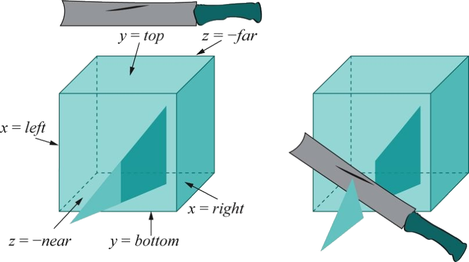
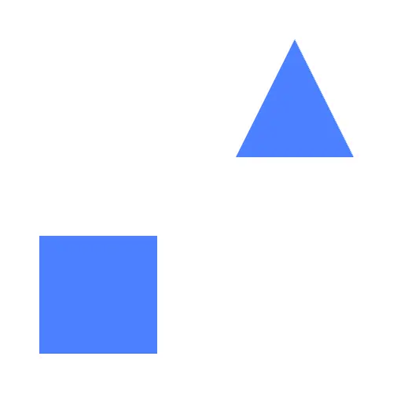
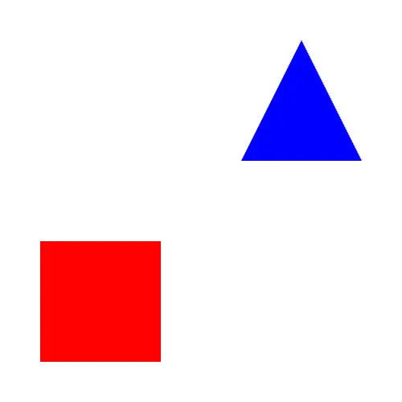
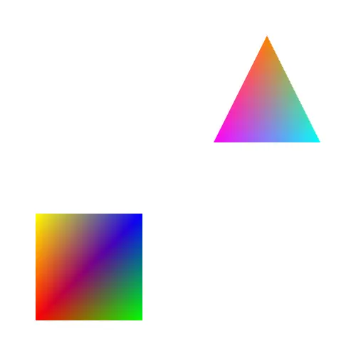
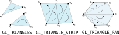
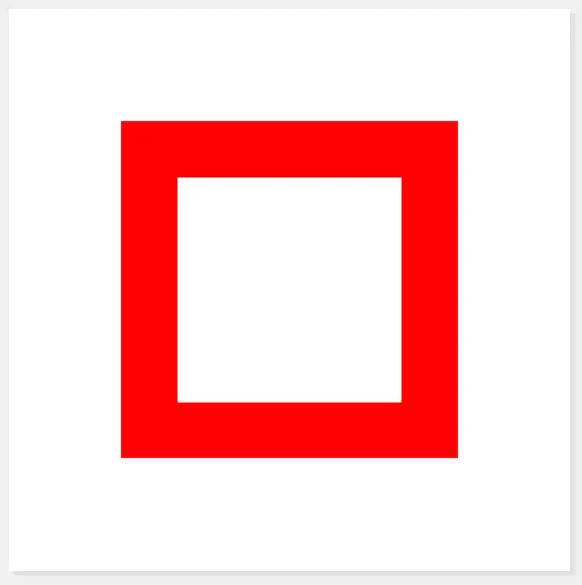
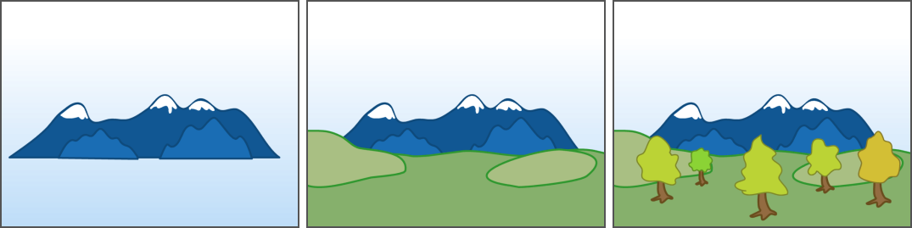
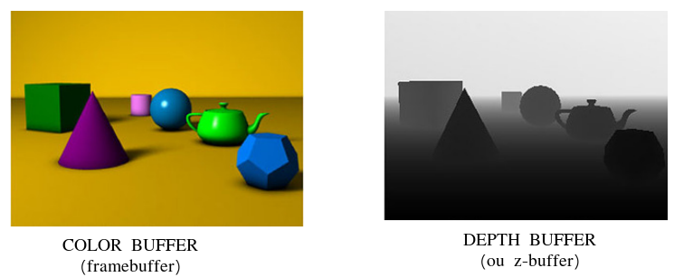
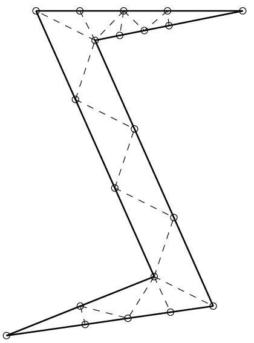

<!-- {"layout": "title"} -->
# Introdução a WebGL &nbsp; **_hands on_**
## parte 2

---
<!-- {"layout": "centered"} -->
# Roteiro

1. [_Clipping_](#clipping) (recorte)
1. [Definindo cores](#definindo-cores)
1. [Primitivas geométricas](#primitivas-geometricas)
1. [Ordem de desenho](#ordem-de-desenho)
1. [Posicionamento de objetos](#posicionamento-de-objetos)


---
<!-- {"layout": "centered"} -->
## Experimento com a coordenada <span class="math">z</span>

::: div .note.exercise font-size: 0.7em; margin-block: 2rem;
**Exercício**: alterar as coordenadas <span class="math">z</span> 
de alguns vértices para valores entre [-1, 1].

Passos:
1. alterar o _vertex shader_ (`vec2`-->`vec3`)
1. alterar o VBO posicao para fornecer 2-->3 valores
1. alterar o `gl.vertexAttribPointer` para ensinar o _shader_ a buscar o atributo
1. finalmente, alterar uma coordenada <span class="math">z</span>

Observações: <!-- {.bullet} -->
- Nada acontece visualmente <!-- {ul:.bulleted} -->
- Os vértices continuam dentro da caixa de visualização<br>que definimos via
  projeção ortográfica
:::

...mas o que acontece quando algum<br>**vértice fica FORA** do volume
de visualização? <!-- {p:.bullet} -->

---
<!-- {"layout": "section-header", "slideClass": "clipping", "hash": "clipping"} -->
# _Clipping_ (recorte)

- Objetos fora do volume: **descartados**
- Objetos no meio do caminho: **recortados** <!-- {.alternate-color} -->
- Objetos dentro do volume: **incluídos**

---
<!-- {"layout": "regular", "slideClass": "compact-code"} -->
# _Clipping_ (Recorte)

- ::: div .note.exercise.push-right.bullet.compact-code-more font-size: 0.7em; width: 420px
  **Experimento**: Alterar os vértices do quadrado:
  ```javascript
  const vertices = new Float32Array([
    120, 120,
    180, 120,
    180, 180,
    120, 180
  ])
  ```
  :::
  Vértices desenhados fora da caixa de visualização são descartados
- **Resultado**: o quadrado não aparece porque foi descartado --- todos seus
  vértices estavam fora da caixa de visualização que definimos no `ortho` <!-- {li:.bullet} -->

::: div .note.exercise.bullet width: 80%; margin-inline: auto; font-size: 0.7em;
**Mais exercícios** a partir de [hello-ortho][hello-ortho]:
1. Quadrado --> triângulo (remover último vértice)
1. Alterar o valor de <span class="math">z</span> do `v0` para um valor
   fora da caixa de visualização (_e.g._, -2.5, -5)

[hello-ortho]: https://fegemo.github.io/utf-cg-exemplos-webgl/hello-ortho/

---
<!-- {"layout": "regular"} -->
## O que aconteceu?

 <!-- {.block.centered style="width: 400px"} -->
<!-- {p:.no-margin.full-width} -->

- Um algoritmo de _clipping_ descartou o vértice que ficou de fora, mas criou
  outros dois na interseção com o volume <!-- {ul:.no-margin} -->
  - Algoritmos de _**line** clipping_: <!-- {ul^0:.multi-column-list-2} -->
    1. Cohen-Sutherland, 1967
    1. Lian-Barsky, 1984
  - Algoritmos de _**polygon** clipping_:
    1. Sutherland-Hodgman, 1974
    1. Weiler-Atherton, 1977


---
<!-- {"layout": "section-header", "slideClass": "colors", "hash": "definindo-cores"} -->
# Definindo Cores

- Como especificar cores
- Cor de um objeto
  - Variável `uniform`
- Cor de cada vértice (atributo)
  - Variável `in`

---
<!-- {"layout": "2-column-content", "slideClass": "compact-code-more"} -->
## Cores

1. _Fragment shader_ até agora: <!-- {ol:.no-bullet.no-margin} -->
   ```glsl
   #version 300 es
   precision mediump float;

   out vec4 corFragmento;

   void main() {
                    // sempre a mesma cor 😦
     corFragmento = vec4(0.0, 0.0, 0.0, 1.0);
   }
   ```
1. ::: div .note.exercise font-size: 0.7em; margin-top: 1rem;
   **Exercício**: altere alguma componente para ∉ [0,1].
   :::

- Até agora, estamos _hard-coding_ a cor do fragmento no _fragment shader_:
  - RGBA (vermelho, verde, azul, alfa)
- Os valores de cada componente são presos (**_clamped_**) entre `0` e `1`:
  - **Se** menores que `0` **então** `0`
  - **Se** maiores que `1.0` **então** `1.0`
  - **Se** entre `0.0` e `1.0` **então** usa o valor

---
<!-- {"layout": "2-column-content", "hash": "valores-rgb-de-algumas-cores"} -->
## Valores RGB de algumas cores

<iframe src="../../samples/rgb-cube/index.html" width="100%" height="350" frameborder="0"></iframe>

- <span class="color-portrait black"> </span> Preto: 0.0, 0.0, 0.0 <!-- {ul:.no-bullet} -->
- <span class="color-portrait red"> </span> Vermelho: 1.0, 0.0, 0.0
- <span class="color-portrait green"> </span> Verde: 0.0, 1.0, 0.0
- <span class="color-portrait blue"> </span> Azul: 0.0, 0.0, 1.0
- <span class="color-portrait yellow"> </span> Amarelo: 1.0, 1.0, 0.0
- <span class="color-portrait magenta"> </span> Magenta: 1.0, 0.0, 1.0
- <span class="color-portrait ciano"> </span> Ciano: 0.0, 1.0, 1.0
- <span class="color-portrait gray"> </span> Cinza: 0.6, 0.6, 0.6
- <span class="color-portrait white"> </span> Branco: 1.0, 1.0, 1.0

---
<!-- {"layout": "centered-horizontal"} -->
## Experimentos com cores

::: div .note.exercise font-size: 0.7em;
**Exercícios** a partir de [hello-diferentes-objetos][hello-diferentes-objetos]:

1. Alterar a cor do quadrado
   - _Easy_, direto no _fragment shader_
1. Desenhar um quadrado de cada cor
   - Criar uma `uniform` e definir seu valor antes de desenhar cada objeto
1. Desenhar um quadrado de forma que cada vértice possua uma cor diferente
   - Resetar o código do exemplo (tirar a `uniform` de cor)
   - Criar novo VBO para cor do vértice e configurar o atributo no _shader_:
     - _vertex shader_: nova variável `in`, nova `out`
     - _fragment shader_: nova variável `in` (mesmo nome da `out` do _vertex_)

- <!-- {ul:.card-list style="justify-content: space-around; gap: 1rem; width: 300px; margin-inline: auto;"} -->
   <!-- {.rounded} -->
-  <!-- {.rounded} -->
-  <!-- {.rounded} -->
:::

[hello-diferentes-objetos]: https://fegemo.github.io/utf-cg-exemplos-webgl/hello-diferentes-objetos/
*[VBO]: Vertex Buffer Object

---
<!-- {"layout": "section-header", "slideClass": "primitives", "hash": "primitivas-geometricas"} -->
# Primitivas Geométricas

Que tipos de objetos podemos desenhar?

 <!-- {style="width: 450px;"} -->

---
<!-- {"layout": "regular"} -->
## Primitivas Geométricas

- Objetos geométricos que o WebGL entende
- São os "tijolos" para construirmos objetos mais complexos
- Usamos como um **argumento para <u>`gl.drawArrays`</u>**. Por exemplo:
  ```javascript
  // ativa algum VAO e... desenha:
  gl.drawArrays(gl.POINTS, 0, 13)
  ```
- Exemplos
  1. Pontos (`gl.POINTS`) <!-- {ol:.multi-column-list-3.no-bullet} -->
  1. Linhas (`gl.LINES`)
  1. Triângulos (`gl.TRIANGLES`)

---


---


---
 <!-- {style="height: 180px"} -->

`gl.POINTS`
  ~ Desenha um ponto para cada vértice <span class="math">n</span>.

`gl.LINES`
  ~ Desenha uma série de segmentos de linha desconectados. São
    desenhados entre <span class="math">v_0</span> e
    <span class="math">v_1</span>, <span class="math">v_2</span> e
    <span class="math">v_3</span>, <span class="math">v_3</span> e
    <span class="math">v_4</span> e
    daí em diante. Se <span class="math">n</span> é ípmar, o último
    vértice não faz parte de um segmento.

`gl.LINE_STRIP`
  ~ Desenha um segmento de <span class="math">v_0</span> a
    <span class="math">v_1</span>, então de
    <span class="math">v_1</span> a <span class="math">v_2</span> e daí por
    diante, desenhando o segmento <span class="math">v_{n-2}</span>
    para <span class="math">v_{n-1}</span>. Então, um total de
    <span class="math">n-1</span> segmentos são desenhados.

`gl.LINE_LOOP`
  ~ Mesmo que `gl.LINE_STRIP`, exceto que um segmento final é desenhado
    de <span class="math">v_{n-1}</span> até <span class="math">v_0</span>,
    completando o circuito.


---
`gl.TRIANGLES`
  ~ Desenha uma série de triângulos usando os vértices
  <span class="math">v_0</span>, <span class="math">v_1</span>,
  <span class="math">v_2</span>, depois <span class="math">v_3</span>,
  <span class="math">v_4</span>, <span class="math">v_5</span>, e daí por
  diante. Se <span class="math">n</span> não é um múltiplo de 3, o
  último ou os 2 últimos vértices são ignorados.

`gl.TRIANGLE_STRIP`
  ~ Desenha uma série de triângulos usando os vértices
  <span class="math">v_0, v_1, v_2</span>, depois
  <span class="math">v_2, v_1, v_3</span>
  (repare na ordem), então <span class="math">v_2, v_3, v_4</span>,
  e daí por diante. A ordem é para assegurar que os triângulos estão
  todos desenhados com a mesma orientação.

`gl.TRIANGLE_FAN`
  ~ Mesmo que `GL_TRIANGLE_STRIP`, exceto que os vértices são
  <span class="math">v_0, v_1, v_2</span>, depois
  <span class="math">v_0, v_2, v_3</span>, depois
  <span class="math">v_0, v_3, v_4</span> e daí por diante.

 <!-- {style="height: 150px"} -->


---
<!-- {"layout": "regular"} -->
## Experimentos com as primitivas

1. Desenhar pontos (`gl.POINTS`) em vez de quadrados. Para que os
  pontos fiquem visíveis, **aumentar seu tamanho usando `gl.pointSize()`**.
1. Usar outras primitivas: `gl.LINES, gl.LINE_STRIP, gl.LINE_LOOP`


---
<!-- {"layout": "section-header", "slideClass": "draw-order", "hash": "ordem-de-desenho"} -->
# Ordem de desenho

- A ordem dos comandos de desenho importa?

---
<!-- {"layout": "2-column-content"} -->
## Atividade

1. Desenhar um quadrado acima do outro <!-- {ol:.no-bullet.center-aligned} -->
    <!-- {.bordered.block.centered.medium-width style="border-radius: 8px"} -->
- Há pelo menos 03 formas:  
  1. Desenhar um círculo vermelho grande, depois um branco pequeno
  1. Igual anterior, mas coloca o branco mais próximo da tela
  1. Desenhar um círculo furado
- Exemplo: [ordem-de-desenho][exemplo-ordem-de-desenho]
- E se alterarmos a ordem do branco com o vermelho?

[exemplo-ordem-de-desenho]: https://fegemo.github.io/utf-cg-exemplos-webgl/ordem-de-desenho

---
<!-- {"layout": "regular"} -->
## O que aconteceu?

- Por padrão, o WebGL usa o **algoritmo do pintor** ⬇️ para a 
  **determinação da visibilidade** dos polígonos
   <!-- {.block.centered.large-width} -->
  - O que é desenhado por último aparece na frente
  - O WebGL simplesmente desenha os triângulos, na ordem que pedimos <!-- {li:.bullet} -->
- Mas como fazer para WebGL de fato usar a coordenada <span class="math">z</span>? <!-- {li:.bullet} -->

---
<!-- {"layout": "regular"} -->
## Ativando: **teste de profundidade**

- Para que o WebGL teste a coordenada <span class="math">z</span>, (1) 
  <u>precisamos ativar o **teste de profundidade**</u>
  ```javascript
  // Em tempo de configuração (ou desenho)
  gl.enable(gl.DEPTH_TEST)
  gl.depthFunc(gl.LEQUAL)
  ```
- Também precisamos (2) <u>limpar o _depth buffer_</u>, ao limparmos a cor
  da janela
  ```javascript
  gl.clear(gl.COLOR_BUFFER_BIT | gl.DEPTH_BUFFER_BIT)
  ```

---
<!-- {"layout": "centered-horizontal"} -->
## O _depth buffer_ (ou z-buffer)




---
<!-- { "layout": "section-header", "slideClass": "posicionamento-de-objetos", "hash": "posicionamento-de-objetos" } -->
# Posicionamento de objetos

1. O jeito ruim
1. O jeito de hoje
1. O jeito melhor (mais flexível)

---
<!-- {"layout": "regular", "slideClass": "compact-code-more"} -->
# Posicionando Objetos: 1) Jeito Ruim <!-- {.bullet} -->

-  <!-- {.push-right.bullet style="max-height: 300px;"} -->
  A forma como temos posicionado objetos não é legal:
  ```javascript
  const esq = quad.x
  const dir = quad.x + quad.largura
  const bai = quad.y
  const cim = quad.y + quad.altura
  
  const vertices = new Float32Array([
    esq, bai, 0,  // ↙️
    dir, bai, 0,  // ↘️
    dir, cim, 0,  // ↗️
    esq, cim, 0   // ↖️
  ])
  ```
  - Problema: e se houver muito mais do que 4 vértices? *➡️*
  - Questão: não seria bem mais fácil definir as coordenadas se 
    **pudéssemos assumir que estamos <u>sempre na origem</u>?**

---
<!-- { "layout": "regular", "slideClass": "compact-code-more" } -->
# Posicionando Objetos: 2) Jeito de Hoje <small>(1/2)</small>

- Damos as coordenadas assumindo que estamos na origem, mas
  **deslocamos o objeto** para onde queremos que ele realmente seja
  desenhado: <!-- {ul:.bullet.two-column-code} -->
  ```javascript
  // inicialização:
  const tamanhoQuad = 20
  const metadeQuad = tamanhoQuad / 2
  let posicaoQuad = [20, 30, 0]

  // assumir (0,0,0) no centro do objeto
  const vertices = new Float32Array([
    -metadeQuad, -metadeQuad, 0,  // ↙️
     metadeQuad, -metadeQuad, 0,  // ↘️
     metadeQuad,  metadeQuad, 0,  // ↗️
    -metadeQuad,  metadeQuad, 0   // ↖️
  ])


  // desenho:
  gl.uniform3fv(deslocamentoLoc, posicaoQuad)
  gl.drawArrays(gl.TRIANGLE_FAN, 0, 4)

  // atualização:
  function keyPressed(e) {
    if (e.key === 'ArrowDown') {
      posicaoQuad.y += 0.2
    }
  }
  ```
  - E o _vertex shader_ aplica o deslocamento... <!-- {li:.bullet} -->

---
<!-- { "layout": "regular", "slideClass": "compact-code-more" } -->
# Posicionando Objetos: 2) Do Jeito de Hoje <small>(2/2)</small>

No _vertex shader_, somamos `deslocamento` às coordenadas do vértice atual,
antes de projetar:
1. `vertex-shader.glsl`
   ```glsl
   #version 300 es

   in vec3 position;
   uniform mat4 projection;
   uniform vec3 offset; // ⬅️ nova uniform: deslocamento

   void main() {
     // ℹ️ soma offset + coords. antes de multiplicar pela projeção
     gl_Position = projection * vec4(position + offset, 1.0);
   }
   ```
   <!-- {ol:.no-bullet.no-margin.no-padding.layout-split-2 style="gap: 1rem;"} -->
- Apesar de suficiente para o que precisamos até agora, existe um jeito mais
  flexível... <!-- {li:.bullet} -->
  - Se usarmos uma **"matriz de transformação de modelo"** (próximo slide) <!-- {li:.bullet} -->

---
<!-- { "layout": "regular", "slideClass": "compact-code-more" } -->
# Posicionando Objetos: 3) Do Jeito Melhor <small>(1/2)</small>

- Objeto representado com origem em seu centro (igual anterior): <!-- {ul:.two-column-code} -->
  ```javascript
  import { translate } from './utils/math.js'
  // ⬆️ vamos usar uma matriz de translação
  // inicialização:
  const tamanhoQuad = 20
  const metadeQuad = tamanhoQuad / 2
  let posicaoQuad = [20, 30, 0]

  // assumir (0,0,0) no centro do objeto
  const vertices = new Float32Array([
    -metadeQuad, -metadeQuad, 0,  // ↙️
     metadeQuad, -metadeQuad, 0,  // ↘️
     metadeQuad,  metadeQuad, 0,  // ↗️
    -metadeQuad,  metadeQuad, 0   // ↖️
  ])


  // desenho:
  gl.uniformMatrix4fv(
    modelLoc, false, modelMatrixQuad)
  gl.drawArrays(gl.TRIANGLE_FAN, 0, 4)

  // atualização:
  function keyPressed(e) {
    if (e.key === 'ArrowDown') {
      posicaoQuad.y += 0.2
    }
    modelMatrixQuad = translate(
      posicaoQuad.x, // ⬆️ no próx. slide
      posicaoQuad.y,
      posicaoQuad.z
    )
  }
  ```

---
<!-- { "layout": "regular", "slideClass": "compact-code-more" } -->
# Posicionando Objetos: 3) Do Jeito Melhor <small>(2/2)</small>

...e no _vertex shader_, **multiplicamos a coordenada pela matriz "model"**,
antes de projetar:
1. `vertex-shader.glsl`
   ```glsl
   #version 300 es

   in vec3 position;
   uniform mat4 projection;
   uniform mat4 model; // ⬅️ agora é uma matriz

   void main() {
     // ℹ️ multiplica coords. pela matriz de modelo e projeção
     gl_Position = projection * model * vec4(position, 1.0);
   }
   ```
1. `utils/math.js`
   ```javascript
   export function translate(tx, ty, tz) {
     return new Float32Array([
        1,  0,  0,  0,
        0,  1,  0,  0,
        0,  0,  1,  0,
       tx, ty, tz,  1
     ])
   }
   ```
   <!-- {ol:.no-bullet.no-margin.no-padding.layout-split-2 style="gap: 1rem;"} -->
- Na aula sobre [transformações](../transforms/) veremos
  a geometria por trás disso

---
<!-- {"layout": "centered"} -->
# Referências

- Capítulo 4 do livro **Computer Graphics with OpenGL 4th edition**
- Documentação do OpenGL 2: https://www.opengl.org/sdk/docs/man2/
- Livro Vermelho: http://www.glprogramming.com/red/ (capítulo 8)
