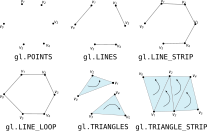
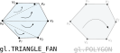
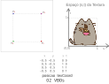
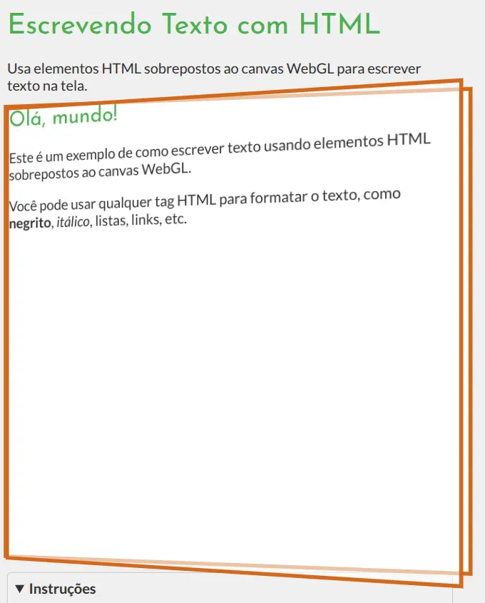
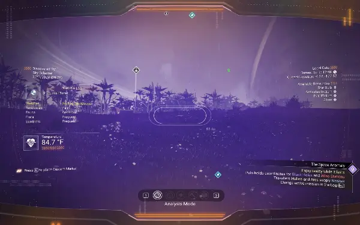
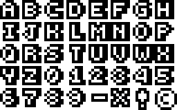
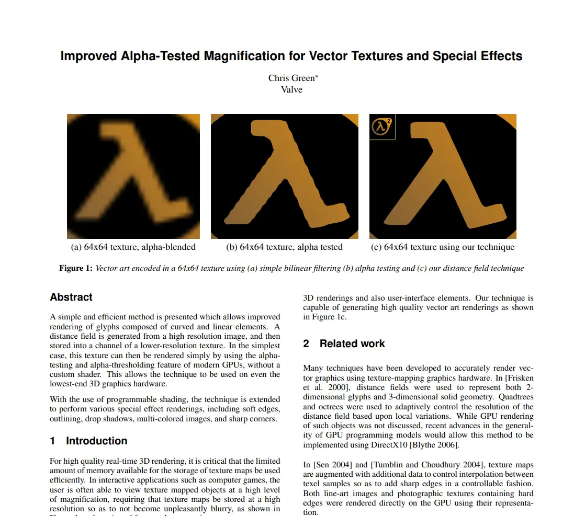
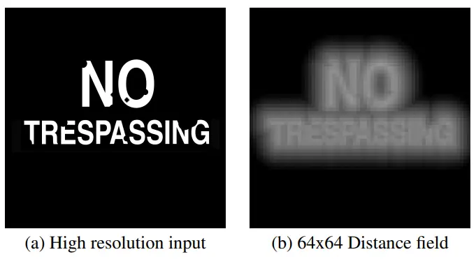
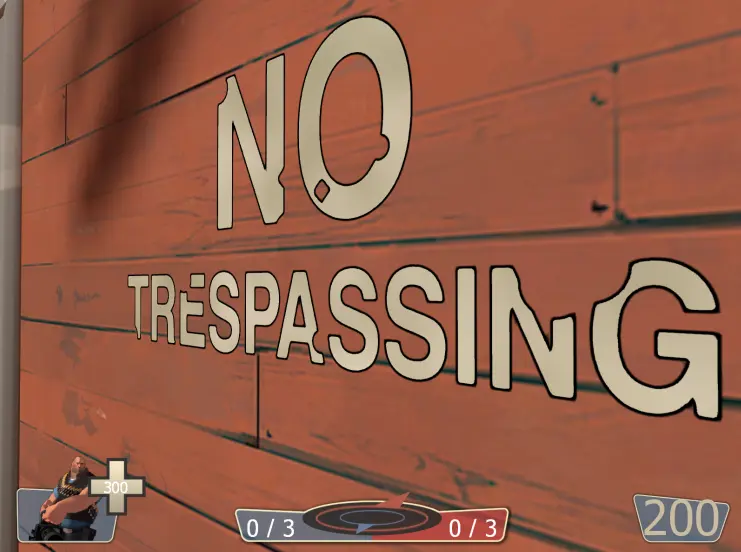
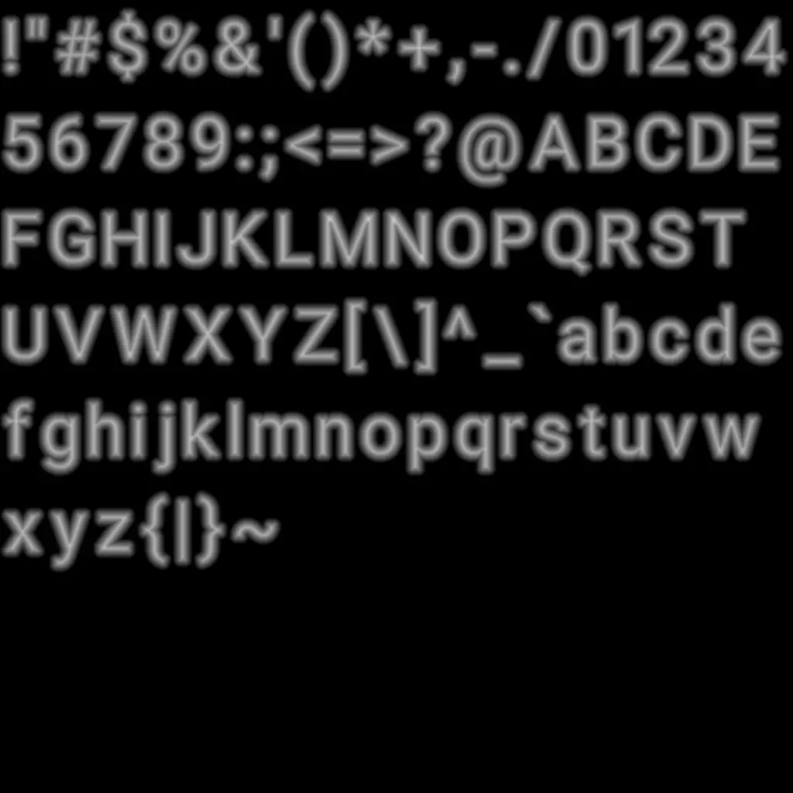

<!-- {"layout": "title"} -->
# Introdução a WebGL &nbsp; **_hands on_**
## parte 4

---
<!-- {"layout": "centered"} -->
# Roteiro

1. [Orientação de polígonos](#orientacao-de-poligonos)
1. [Usando texturas](#usando-texturas)
1. [Escrevendo texto](#escrevendo-texto)
1. **[Trabalho Prático 1](#tp1)**

---
<!-- { "layout": "section-header", "slideClass": "orientacao-de-poligonos", "hash": "orientacao-de-poligonos" } -->
# Orientação de Polígonos
## Lado da frente e de trás

---
<!-- { "layout": "regular" } -->
# Orientação

- Como estamos em 3D, **todo polígono possui um lado da frente e um lado de trás**
  - Quando falamos de objetos 3D, aí há coletivamente o lado de fora e o de dentro
- Em Computação Gráfica, é importante saber qual é o lado do polígono que
  estamos vendo por:
  - **Desempenho**: muitas vezes desenhamos só se estivermos vendo a frente
  - **Flexibilidade**: desenhar frente de um jeito, costas de outro
- O lado que estamos vendo é determinado pela **orientação do polígono**
- Em WebGL, definimos a orientação de forma implícita,
  **de acordo com a primitiva**...

---
<!-- { "layout": "regular" } -->
# Orientação no WebGL

- A frente do polígono em WebGL é dado 
  **<u>pela ordem</u> em que declaramos seus vértices**
  1. <!-- {ol:.full-width.no-bullet.no-padding style="padding-block: 2rem;"} -->
     <!-- {li:style="display: flex; justify-content: center; gap: 2rem;"} -->
      <!-- {style="width: 40%;"} -->
      <!-- {style="width: 27%;"} -->
- Se definido 🔄 (CCW), vemos o lado da frente
- Se definido 🔃 (CW), vemos o lado de trás

*[CCW]: Counterclockwise*
*[CW]: Clockwise*

---
<!-- {"layout": "2-column-content", "playMediaOnActivation": {"selector": "#color-animation" }, "slideClass": "compact-code-more"} -->
# Exemplo de Orientação


- <!-- {ul:.no-bullet.no-margin.no-padding.center-aligned} -->
  <video width="300" preload="auto" controls loop src="../../videos/orientacao-de-poligonos.mp4" id="color-animation" class="bordered subtly-round"></video>
  - [orientacao-poligonos][exemplo-orientacao-poligonos] <!-- {ul^0:.no-padding} -->
    
1. É possível ativar o **descarte de faces de trás**
   <!-- {ol:.no-margin.no-padding.no-bullet} -->
   - Isso é um recurso de otimização <!-- {li:.bullet} -->
     ```javascript
     gl.enable(gl.CULL_FACE)
     gl.cullFace(gl.BACK)  // valor padrão
     gl.frontFace(gl.CCW)  // valor padrão
     ```
1. ::: div .note.warning font-size: 0.7em; margin-top: 1rem;
   **Note**: esse exemplo artificalmente desenhou um quadrado com apenas linhas 
   "nas costas" do outro. <!-- {p:.no-margin style="font-size: 1em;"} -->
   :::
1. ::: div .note.exercise font-size: 0.7em; margin-top: 1rem;
   **Exercício**: altere a primitiva usada para desenhar. Depois, altere a ordem
   em que os vértices estão definidos. <!-- {p:style="font-size: 1em;"} -->
   
   O que aconteceu? <span class="bullet">Repare que a **ordem dos vértices define a orientação**.</span>
   <!-- {p:.no-margin} -->
   :::

[exemplo-orientacao-poligonos]: https://fegemo.github.io/utf-cg-exemplos-webgl/orientacao-poligonos/

---
<!-- { "layout": "section-header", "slideClass": "usando-texturas", "hash": "usando-texturas" } -->
# Usando Texturas

---
<!-- { "layout": "regular" } -->
# Texturas

- <!-- {ul:.full-width} -->
  ::: figure .push-right.polaroid max-width: 250px; text-align: center;
   <!-- {.bordered style="border-radius: 8px; max-width: 250px;"} -->
  [Textura Simples][exemplo-textura-simples]
  :::
  Teremos uma [aula sobre texturas](../textures) mais a frente
- Contudo, vamos começar a aprender para já ir usando:
  - No _shader_: 
    1. **+atributo** de **coordenada de textura**
    1. **+_varying_** de coordenada de textura
    1. _fragment shader_ **amostra a textura** para "pintar"
  - Programa JS:
    1. **carregar arquivo** da textura <!-- {ol:start="4"} -->
       - **criar e configurar** textura WebGL
    1. **configurar atributo** de coordenadas de textura
    1. **configurar _blending_** para transparências

[exemplo-textura-simples]: https://fegemo.github.io/utf-cg-exemplos-webgl/textura-simples/

---
<!-- {"layout": "regular", "slideClass": "compact-code-more"} -->
# Textura no _Shader_

1. <!-- {ol:.layout-split-2.no-bullet style="gap: 1rem;"} -->
   `vertex.glsl`
   ```glsl
   #version 300 es

   in vec3 a_position;
   // ℹ️ novo atributo: coordenada de textura
   in vec2 a_texcoord;
   // ℹ️ nova varying: coord. text. interpolada
   out vec2 v_texcoord;

   void main() {
     gl_Position = vec4(a_position, 1.0);

     // ℹ️ repassa as coordenadas de textura 
     // para o fragment shader. Será interpolada
     // para cada fragmento (pixel) do polígono
     v_texcoord = a_texcoord;
   }
   ```
1. `fragment.glsl`
   ```glsl
   #version 300 es

   precision mediump float;

   // ℹ️ nova varying: coordenada de textura
   in vec2 v_texcoord;
   // ℹ️ nova uniform: a textura
   uniform sampler2D u_texture;

   out vec4 outColor;

   void main() {
     // ℹ️ agora pegamos a cor da textura
     outColor = texture(u_texture, v_texcoord);
   }
   ```

---
<!-- {"layout": "regular", "slideClass": "compact-code-more"} -->
# Textura: coordenadas de textura <small>(1/2)</small>
  
- Precisamos associar uma coordenada <span class="math">(s, t)\in[0,1]</span>
  para cada vértice
  - Chamamos de "mapear a textura" no polígono
    
 <!-- {style="max-width: 400px;"} -->

<!-- {p:.center-aligned.full-width} -->

---
<!-- {"layout": "regular", "slideClass": "compact-code vbo-coordenada-textura", "state": "show-active-slide-and-previous", "embeddedStyles": ".vbo-coordenada-textura > * { margin-left: 15%; }"} -->

- E configurar o novo **VBO de coordenadas de textura**:
  ```javascript
  // ℹ️ coordenadas de textura de cada vértice
  // a ordem deve ser a mesma dos vértices
  const texcoords = new Float32Array([
      0.0, 0.0, // do v0 ↙️
      1.0, 0.0, // do v1 ↘️
      1.0, 1.0, // do v2 ↗️
      0.0, 1.0  // do v3 ↖️
  ])

  // ℹ️ configura o atributo 'texcoord' 
  // ("in vec2 texcoord" do shader)
  const texcoordLoc = // ...
  // ...5 passos para configurar um VBO
  ```

---
<!-- {"layout": "regular", "slideClass": "compact-code-more"} -->
# Textura: carregando e configurando

1. <!-- {ol:.layout-split-2.bulleted.no-bullet.no-margin.no-padding style="gap: 1rem;"} -->
   ```javascript
   // (1) carrega a imagem
   const image = new Image()
   image.src = 'pusheen-noodles.png'

   // (2) cria e configura a textura
   // (2.1) cria e ativa
   const texture = gl.createTexture()
   gl.bindTexture(gl.TEXTURE_2D, texture)

   // (2.2) sobe os dados da imagem
   gl.texImage2D(gl.TEXTURE_2D, 0, gl.RGBA, gl.RGBA, gl.UNSIGNED_BYTE, image)

   // (2.3) configura filtros de redução/ampliação
   gl.generateMipmap(gl.TEXTURE_2D)
   gl.texParameteri(gl.TEXTURE_2D, gl.TEXTURE_MIN_FILTER, gl.LINEAR_MIPMAP_LINEAR)
   gl.texParameteri(gl.TEXTURE_2D, gl.TEXTURE_MAG_FILTER, gl.LINEAR)
   ```
1. ::: div .note.warning font-size: 0.7em;
   **Atenção**: carregar a imagem é um processo assíncrono. Pode (vai) acontecer
   do WebGL renderizar e a imagem ainda não está pronta. Mas não deve dar erro.

   **Como lidar bem**? (a) pré-carregar imagens ou (b) aguardar para renderizar
   a primeira vez (`async/await`). 
   
   Exemplo 
   [textura-simples][exemplo-textura-simples] **aguarda para renderizar**.
   :::

[exemplo-textura-simples]: https://fegemo.github.io/utf-cg-exemplos-webgl/textura-simples

---
<!-- {"layout": "regular", "slideClass": "compact-code-more"} -->
# Textura: configurando transparência

```javascript
// ℹ️ habilita o blending para lidar com transparências da textura (canal alpha)
gl.enable(gl.BLEND)
gl.blendFunc(gl.SRC_ALPHA, gl.ONE_MINUS_SRC_ALPHA)
```
...sem isso, pixels transparentes não se misturam corretamente com o que atrás.


---
<!-- {"layout": "section-header", "slideClass": "text", "hash": "escrevendo-texto"} -->
# Escrevendo Texto

- Diferentes abordagens:
  1. Sobreposição de HTML
  1. Sobreposição de Canvas 2D
  1. Textura com texto
  1. Atlas de textura com glifos de texto

---
<!-- {"layout": "regular"} -->
# Diferentes Abordagens

- WebGL desconhece texto
- Únicas funções de desenho:
  1. `gl.clear()` <!-- {ol:.multi-column-list-3} -->
  1. `gl.drawArrays()`
  1. `gl.drawElements()`
- Há diferentes abordagens, cada qual com suas particularidades
  1. **HTML sobreposto**
  1. Canvas sobreposto
  1. Textura de texto
  1. **Atlas de textura com glifos de texto**

---
<!-- {"layout": "regular", "slideClass": "compact-code-more"} -->
# 1) Elementos HTML sobrepostos ao canvas

- **Ideia**: aproveitar o motor de renderização e facilidades da Web
  1. <!-- {ol:.layout-split-3.no-bullet.no-margin.no-padding.bullet style="gap: 1rem;"} -->
     `index.html`
     ```html
     ...
     <div id="container">
       <canvas id="aplicacao-webgl"></canvas>
       <div id="texto-sobreposto">
         <!-- quaisquer elementos HTML aqui -->
       </div>
     </div>
     ```
     - Todo o poder de HTML e CSS <!-- {li:.bullet} -->
     - Super flexibilidade, _widgets_, etc. <!-- {li:.bullet} -->
     - Ruim: texto <u>sempre acima</u> <!-- {li:.bullet} -->
  1. `main.css`
     ```css
     #container {
       position: relative;
     }
     #texto-sobreposto {
       position: absolute;
       inset: 0;
     }
     ```
  1.  <!-- {.block.centered.bordered style="border-radius: 8px; max-width: 250px"} -->
     [Escrevendo Texto HTML][exemplo-escrevendo-texto-html]
    
[exemplo-escrevendo-texto-html]: https://fegemo.github.io/utf-cg-exemplos-webgl/escrevendo-texto-html

---
<!-- {"layout": "regular", "slideClass": "compact-code-more"} -->
# 2) Canvas 2D sobreposto ao 3D

- É possível sobrepor 2 canvas, o de baixo usando WebGL e o de cima 2D:
  1. <!-- {ol:.layout-split-3.no-bullet.no-margin.no-padding.bullet style="gap: 1rem;"} -->
     `index.html`
     ```html
     ...
     <div id="container">
       <canvas id="aplicacao-webgl"></canvas>
       <canvas id="texto-sobreposto"></canvas>
     </div>
     ```
     O que se ganha?
     - Desenhos arbitrários usando uma API mais simples <!-- {li:.bullet style="list-style-type: circle"} -->
     - Perde-se a flexibil. de HTML e CSS <!-- {li:.bullet style="list-style-type: circle"} -->
     - Texto continua <u>sempre acima</u> <!-- {li:.bullet style="list-style-type: circle"  } -->
  1. `main.js`
     ```javascript
     const canvas1 = document.querySelector('#aplicacao-webgl')
     const canvas2 = document.querySelector('#texto-sobreposto')
     const gl = canvas1.getContext('webgl2')
     const ctx = canvas2.getContext('2d')

     // apaga o canvas de texto
     ctx.clearRect(0, 0, ctx.canvas.width, ctx.canvas.height);

     ctx.font = '50px serif'
     ctx.fillStyle = 'rgb(20, 255, 30)'
     ctx.fillText('Um texto maneiro', pixelX, pixelY);
     // etc.
     ```
     - API do [Canvas 2D na MDN][mdn-canvas-2d] <!-- {li:style="list-style-type: circle"} -->

[mdn-canvas-2d]: https://developer.mozilla.org/en-US/docs/Web/API/CanvasRenderingContext2D

---
<!-- {"layout": "regular", "slideClass": "compact-code-more"} -->
# 3) Textura de Texto

- Podemos (1) criar uma textura com cada texto que aparece no programa WebGL e
  (2) desenhar um retângulo com ela, em uma posição dentro do mundo <!-- {li:.bullet} -->
- [↪️ Tutorial: Textura de Texto][webgl2fundamentals-webgl-text-texture] <!-- {.push-right.bullet} -->
  **Criar a textura**
  1. <!-- {ol:.no-bullet.no-padding} -->
     **(a)** _offline:_ gerando arquivos ou
  1. **(b)** <!-- {.alternate-color} --> _online:_ criando _offscreen canvas_ ⬇️
     - <!-- {.two-column-code} -->
       ```javascript
       const cvOculto = document.createElement('canvas')
       const ctx = cvOculto.getContext('2d')

       function texturaTexto(texto, largura, altura) {
         ctx.canvas.width  = largura
         ctx.canvas.height = altura
         ctx.font = '20px monospace'
         ctx.textAlign = 'center'
         ctx.textBaseline = 'middle'
         ctx.fillStyle = 'black'
         ctx.clearRect(0, 0, largura, altura)
         ctx.fillText(text, largura/2, altura/2)
         return ctx.canvas
       }

       const txOla = texturaTexto('Ola!', 100, 30)
       // ...cria textura, daí sobe a imagem:
       gl.texImage2D(gl.TEXTURE_2D, 0, 
          gl.RGBA, gl.RGBA, 
          gl.UNSIGNED_BYTE, txOla)
       ```

[webgl2fundamentals-webgl-text-texture]: https://webgl2fundamentals.org/webgl/lessons/webgl-text-texture.html

---
<!-- {"layout": "regular", "slideClass": "compact-code-more"} -->
# 4) Atlas de Textura de Glifos de Texto <small>(1/3)</small>

-  <!-- {.push-right.bordered style="border-radius: 8px; max-width: 300px"} -->
  Para texto estático <u>3) Textura de Texto</u> funciona bem
- Mas para GUI/HUD com muito texto dinâmico, fica caro ➡️ <!-- {li:.bullet} -->
- **Ideia**: em vez de 1 textura por texto/frase, 1 por glifo: <!-- {li:.bullet} -->
   <!-- {.push-left style="margin: 1rem 3rem 0 0"} -->
  - Vamos colocar todos os glifos em uma única textura, e usar 
    as coordenadas de textura <span class="math">(s,t)</span>:
    ```javascript
    const fontInfo = {
      letterHeight: 8,
      spaceWidth: 8,
      textureWidth: 64,
      textureHeight: 40,
      glyphInfos: {
        'a': { x:  0, y:  32, width: 8 }, // s = x/textureWidth
        'b': { x:  8, y:  32, width: 8 }, // t = y/textureHeight
        'c': { s: 16, t:  32, width: 8 },
    // ...
    ```
*[GUI]: Graphical User Interface
*[HUD]: Head-up Display

---
<!-- {"layout": "centered-horizontal"} -->
## Paper da Valve na SIGGRAPH 2007

- <!-- {ul:.layout-split-2.no-padding.full-width style="gap: 1rem;"} -->
  <!-- {li:.no-bullet} -->
   <!-- {.block style="max-height: 380px; box-shadow: 8px 8px 8px #0002;"} -->
  [Leia o paper (5p)][paper-valve-sdf]: curto, direto ao ponto
- <!-- {li:style="list-style-type: none"} -->
  - Renderiza texto **bonito e rápido**
  - A partir de uma imagem de texto de alta resolução, gera a textura SDF (menor):
    1. Pixel branco: calcula distância até pixel preto mais próximo
    1. P.preto: idem para p.branco, inverte sinal
    1. Normaliza entre <span class="math">[0,1]</span>
  - <!-- {li:.no-bullet style="display: flex; align-items: center; justify-content: space-evenly;"} -->
     <!-- {style="max-width: 250px;"} -->
     <!-- {style="width: 172px;"} -->

[paper-valve-sdf]: https://steamcdn-a.akamaihd.net/apps/valve/2007/SIGGRAPH2007_AlphaTestedMagnification.pdf
*[SDF]: Signed Distance Field

---
<!-- {"layout": "regular", "slideClass": "compact-code-more"} -->
# 4) Atlas de Textura de Glifos de Texto <small>(1/3)</small>

-  <!-- {.push-right.bordered style="border-radius: 8px; max-width: 300px"} -->
  Para texto estático <u>3) Textura de Texto</u> funciona bem
- Mas para GUI/HUD com muito texto dinâmico, fica caro ➡️ <!-- {li:.bullet} -->
- **Ideia**: em vez de 1 textura por texto/frase, 1 por glifo: <!-- {li:.bullet} -->
   <!-- {.push-left style="margin: 1rem 3rem 0 0"} -->
  - Vamos colocar todos os glifos em uma única textura, e usar 
    as coordenadas de textura <span class="math">(s,t)</span>:
    ```javascript
    const fontInfo = {
      letterHeight: 8,
      spaceWidth: 8,
      textureWidth: 64,
      textureHeight: 40,
      glyphInfos: {
        'a': { x:  0, y:  32, width: 8 }, // s = x/textureWidth
        'b': { x:  8, y:  32, width: 8 }, // t = y/textureHeight
        'c': { x: 16, y:  32, width: 8 },
    // ...
    ```
*[GUI]: Graphical User Interface
*[HUD]: Head-up Display

---
<!-- {"layout": "regular", "slideClass": "compact-code-more"} -->
# 4) Atlas de Textura de Glifos de Texto <small>(2/3)</small>

- Se tivermos uma imagem SDF com glifos e um atlas, do tipo:
  1. <!-- {ol:.layout-split-2.full-width.no-bullet.no-padding.no-margin.two-column-code style="gap: 1rem;"} -->
     `fonts/roboto.png`
      <!-- {.block style="max-width: 200px"} -->
  1. `fonts/roboto.json`
     ```json
     {
       "aspect":1,
       "row_height":0.121094,
       "ascent":0.080078,
       "descent":0.021484,
       "chars":{
         "0":{
           "codepoint":48,
           "rect":[
             0.711914,
             0,
             0.770264,
             0.121094
           ]
         },
         "1":{
           "codepoint":49,
           "rect":[
             0.770264,
             0,
             0.813232,
             0.121094
           ]
         },
     ```
- Podemos fazer o mesmo... **usando uma biblioteca** para ajudar (próximo slide) <!-- {li:.bullet} -->
- E, para gerar SDF+json de um arquivo TTF: <!-- {li:.bullet} -->
  [SDF Font Atlas Generation Tool][sdf-atlas]

[sdf-atlas]: https://github.com/fegemo/sdf-atlas
*[SDF]: Signed Distance Field
*[TTF]: TrueType Font

---
<!-- {"layout": "regular", "slideClass": "compact-code-more"} -->
# 4) Atlas de Textura de Glifos de Texto <small>(3/3)</small>

- Podemos usar a biblioteca **webgl-fonts** <!-- {ul:.two-column-code} -->
  ([repo][webgl-fonts-repo], [demo][webgl-fonts-demo])
  ```javascript
  // importa a biblioteca
  import { createRenderer, loadFont } from 
    'https://cdn.jsdelivr.net/npm/' + 
    'webgl-fonts@1.2.5/+esm'
  
  // carrega img SDF (.png) + atlas (.json):
  // fonts/roboto.png + fonts/roboto.json
  const fonte = await loadFont(gl, 'fonts/roboto')
  const escritor = createRenderer(gl)

  function desenhaCena() {
    // desenha coisas em 3D
    // ...depois o texto:
    escreve('Olá', 0, 0)
  }


  function escreve(texto, x, y) {
    escritor.render({
      font: fonte,
      fontSize: 32,
      text: texto,
      translateX: x,
      translateY: y,
      fontHinting: true,
      subpixel: true,
      fontColor: [1, 1, 1, 1],
      backgroundColor: [0, 0, 0, 1],
    })
  }
  ```
  - Exemplo [escrevendo-texto-atlas][exemplo-escrevendo-texto-atlas]

[webgl-fonts-repo]: https://github.com/mate-h/webgl-fonts
[webgl-fonts-demo]: https://webgl-fonts.vercel.app/ 
[exemplo-escrevendo-texto-atlas]: https://fegemo.github.io/utf-cg-exemplos-webgl/escrevendo-texto-atlas

---
<!-- { "layout": "centered", "hash": "tp1" } -->
# Trabalho Prático 1 \o/

_A wild TP1 appears..._

---
<!-- {"layout": "2-column-content"} -->
# TP1: **Defesa de Torres**


> No centro,
há uma torre, que possui uma certa quantidade de pontos de vida e deve
ser protegida.
> De tempos em tempos, surgem inimigos de fora da tela e que vão andando
em direção ao centro para atacar a torre.


 <!-- {.push-right style="width: 210px; margin-left: 1em"} -->
- Enunciado no SIGAA
