<!-- {"layout": "title"} -->
# Introdução a WebGL &nbsp; **_hands on_**
## Sistemas de coordenadas, cores e primitivas geométricas

---
<!-- {"layout": "centered"} -->
# Roteiro

1. Primeiro programa
1. Sistemas de coordenadas
1. _Clipping_ (recorte)
1. Cores
1. Primitivas geométricas
1. Lista de exercícios 1

---
<!-- {"layout": "centered-horizontal", "state": "transition-put-next-further"} -->
# Primeiro programa

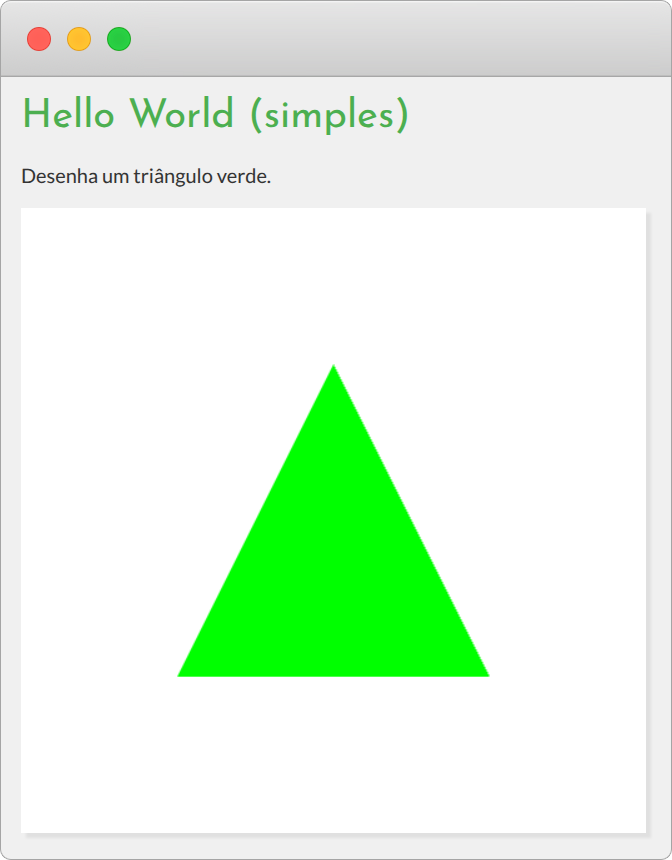 <!-- {.bordered.small-width style="border-radius: 8px; width: 336px;"} --> <!-- {p:.full-width.center-aligned} -->

---
<!-- {"layout": "centered-horizontal", "slideClass": "compact-code-more", "state": "transition-put-next-further transition-put-previous-closer"} -->
## O código fonte

```javascript
function configuraTudo() {
  // 1. inicia contexto WebGL2
  const canvas = document.querySelector('canvas')
  const gl = canvas.getContext('webgl2')

  // 2. registra callbacks p/ eventos de interesse
  // 3. cria, compila e linka programa shader
  const vsCode = `#version 300 es...`
  const vs = gl.createShader(gl.VERTEX_SHADER)
  gl.shaderSource(vs, vsCode)
  gl.compileShader(vs)

  // 3.2 cria e compila o fragment shader
  const fsCode = `#version 300 es...`
  const fs = gl.createShader(gl.FRAGMENT_SHADER)
  gl.shaderSource(fs, fsCode)
  gl.compileShader(fs)

  // 3.3 cria o programa, associa vs/fs e linka
  const programa = gl.createProgram()
  gl.attachShader(programa, vs)
  gl.attachShader(programa, fs)
  gl.linkProgram(programa)

  // 4. especifica a cena
  const vertices = new Float32Array(
    [0.0, 0.5,   -0.5, -0.5,     0.5, -0.5]
    // topo        esquerda       direita
  )
  // cria um VAO para o triângulo
  const vao = gl.createVertexArray()
  gl.bindVertexArray(vao)
  
  // cria um VBO (buffer) com vértices
  const vbo = gl.createBuffer()
  gl.bindBuffer(gl.ARRAY_BUFFER, vbo)
  gl.bufferData(gl.ARRAY_BUFFER, vertices, gl.STATIC_DRAW)
  
  // acha o slot do atributo dentro do shader
  const posicaoLoc = gl.getAttribLocation(programa, 'posicao')

  // instrui GPU onde e como buscar o atributo 'posicao' deste VBO
  gl.vertexAttribPointer(
   // index, size, type, normalize, stride, offset
      posicaoLoc, 2, gl.FLOAT, false, 0, 0)

  // ativa o atributo (senão mesmo valor para todos vértices)
  gl.enableVertexAttribArray(posicaoLoc)

  // 5. inicia valores para variáveis de estado
  gl.clearColor(1, 1, 1, 1)
  gl.useProgram(programa)

  return gl
}

function desenhaCena(gl) {
  gl.clear(GL_COLOR_BUFFER_BIT)
  gl.drawArrays(gl.TRIANGLES, 0, 3)
}


const gl = configuraTudo()
let logoAntes = 0

function loopPrincipal(agora) {
  // (0) descobre o tempo desde a última chamada
  const quantoPassou = (agora - logoAntes) / 1000
  logoAntes = agora
  
  // (1) atualiza a lógica do programa
  atualizaLogica(quantoPassou)

  // (2) desenha a cena no novo estado
  desenhaCena(gl)

  // registra a próxima chamada do loop
  requestAnimationFrame(loopPrincipal)
}

requestAnimationFrame(loopPrincipal)
```

Exemplo: [hello-world-organizado][exemplo-hello-world-organizado] <!-- {target="_blank"} -->

[exemplo-hello-world-organizado]: https://fegemo.github.io/utf-cg-exemplos-webgl/hello-organizado/

---
<!-- {"layout": "centered-horizontal", "slideClass": "compact-code-more", "state": "transition-put-previous-closer"} -->
## Apenas o triângulo (config./desenho)

- <!-- {ul:.layout-split-2.no-bullet style="gap: 1rem;"} -->
  ```javascript
  function configuraTudo() {
    // ...
    // 4. especifica a cena
    const vertices = new Float32Array([
       0.0,  0.5,   // topo
      -0.5, -0.5,   // esquerda
       0.5, -0.5    // direita
      ])
    // ...
  }

  function desenhaCena(gl) {
    // apaga o conteúdo da janela
    gl.clear(GL_COLOR_BUFFER_BIT);
    
    // desenha de acordo com o VAO atual
    gl.drawArrays(gl.TRIANGLES, 0, 3)
  }
  ```
- E o _vertex shader:_ <!-- {li:.bullet} -->
  ```glsl
  #version 300 es

  in vec2 posicao;
  
  void main() {
    // apenas passa a posicao adiante
    gl_Position = vec4(posicao, 0.0, 1.0);
  }
  ```
  - Mas por que esses `0.5` e `-0.5`? <!-- {li:.bullet} -->
  - Qual sistema de coordenadas estamos usando? <!-- {li:.bullet} -->

---
<!-- {"layout": "section-header", "slideClass": "coordinate-system"} -->
# Sistemas de Coordenadas

- Coordenadas Normalizadas de Dispositivo
- Projeção ortogonal
- Coordenadas do mundo
- Coordenadas da janela
- Recorte (_clipping_)

*[NDC]: Normalized Device Coordinates

---
<!-- {"layout": "regular", "slideClass": "compact-code-more"} -->
# Coordenadas Normalizadas de Dispositivo

- NDC é o sistema de coordenadas que o WebGL usa para desenhar os objetos <!-- {ul:.full-width} -->
- ::: sample ndc .push-right width: 200px; height: 200px;
  :::
  É um cubo, de tamanho 2, centrado na origem:
  - Eixo <span class="math">x</span>: -1 (esqu.) até +1 (dire.)
  - Eixo <span class="math">y</span>: -1 (baixo) até +1 (cima)
  - Eixo <span class="math">z</span>: -1 (perto) até +1 (longe) 
- <!-- {.push-code-right.bullet} -->
  ```javascript
  const vertices = new Float32Array([
    0.0, 0.5,   -0.5, -0.5,   0.5, -0.5
    // topo      esquerda      direita
  ])
  ```
  O triângulo foi definido dentro desse espaço ↘️
  - Se houver vértices para fora, eles não aparecem
- E se quisermos usar outros sistemas de coordenadas? <!-- {li:.bullet} -->
  - Por exemplo: <span class="math">x,y\in[0,100]</span>
  - Podemos, mas para o WebGL, ao final precisamos converter ao NDC
    - Vamos fazer uma **transformação das coordenadas** <!-- {li:.bullet} -->

*[NDC]: Normalized Device Coordinates

---
<!-- {"layout": "regular", "slideClass": "compact-code-more"} -->
# Definindo o Mundo

- <!-- {ul:.two-column-code} -->
  **Ideia**: definir os vértices indo de 0 a 100 nos eixos <span class="math">x, y</span>:
  ```javascript
  const vertices = new Float32Array([
    // topo     esquerda   direita
      50, 75,    25, 25,   75, 25
  ])
  // Antes estava assim:
  // topo       esquerda    direita
  // 0.0, 0.5,  -0.5,-0.5,  0.5,-0.5

  ```
  - Mas WebGL precisa das coordenadas como NDC
- Então, no _vertex shader_ fazemos uma transformação:
  ```glsl
  #version 300
  
  vec2 in posicao;

  void main() {
    // se x = 50, agora vira x' = 0
    gl_Position = vec4(posicao / 50.0 - 1.0, 0.0, 1.0);
  }


  // Antes estava assim:
  // gl_Position = vec4(posicao, 0.0, 1.0);
  // z e w continuam fixos (0 e 1)  

  ```
  - Isso é parte de uma **projeção ortogonal**

*[NDC]: Normalized Device Coordinates

---
<!-- {"layout": "centered-horizontal"} -->
# Projeção

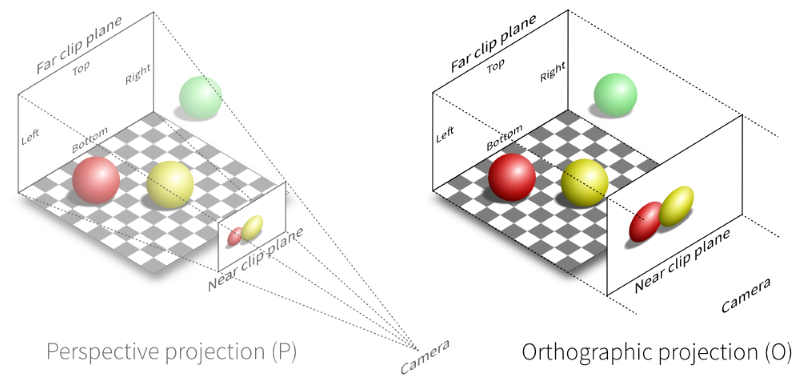

---
<!-- {"layout": "regular", "slideClass": "compact-code-more"} -->
# Projeção Ortogonal

- É o mapeamento de pontos em um plano perpendicular à "câmera"
  - Passamos do espaço 3D para 2D
- ::: div .note.info.push-right.bullet width: 370px;
  Na aula sobre [_pipeline_](../pipeline), entenderemos a operação **projeção** por inteiro.

  É apenas parte porque ainda continuamos com a coord. 
  <span class="math">z</span>.
  :::
  A transformação que fizemos é _parte de_ uma projeção
- Se tivermos um valor que queremos para os cantos `left/right`, 
  `bottom/top` e `near/far`, o cálculo é: <!-- {li:.bullet} -->
  ```javascript
  novoX = 2*(x - left)   / (right - left) - 1
  novoY = 2*(y - bottom) / (top - bottom) - 1
  
  // para x,y ∈ [0,100]: l=0, r=100, b=0, t=100
  novoX = x/50 - 1 
  novoY = y/50 - 1 
  ```
  - É possível agilizar esse cálculo... <!-- {li:.bullet} -->

---
<!-- {"layout": "regular"} -->
## Mesma Operação usando Matriz

- Precisamos transformar as coordenadas <span class="math">P=(x,y,z)</span> do vértice, <span class="math">P'=t(P)</span>
  - **Proposição**: há uma matriz que multiplica as coordenadas e as transforma

1. Operação <span class="math">t(P)</span> que queremos: <!-- {ol:.bullet.layout-split-2.no-bullet style="justify-content: space-around; height: auto;"} -->
   <div class="math" style="font-size: 0.8em">\begin{align*}x'&=2(x-\text{left})/(\text{right}-\text{left}) - 1
   \\y'&=2(y-\text{bottom})/(\text{top}-\text{bottom}) - 1
   \\z'&=2(z-\text{near})/(\text{far}-\text{near}) - 1\end{align*}</div>
1. Forma matricial <span class="math">T(P)</span>, usando uma 4x4:
   <figure class="picture-steps clean" style="font-size: 0.8em">
     <div class="bullet math" style="width: 100%;">T(P)=\begin{bmatrix} 1&0&0&0 \\ 0&1&0&0 \\ 0&0&1&0 \\ 0&0&0&1 \end{bmatrix}\times \begin{bmatrix} x \\ y \\ z \\ 1 \end{bmatrix}=\begin{bmatrix} x' \\ y' \\ z' \\ 1 \end{bmatrix}</div>
     <div class="bullet math">T(P)=\begin{bmatrix} \frac{2}{r-l}&0&0&- \frac{r+l}{r-l} \\ 0&\frac{2}{t-b}&0&- \frac{t+b}{t-b} \\ 0&0&\frac{-2}{f-n}&- \frac{f+n}{f-n} \\ 0&0&0&1 \end{bmatrix} \begin{bmatrix} x \\ y \\ z \\ 1 \end{bmatrix}=\begin{bmatrix} x' \\ y' \\ z' \\ 1 \end{bmatrix}</div>
   </figure>
Nas aulas sobre [transformações](../transforms) e [projeção](../projection/) entenderemos de onde vem essa matriz... <!-- {p:.bullet.no-margin} -->

Mas como podemos transformar os vértices da cena? <!-- {p:.bullet.no-margin style="margin-top: 1em;"} -->

<!-- 

Indo da forma matricial (escala e translação) para a intuitiva:
====
2/(r-l) * x - (r+l)/(r-l)
2x/(r-l) + (2l-2l)/(r-l) - (r+l)/(r-l)
(2x +2l -2l - r-l))/(r-l) # truque: somamos e subtraímos 2l ao numerador
(2(x-l) +2l-r-l)/(r-l)    # isolamos 2(x-l), que é o que queremos no numerador
(2(x-l) -r+l)/(r-l)
(2(x-l) - (r-l))/(r-l)
2(x-l)/(r-l) - (r-l)/(r-l)
2(x-l)/(r-l) - 1

2(x-l)/(r-l) - 1
 -->

---
<!-- {"layout": "regular", "slideClass": "compact-code-more"} -->
## Projetando os Vértices

- Em algum momento, precisamos projetar as coordenadas de cada vértice:
  - Multiplicar as coordenadas pela matriz de projeção
- Logo, se é uma **operação por vértice** e envolve **multiplicação de matriz**... <!-- {li:.bullet} -->
  - Vamos fazer no _vertex shader:_ 🎉 <!-- {li:.bullet} -->
    ```glsl
    #version 300 es

    in vec2 posicao;
    uniform mat4 projecao; // ℹ️ novidade

    void main() {
      // ℹ️ GLSL faz mat4 x vec4 com tranquilidade:
      gl_Position = projecao * vec4(posicao, 0, 1);
    }
    ```
    - Mas como informar o valor dessa matriz para o _shader_? <!-- {li:.bullet} -->

---
<!-- {"layout": "centered-horizontal"} -->
# Variáveis em _Shaders_: `uniform`

Atributo <!-- {dl:.dl-6} -->
  ~ descreve um atributo do vértice (coordenada, cor, etc.)
  ~ tem um valor diferente para cada vértice
  ~ definido no _shader_ com `in TIPO NOME;` (eg, `in vec2 posicao;`)
  ~ pode ser acessado pelo _vertex shader_


Uniforme 
  ~ **descreve um objeto** (ie, conjunto de vértices)
  ~ tem um **valor constante** por objeto
  ~ definido com `uniform TIPO NOME;` (eg, `uniform mat4 projecao;`)
  ~ pode ser acessado no _vertex_ e no _fragment shader_ <!-- {dd:.bullet} -->

...mas como passar o valor da `uniform` do programa js para o _shader_? <!-- {p:.bullet} -->

---
<!-- {"layout": "regular", "slideClass": "compact-code-more"} -->
## Definindo o valor de uma `uniform` <!-- {.bullet} -->

- ::: div .info.note.push-right.bullet width: 210px; font-size: 0.8em; padding-bottom: 0; margin-bottom: 0.5em;
  ### E esses valores? <!-- {h3:style="font-size: 1em; line-height: 1.5; margin-bottom: 0.15em;"} -->
  <figure class="picture-steps clean" style="font-size: 0.6em">
    <div class="bullet math">\begin{bmatrix} \frac{2}{r-l}&0&0&- \frac{r+l}{r-l} \\ 0&\frac{2}{t-b}&0&- \frac{t+b}{t-b} \\ 0&0&\frac{-2}{f-n}&- \frac{f+n}{f-n} \\ 0&0&0&1 \end{bmatrix}</div>
    <div class="bullet math" style="left: 50%; translate: -50%;">\begin{bmatrix} 0.02&0&0&-1 \\ 0&0.02&0&-1 \\ 0&0&1&0 \\ 0&0&0&1 \end{bmatrix}</div>
  </figure>
  :::
  ::: div .info.note.push-right.bullet.clear-both width: 210px; font-size: 0.8em; padding-bottom: 0;
  ### **¹column-major** <!-- {h3:style="font-size: 1em;"} -->
  WebGL lê vetores 1D para matriz nesta ordem: <!-- {p:style="font-size: .8em"} -->
   <!-- {.block.centered.rounded style="width: 120px; margin-top: 0.5em;"} -->
  :::
  <!-- {ul:.full-width} -->
  Para definir o valor, 3 passos:
  1. \[**Inicialização** + **Atualização**\]: definir o valor, eg:
     ```javascript
     const matrizProjecao = new Float32Array( // é um array 1D, *column-major*¹
          [0.02, 0, 0, 0,  0, 0.02, 0, 0,  0, 0, 0, 1,  -1, -1, 0, 1])
     ``` 
  1. \[**Inicialização**\]: descobrir sua localização no _shader_:
     ```javascript
     const projecaoUniformLoc = gl.getUniformLocation(programa, 'projecao')
     // já conhecíamos esta:    gl.getAttribLocation(programa, 'nome');
     ```
  1. \[**Desenho**\]: enviar valor atual ao _shader_, de acordo com seu tipo:
     ```javascript
     // parâmetros: slot, se deve transpor (sempre false), valor
     gl.uniformMatrix4fv(projecaoUniformLoc, false, matrizProjecao)
     
     // sufixos de gl.uniform: v: 1D-array, f: float, Matrix4: matriz 4x4
     ```

---
<!-- {"layout": "regular", "slideClass": "compact-code-more"} -->
# Projeção Ortogonal

- ::: figure .push-right.bullet width: 300px; font-size: 0.7em
  <div class="bullet math">T(P)=\begin{bmatrix} \frac{2}{r-l}&0&0&- \frac{r+l}{r-l} \\ 0&\frac{2}{t-b}&0&- \frac{t+b}{t-b} \\ 0&0&\frac{-2}{f-n}&- \frac{f+n}{f-n} \\ 0&0&0&1 \end{bmatrix}</div>
  :::
  ::: div .note.exercise.clear-both.push-right.bullet width: 300px; margin-top: 0.5rem; font-size: 0.7em
  **Exercício 1**: fazer [hello-organizado][hello-organizado] <!-- {target="_blank"} --> representar os vértices com x, y ∈ [0, 100]. <!-- {p:style="font-size: 1em;"} -->
  
  **Exercício 2**: criar um quadrado, em vez de triângulo. <!-- {p:style="font-size: 1em;"} -->
  
  **Exercício 3**: cor do quadrado: preta. <!-- {p:style="font-size: 1em;"} -->
  ::: 
  Em vez de escrever a matriz de projeção ortogonal "na mão", podemos criar
  uma função `criaMatrizProjecaoOrtogonal` ou, mais curtinho, `ortho`:
  ```javascript
  function ortho(left, right, bottom, top, near, far) {
    const tx = -(right + left)/(right - left)
    const ty = -(top + bottom)/(top - bottom)
    const tz = -(far + near  )/(far - near  )

    return new Float32Array([ // lembre-se, column-major
      2/(right-left), 0, 0, 0,
      0, 2/(top-bottom), 0, 0,
      0, 0, -2/(far-near),  0,
      tx, ty, tz,           1
    ])
  }
  ```

[hello-organizado]: https://fegemo.github.io/utf-cg-exemplos-webgl/hello-organizado/

---
<!-- {"layout": "centered-horizontal"} -->
## Hello Ortho <small>([versão expandida][hello-ortho])</small>

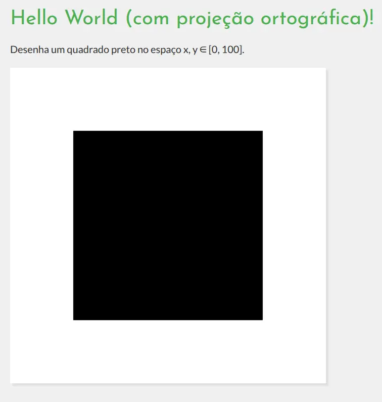  <!-- {.bordered.small-width style="border-radius: 8px; width: 378px;"} --> <!-- {p:.full-width.center-aligned} -->

[hello-ortho]: https://fegemo.github.io/utf-cg-exemplos-webgl/hello-ortho/

---
<!-- {"layout": "2-column-content"} -->
## Ortho - o tamanho do mundo

1. <!-- {ol:.no-bullet.no-margin.compact-code-more} -->
   ```javascript
   ortho(left, right, bottom, top, near, far)
   ```
1. 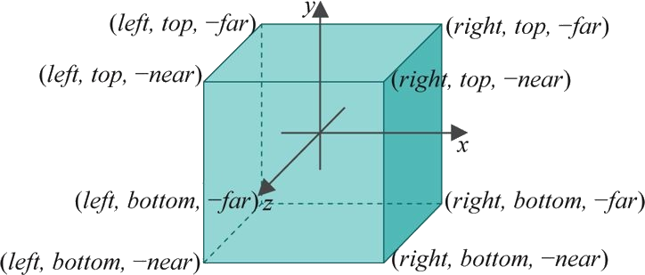 <!-- {style="width: 420px; margin-top: 2rem;"} -->
   

- Forma um cubo com lados alinhados aos eixos
  - `left` até `right` no eixo X
  - `bottom` até `top` no eixo Y
  - `near` até `far` no eixo Z
- **Tudo que está dentro é desenhado**, tudo que está fora é descartado
  - Se `ortho(0, 100, 0, 100, -1, 1)`
    - vértice em `(0,   0, 0)`: ↙️
    - vértice em `(0, 100, 0)`: ↖️

---
<!-- {"layout": "centered"} -->
## O volume de visualização do [hello-ortho][hello-ortho]

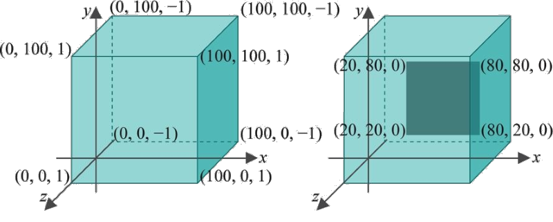 <!-- {style="width: 600px;"} -->

Repare **onde estão os vértices** do quadrado<br>dentro do cubo de visualização

[hello-ortho]: https://fegemo.github.io/utf-cg-exemplos-webgl/hello-ortho/

---
<!-- {"layout": "centered", "state": "show-active-slide-and-previous"} -->
## Coordenadas dos Vértices

```javascript
// define os vértices de um quadrado
const vertices = new Float32Array([
  20, 20, // v0: vértice 0
  80, 20, // v1
  80, 80, // v2
  20, 80  // v3
])
```

---
<!-- {"layout": "regular"} -->
## Sistema de **coordenadas global** ou "do mundo"

- É o sistema de coordenadas definido via a projeção ortográfica ou perspectiva
  (nosso `ortho` ou um `frustum` que podemos criar) <!-- {li:.bullet} -->
- ::: div .info.note.push-right.bullet font-size: 0.7em; width: 400px
  ### Matriz de Projeção <!-- {style="font-size: 1em;"} -->
  A matriz de projeção é responsável por converter as coordenadas de um sistema
  "global" para o NDC (ie, x,y,z ∈ [-1, 1]). <!-- {p:style="font-size: 1em;"} -->
  :::
  Toda a cena deve ser definida nesse sistema de coordenadas
  - No [hello-ortho][hello-ortho], nossa cena contém apenas os 4 vértices do quadrado


[hello-ortho]: https://fegemo.github.io/utf-cg-exemplos-webgl/hello-ortho/
*[NDC]: Normalized Device Coordinates

::: div .note.exercise.bullet.no-margin.compact-code-more margin-inline: auto
### **Exercício 4**:
Trocar a caixa de visualização para:
```javascript
ortho(-100, 100, -100, 100, −1, 1)
```

---
<!-- {"layout": "regular"} -->
## Resultado do experimento

- 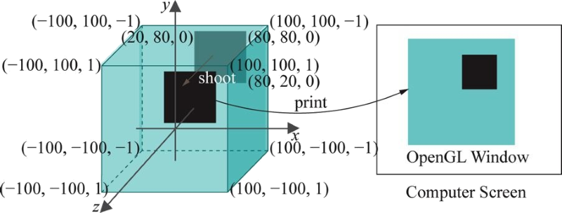 <!-- {.half-width.push-left} --> <!-- {li:.no-bullet.bulleted} -->
  ::: div .note.exercise.compact-code font-size: 0.7em; margin-left: 52%;
  ### **Mais experimentos**: <!-- {h3:.bullet style="font-size: 1em;"} -->
  Trocar o sistema de coordenadas pelos valores e testar: <!-- {p:style="font-size: 1em;"} -->
  ```javascript
  ortho( 0, 200,  0, 200, −1, 1)
  ortho(20,  80, 20,  80, −1, 1)
  ortho( 0, 100,  0, 100, −2, 5)
  ```
  :::
- Conclusões: <!-- {li:.bullet.clear-both style="margin-top: 2rem;"} -->
  1. **Especificamos o sistema de coordenadas global**
      com a matriz de projeção
  1. A **unidade de medida** dos valores dos vértices é definida
      pelo sistema de coordenadas: `(20, 20, 0)` não representa pixels!
- Mas também há outro sistema de coordenadas: **da janela** <!-- {li:.bullet} -->

---
<!-- {"layout": "regular"} -->
## Sistema de coordenadas **da janela**

::: div .note.exercise.centered font-size: 0.7em;
**Experimento**: trocar o tamanho do `<canvas>` de [hello-ortho][hello-ortho] para 500x250
1. Por que o quadrado deixou de ser quadrado?
1. Como fazer com que ele continue quadrado ao redimensionar?
:::

1. Porque na fase de "impressão", **o conteúdo** da cena "fotografada" foi
  **redimensionado** para que fosse revelado
1. Podemos **fixar a tela de pintura** (_viewport_)
   ```c
   gl.viewport(0, 0, 500, 500);  // não é solução...
   ```
   ...ou definir um "novo mundo" sempre que a tela de pintura for redimensionada 👍
   <br><small>(vide [hello-resizable][hello-resizable])</small> <!-- {a:target="_blank"} -->

[hello-ortho]: https://fegemo.github.io/utf-cg-exemplos-webgl/hello-ortho/
[hello-resizable]: https://fegemo.github.io/utf-cg-exemplos-webgl/hello-resizable/

---
<!-- {"layout": "2-column-content"} -->
## Os 2 Passos para renderização

Passo 1 <!-- {dl:.dl-6 style="line-height: 1.15em"} -->
  ~ **"Fotografar"** (a ➡️ b)
  ~ Objetos são **projetados perpendicularmente**  na caixa de
    visualização (o plano próximo, ou _near plane_)

Passo 2
  ~ **"Revelar"** (b ➡️ c)
  ~ O **plano de visualização** é escalado ("redimensionado") para
     caber na janela

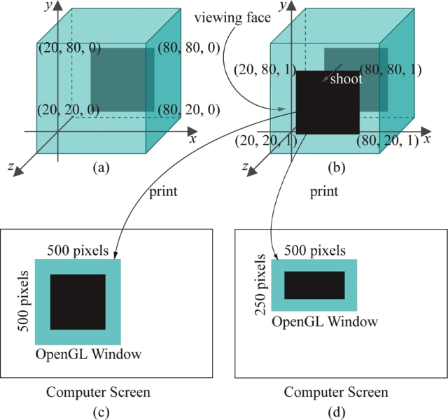 <!-- {style="width: 420px"} -->


---
<!-- {"layout": "regular"} -->
## Os **02 sistemas de coordenadas**

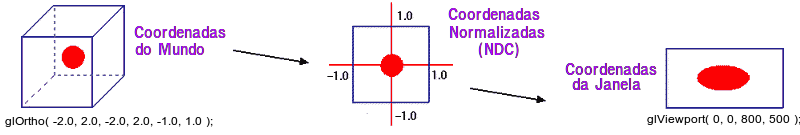 <!-- {.centered style="width: 500px;"} --> <!-- {p:.full-width} -->

- Sistema de **coordenadas do mundo** (`ortho` ou `frustum`): <!-- {ul:.multi-column-list-2} -->
  - Um espaço 3D virtual em que criamos nossas cenas
  - Unidade de medida: **arbitrária** <!-- {.alternate-color} -->
- Sistema de **coordenadas da janela** (`gl.viewport(...)`):
  - Espaço 2D real onde as imagens "reveladas" são desenhadas
  - Unidade de medida: **pixel** <!-- {.alternate-color.bullet} -->

...agora vamos ver como **desenhar várias coisas** na tela. <!-- {p:.no-margin.bullet} -->

---
<!-- {"layout": "section-header", "slideClass": "desenhando-varias-coisas"} -->
# Desenhando várias coisas

- Relembrando VBOs
- Relembrando VAOs
- Múltiplas _draw calls_

*[VBOs]: Vertex Buffer Object
*[VAOs]: Vertex Array Object

---
<!-- {"layout": "regular", "slideClass": "compact-code-more", "embeddedStyles": ".no-p-margin p { margin: 0; }",
"backdrop": "white-noise"} -->
## Configuração Inicial <small>(especifica a cena)</small>

```javascript
function configuraTudo() {
  // ...
  // 4. especifica a cena
  // 4.1 vértices de um triângulo em um 1D-array
  const vertices = new Float32Array([0.0, 0.5,   -0.5, -0.5,   0.5, -0.5 ])
                                    // topo       esquerda       direita

  // 4.2 cria um VAO para o triângulo (e isso aqui??)
  const vao = gl.createVertexArray()
  gl.bindVertexArray(vao)
  
  // 4.3 cria um buffer para armazenar um atributo de vértice (ie, um VBO)
  const vbo = gl.createBuffer()                                           // a. cria um buffer genérico
  gl.bindBuffer(gl.ARRAY_BUFFER, vbo)                                     // b. vincula ele ao ARRAY_BUFFER
  gl.bufferData(gl.ARRAY_BUFFER, vertices, gl.STATIC_DRAW)                // c. upload dos dados RAM->VRAM
  const posicaoLoc = gl.getAttribLocation(programa, 'posicao')
  gl.vertexAttribPointer(// index, size, type, normalize, stride, offset     d. instrui shader onde e como
                            posicaoLoc, 2, gl.FLOAT, false, 0, 0)         //    buscar os dados do atributo
  gl.enableVertexAttribArray(posicaoLoc)                                  // e. habilita o atributo
  // ...
```

---
<!-- {"layout": "centered-horizontal", "slideClass": "compact-code-more", 
"backdrop": "white-noise"} -->
## **VBOs**: _vertex buffer objects_ <small>(1/2)</small>

- 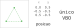 <!-- {.push-right.bullet style="margin-bottom: 1rem;"} -->
  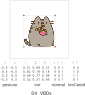 <!-- {.push-right.clear-both.bullet style="width: 300px"} -->
  Cada aplicação pode querer atribuir diferentes propriedades a cada vértice,
  mas a **posição** é o básico:
  1. Cria um _buffer_, solicitando espaço na VRAM <!-- {ol:.bullet style="list-style-type: lower-alpha"} -->
     ```javascript
     const vbo = gl.createBuffer()
     ```
  1. (Ativa ou) vincula ao `ARRAY_BUFFER`: <!-- {li:.bullet} -->
     ```javascript
     gl.bindBuffer(gl.ARRAY_BUFFER, vbo)
     ```
     - Dizemos que o _buffer_ agora é um VBO
  1. Faz _upload_ de `vertices` para VRAM:  <!-- {li:.bullet} -->
     ```javascript
     gl.bufferData(gl.ARRAY_BUFFER, vertices, gl.STATIC_DRAW)
     ```
     - A _hint_ indica que vértices não serão alterados

*[VBOs]: Vertex Buffer Objects

---
<!-- {"layout": "centered-horizontal", "slideClass": "compact-code-more", 
"backdrop": "white-noise"} -->
## **VBOs**: _vertex buffer objects_ <small>(2/2)</small>

-  <!-- {.push-right} -->
  Precisamos conectar os atributos (variáveis `in`) do _vertex shader_ aos
  VBOs (no caso, atributo **'posicao'** ⬅️ este VBO)
- Acha em qual _slot_ do _shader_ está `posicao`
     ```javascript  
     const posicaoLoc = gl.getAttribLocation(programa, 'posicao') // quase certo será slot 0, pq só tem 1 atributo
     ```
  5. Instrui o _vertex processor_ onde e como preencher `posicao`  <!-- {ol:style="list-style-type: lower-alpha"} -->
     ```javascript
     gl.vertexAttribPointer(posicaoLoc, // em qual slot 
       2,           // size: qtos valores por vértice ∈ {1, 2, 3, 4}
       gl.FLOAT,    // type: tipo de dados ∈ {FLOAT, HALF_FLOAT, INT, UNSIGNED_INT, BYTE etc.}
       false,       // normalize? muda amplitude para [0,1] ou [-1,1] de acordo com type (exceto p/ FLOATS)
       0,           // stride: qtos valores saltar por vértice, a mais que size, EM BYTES
       0)           // offset: qtos valores saltar inicialmente, EM BYTES
     ```
  6. Ativa o atributo para que ele seja efetivamente buscado
     ```javascript
     gl.enableVertexAttribArray(posicaoLoc)   // senão, usa um valor constante para todo vértice 🤷‍♂️
     ```

*[VBO]: Vertex Buffer Object
*[VBOs]: Vertex Buffer Objects

---
<!-- {"layout": "regular", "slideClass": "compact-code-more", "backdrop": "white-noise"} -->
## Definindo Objetos com **VBOs** e **VAOs** <small>(1/3)</small> <!-- {strong:.alternate-color} -->

-  <!-- {.push-right style="width: 250px"} --> <!-- {ul:.full-width} -->
  ::: div .note.info.push-right.clear-both width: 250px; margin-top: 1rem;
  **VAOs** <!-- {strong:.alternate-color} --> chegaram no WebGL2 👍 e são uma ótima prática para reduzir o número de chamadas. <!-- {p:.no-margin.smaller-text-70} -->
  :::
  Algumas aplicações descrevem objetos usando vários **VBOs**
- Vários objetos, vários **VBOs** descrevendo cada um. Ao desenhar:
  ```javascript
  function desenha(gl) {                // 👎 NÃO FAÇA ASSIM... USE VAOs ;)
    // objeto 1, vbo posição
    gl.bindBuffer(vbo1)
    gl.vertexAttribPointer(posAttr1, /*...*/)
    gl.enableVertexAttribArray(posAttr1)
    // objeto 1, vbo de cor
    gl.bindBuffer(vbo2)
    // ........
    gl.drawArrays(/*...*/) // finalmente, desenha objeto 1
    
    // objeto 2
  }
  ```
- Um **VAO** <!-- {strong:.alternate-color} --> salva a configuração de 
  cada **VBO**
- Podemos usar um **VAO** para cada objeto <!-- {strong:.alternate-color} --> (próximo slide)

*[VBO]: Vertex Buffer Object
*[VBOs]: Vertex Buffer Objects
*[VAO]: Vertex Array Object
*[VAOs]: Vertex Array Objects

---
<!-- {"layout": "regular", "slideClass": "compact-code-more", "embeddedStyles": ".vao-code pre { max-height: 53vh; overflow-y: auto;}", "backdrop": "white-noise"} -->
## Definindo Objetos com **VBOs** e **VAO** <small>(2/3)</small> <!-- {strong:.alternate-color} -->

- Cena com 4 **VBOs**  <!-- {ul:.vao-code.layout-split-3 style="gap: 1rem;"} -->
   <!-- {style="width: 250px"} -->
- Apenas com **VBOs**:
  ```javascript
  function configuraTudo() {
    // 4.3 configura a cena
    // 4.3.1 cria vbo para posição
    vboPosicao = gl.createBuffer() 
    gl.bindBuffer(...)
    gl.bufferData(...)

    // 4.3.2 cria vbo para cor 
    // 4.3.3 cria vbo para normal 
    // 4.3.4 cria vbo para c. textura
  }

  function desenha() {
    // configura vbo posição
    gl.bindBuffer(vboPosicao)
    gl.vertexAttribPointer(/*...*/)
    gl.enableVertexAttribArray(...)

    // configura vbo cor
    // configura vbo normal
    // configura vbo c. textura
    gl.drawArrays(...)

    // se houver outro objeto,
    // faz tudo de novo 👎
  }
  ```
- Usando um **VAO** por objeto: 👍 <!-- {strong:.alternate-color} -->
  ```javascript
  function configuraTudo() {
    // 4.3 configura a cena
    // 4.3.0 cria um VAO e ativa
    vao = gl.createVertexArray()
    gl.bindVertexArray(vao)

    // 4.3.1 configura vbo posição
    vboPosicao = gl.createBuffer() 
    gl.bindBuffer(...)
    gl.bufferData(...)
    gl.vertexAttribPointer(/*...*/)
    gl.enableVertexAttribArray(...)
    
    // 4.3.2 configura vbo cor
    // 4.3.3 configura vbo normal
    // 4.3.4 configura vbo c. textura
  }
  function desenha() {
    // 🎉 ativa o VAO e desenha
    gl.bindVertexArray(vaoTriangulo)
    gl.drawArrays(...)

    // se houver outro objeto, 
    // ativa seu VAO e desenha
    // ...
  }
  ```

*[VBO]: Vertex Buffer Object
*[VBOs]: Vertex Buffer Objects
*[VAO]: Vertex Array Object
*[VAOs]: Vertex Array Objects

---
<!-- {"layout": "regular", "backdrop": "white-noise"} -->
## Definindo Objetos com **VBOs** e **VAO** <small>(3/3)</small> <!-- {strong:.alternate-color} -->

> Então quer dizer que o **VAO** salva todos os dados do objeto juntos?? <!-- {strong:.alternate-color} -->

- Não, quem armazena ainda são os **VBOs**
- O **VAO** <!-- {strong:.alternate-color} --> (_vertex array object_) é levinho, salva apenas as "instruções"<!-- {li:.bullet} --> 
  - Usamos VAO para "memorizar" a configuração de cada objeto
  - Salva quais atritubos de vértice estão ligados e como buscá-los
  - Basicamente, ele guarda todos:
    1. `gl.vertexAttribPointer()` <!-- {ol:.multi-column-list-2} -->
    1. `gl.enableVertexAttribArray()`
  - Daí, ao desenhar, ativamos o **VAO** <!-- {strong:.alternate-color} --> e invocamos a _draw call_


*[VAO]: Vertex Array Object
*[VAOs]: Vertex Array Objects

---
<!-- {"layout": "regular"} -->
# Múltiplas _Draw Calls_ <small>(1 por objeto)</small>

- Havendo mais de um objeto (portanto, 1+ VAOs), podemos: <!-- {ul:style="margin-bottom: 1rem;"} -->
  1. Configurar cada VAO (e seus VBOs) **durante inicialização**
  1. Ativar e desenhar cada VAO **durante redesenho** <!-- {.alternate-color} -->

1. **Inicialização**: <!-- {ol:.layout-split-2.no-margin.compact-code-more.no-bullet style="gap: 1rem;"} -->
   ```javascript
   const cena = {}
   function configuraTudo() {
    // quadrado: cria VAO e o(s) VBO(s)
    const verticesQuadrado = new Float32Array([...])
    cena.vaoQuadrado = gl.createVertexArray()
    gl.bindVertexArray(vaoQuadrado)
    // ...
    // triangulo: cria VAO e o(s) VBO(s)
    const verticesTriangulo = new Float32Array([...])
    cena.vaoTriangulo = ...
   }
   ```
1. **Desenho**: <!-- {.alternate-color} -->
   ```javascript
   function desenhaCena(gl) {
     gl.clear(gl.COLOR_BUFFER_BIT)
     // quadrado: ativa VAO e desenha
     gl.bindVertexArray(cena.vaoQuadrado)
     gl.drawArrays(gl.TRIANGLE_FAN, 0, 4)
     
     // triangulo: ativa VAO e desenha
     gl.bindVertexArray(cena.vaoTriangulo)
     gl.drawArrays(gl.TRIANGLES, 0, 3)
   }
   ```


*[VBO]: Vertex Buffer Object
*[VBOs]: Vertex Buffer Objects
*[VAO]: Vertex Array Object
*[VAOs]: Vertex Array Objects

---
<!-- {"layout": "centered-horizontal"} -->
# Exemplo: Quadrado e Triângulo

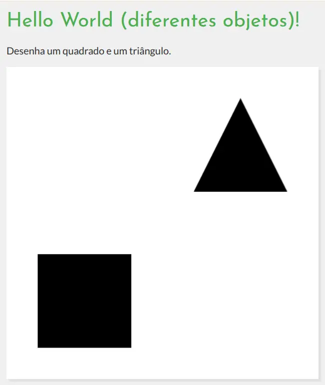 <!-- {.bordered.small-width style="border-radius: 8px; width: 300px;"} --> <!-- {p:.full-width.center-aligned} -->

Exemplo: [hello-diferentes-objetos][hello-diferentes-objetos]

[hello-diferentes-objetos]: https://fegemo.github.io/utf-cg-exemplos-webgl/hello-diferentes-objetos/

---
<!-- {"layout": "centered"} -->
## Experimento com a coordenada <span class="math">z</span>

::: div .note.exercise font-size: 0.7em; margin-block: 2rem;
**Exercício**: alterar as coordenadas <span class="math">z</span> 
de alguns vértices para valores entre [-1, 1].

Passos:
1. alterar o _vertex shader_ (`vec2`-->`vec3`)
1. alterar o VBO posicao para fornecer 2-->3 valores
1. alterar o `gl.vertexAttribPointer` para ensinar o _shader_ a buscar o atributo
1. finalmente, alterar uma coordenada <span class="math">z</span>

Observações: <!-- {.bullet} -->
- Nada acontece visualmente <!-- {ul:.bulleted} -->
- Os vértices continuam dentro da caixa de visualização<br>que definimos via
  projeção ortográfica
:::

...mas o que acontece quando algum<br>**vértice fica FORA** do volume
de visualização? <!-- {p:.bullet} -->

---
<!-- {"layout": "section-header", "slideClass": "clipping"} -->
# _Clipping_ (recorte)

- Objetos fora do volume: **descartados**
- Objetos no meio do caminho: **recortados** <!-- {.alternate-color} -->
- Objetos dentro do volume: **incluídos**

---
<!-- {"layout": "regular", "slideClass": "compact-code"} -->
# _Clipping_ (Recorte)

- ::: div .note.exercise.push-right.bullet.compact-code-more font-size: 0.7em; width: 420px
  **Experimento**: Alterar os vértices do quadrado:
  ```javascript
  const vertices = new Float32Array([
    120, 120,
    180, 120,
    180, 180,
    120, 180
  ])
  ```
  :::
  Vértices desenhados fora da caixa de visualização são descartados
- **Resultado**: o quadrado não aparece porque foi descartado --- todos seus
  vértices estavam fora da caixa de visualização que definimos no `ortho` <!-- {li:.bullet} -->

::: div .note.exercise.bullet width: 80%; margin-inline: auto; font-size: 0.7em;
**Mais exercícios** a partir de [hello-ortho][hello-ortho]:
1. Quadrado --> triângulo (remover último vértice)
1. Alterar o valor de <span class="math">z</span> do `v0` para um valor
   fora da caixa de visualização (_e.g._, -2.5, -5)

[hello-ortho]: https://fegemo.github.io/utf-cg-exemplos-webgl/hello-ortho/

---
<!-- {"layout": "regular"} -->
## O que aconteceu?

 <!-- {.block.centered style="width: 400px"} -->
<!-- {p:.no-margin.full-width} -->

- Um algoritmo de _clipping_ descartou o vértice que ficou de fora, mas criou
  outros dois na interseção com o volume <!-- {ul:.no-margin} -->
  - Algoritmos de _**line** clipping_: <!-- {ul^0:.multi-column-list-2} -->
    1. Cohen-Sutherland, 1967
    1. Lian-Barsky, 1984
  - Algoritmos de _**polygon** clipping_:
    1. Sutherland-Hodgman, 1974
    1. Weiler-Atherton, 1977

---
<!-- {"layout": "section-header", "slideClass": "colors"} -->
# Cores

- Como especificar cores
- Variável de estado: cor
- Interpolação de cores

---
<!-- {"layout": "2-column-content", "slideClass": "compact-code-more"} -->
## Cores

1. _Fragment shader_ até agora: <!-- {ol:.no-bullet.no-margin} -->
   ```glsl
   #version 300 es
   precision mediump float;

   out vec4 corFragmento;

   void main() {
                    // sempre a mesma cor 😦
     corFragmento = vec4(0.0, 0.0, 0.0, 1.0);
   }
   ```
1. ::: div .note.exercise font-size: 0.7em; margin-top: 1rem;
   **Exercício**: altere alguma componente para ∉ [0,1].
   :::

- Até agora, estamos _hard-coding_ a cor do fragmento no _fragment shader_:
  - RGBA (vermelho, verde, azul, alfa)
- Os valores de cada componente são presos (**_clamped_**) entre `0` e `1`:
  - **Se** menores que `0` **então** `0`
  - **Se** maiores que `1.0` **então** `1.0`
  - **Se** entre `0.0` e `1.0` **então** usa o valor

---
<!-- {"layout": "2-column-content", "hash": "valores-rgb-de-algumas-cores"} -->
## Valores RGB de algumas cores

<iframe src="../../samples/rgb-cube/index.html" width="100%" height="350" frameborder="0"></iframe>

- <span class="color-portrait black"> </span> Preto: 0.0, 0.0, 0.0 <!-- {ul:.no-bullet} -->
- <span class="color-portrait red"> </span> Vermelho: 1.0, 0.0, 0.0
- <span class="color-portrait green"> </span> Verde: 0.0, 1.0, 0.0
- <span class="color-portrait blue"> </span> Azul: 0.0, 0.0, 1.0
- <span class="color-portrait yellow"> </span> Amarelo: 1.0, 1.0, 0.0
- <span class="color-portrait magenta"> </span> Magenta: 1.0, 0.0, 1.0
- <span class="color-portrait ciano"> </span> Ciano: 0.0, 1.0, 1.0
- <span class="color-portrait gray"> </span> Cinza: 0.6, 0.6, 0.6
- <span class="color-portrait white"> </span> Branco: 1.0, 1.0, 1.0

---
<!-- {"layout": "centered-horizontal"} -->
## Experimentos com cores

::: div .note.exercise font-size: 0.7em;
**Exercícios** a partir de [hello-diferentes-objetos][hello-diferentes-objetos]:

1. Alterar a cor do quadrado
   - _Easy_, direto no _fragment shader_
1. Desenhar um quadrado de cada cor
   - Criar uma `uniform` e definir seu valor antes de desenhar cada objeto
1. Desenhar um quadrado de forma que cada vértice possua uma cor diferente
   - Resetar o código do exemplo (tirar a `uniform` de cor)
   - Criar novo VBO para cor do vértice e configurar o atributo no _shader_:
     - _vertex shader_: nova variável `in`, nova `out`
     - _fragment shader_: nova variável `in` (mesmo nome da `out` do _vertex_)

- <!-- {ul:.card-list style="justify-content: space-around; gap: 1rem; width: 300px; margin-inline: auto;"} -->
   <!-- {.rounded} -->
-  <!-- {.rounded} -->
-  <!-- {.rounded} -->
:::

[hello-diferentes-objetos]: https://fegemo.github.io/utf-cg-exemplos-webgl/hello-diferentes-objetos/
*[VBO]: Vertex Buffer Object

---
<!-- {"layout": "section-header", "slideClass": "primitives"} -->
# Primitivas Geométricas

Que tipos de objetos podemos desenhar?

 <!-- {style="width: 450px;"} -->

---
<!-- {"layout": "regular"} -->
## Primitivas Geométricas

- Objetos geométricos que o WebGL entende
- São os "tijolos" para construirmos objetos mais complexos
- Usamos como um **argumento para <u>`gl.drawArrays`</u>**. Por exemplo:
  ```javascript
  // ativa algum VAO e... desenha:
  gl.drawArrays(gl.POINTS, 0, 13)
  ```
- Exemplos
  1. Pontos (`GL_POINTS`) <!-- {ol:.multi-column-list-3.no-bullet} -->
  1. Linhas (`GL_LINES`)
  1. Triângulos (`GL_TRIANGLES`)

---


---


---
 <!-- {style="height: 180px"} -->

`GL_POINTS`
  ~ Desenha um ponto para cada vértice <span class="math">n</span>.

`GL_LINES`
  ~ Desenha uma série de segmentos de linha desconectados. São
    desenhados entre <span class="math">v_0</span> e
    <span class="math">v_1</span>, <span class="math">v_2</span> e
    <span class="math">v_3</span>, <span class="math">v_3</span> e
    <span class="math">v_4</span> e
    daí em diante. Se <span class="math">n</span> é ípmar, o último
    vértice não faz parte de um segmento.

`GL_LINE_STRIP`
  ~ Desenha um segmento de <span class="math">v_0</span> a
    <span class="math">v_1</span>, então de
    <span class="math">v_1</span> a <span class="math">v_2</span> e daí por
    diante, desenhando o segmento <span class="math">v_{n-2}</span>
    para <span class="math">v_{n-1}</span>. Então, um total de
    <span class="math">n-1</span> segmentos são desenhados.

`GL_LINE_LOOP`
  ~ Mesmo que `GL_LINE_STRIP`, exceto que um segmento final é desenhado
    de <span class="math">v_{n-1}</span> até <span class="math">v_0</span>,
    completando o circuito.


---
`GL_TRIANGLES`
  ~ Desenha uma série de triângulos usando os vértices
  <span class="math">v_0</span>, <span class="math">v_1</span>,
  <span class="math">v_2</span>, depois <span class="math">v_3</span>,
  <span class="math">v_4</span>, <span class="math">v_5</span>, e daí por
  diante. Se <span class="math">n</span> não é um múltiplo de 3, o
  último ou os 2 últimos vértices são ignorados.

`GL_TRIANGLE_STRIP`
  ~ Desenha uma série de triângulos usando os vértices
  <span class="math">v_0, v_1, v_2</span>, depois
  <span class="math">v_2, v_1, v_3</span>
  (repare na ordem), então <span class="math">v_2, v_3, v_4</span>,
  e daí por diante. A ordem é para assegurar que os triângulos estão
  todos desenhados com a mesma orientação.

`GL_TRIANGLE_FAN`
  ~ Mesmo que `GL_TRIANGLE_STRIP`, exceto que os vértices são
  <span class="math">v_0, v_1, v_2</span>, depois
  <span class="math">v_0, v_2, v_3</span>, depois
  <span class="math">v_0, v_3, v_4</span> e daí por diante.

 <!-- {style="height: 150px"} -->


---
<!-- {"layout": "regular"} -->
## Experimentos com as primitivas

1. Desenhar pontos (`GL_POINTS`) em vez de quadrados. Para que os
  pontos fiquem visíveis, **aumentar seu tamanho usando `glPointSize()`**.
1. Usar outras primitivas: `GL_LINES, GL_LINE_STRIP, GL_LINE_LOOP`


---
# Lista de exercícios 1

Link via **SIGAA** ou **Moodle**

---
# Referências

- Livro WebGL2 Fundamentals: https://webgl2fundamentals.org/
- Documentação do WebGL 2: https://developer.mozilla.org/en-US/docs/Web/API/WebGL_API
