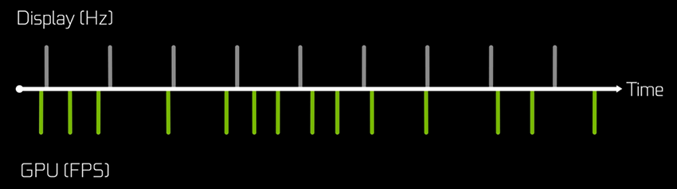
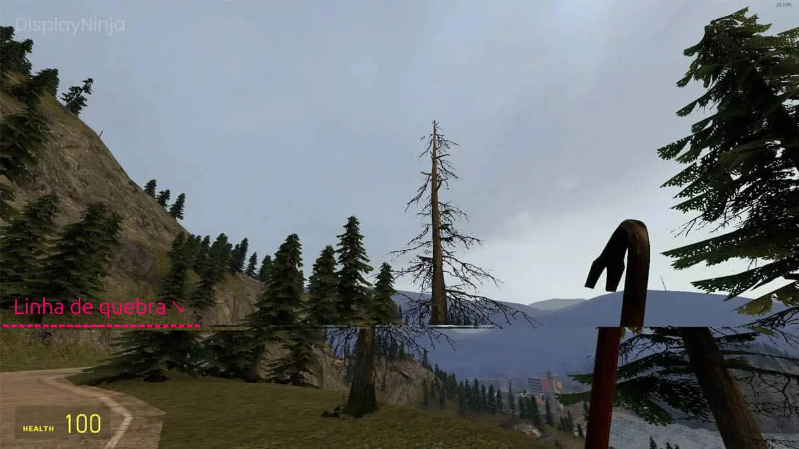
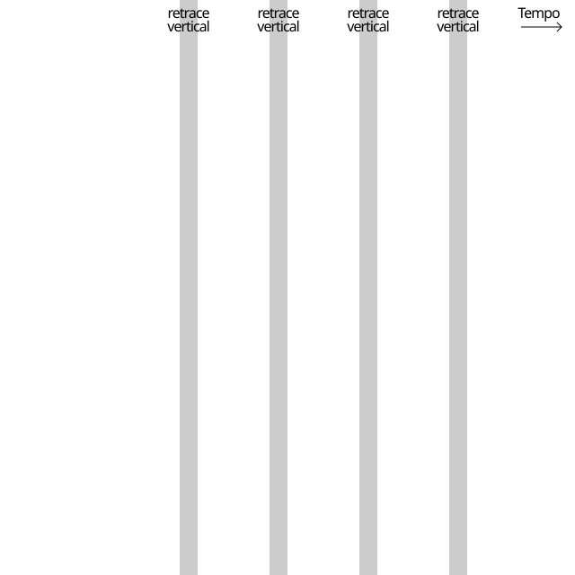
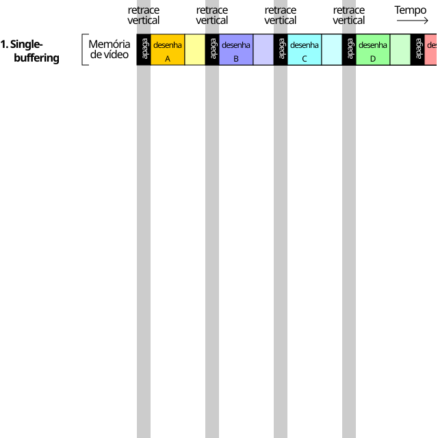
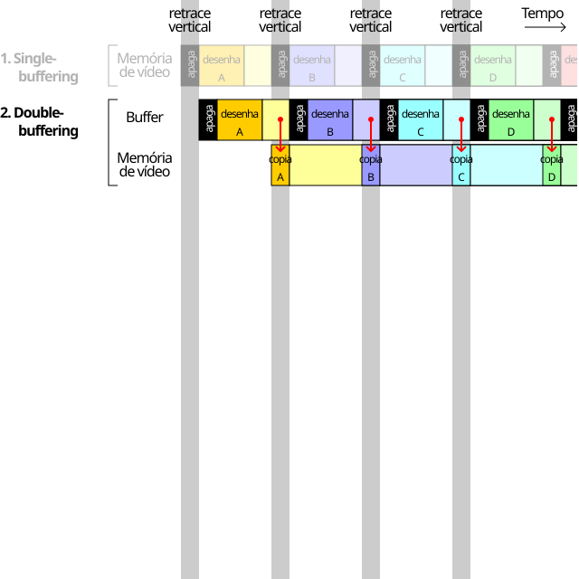
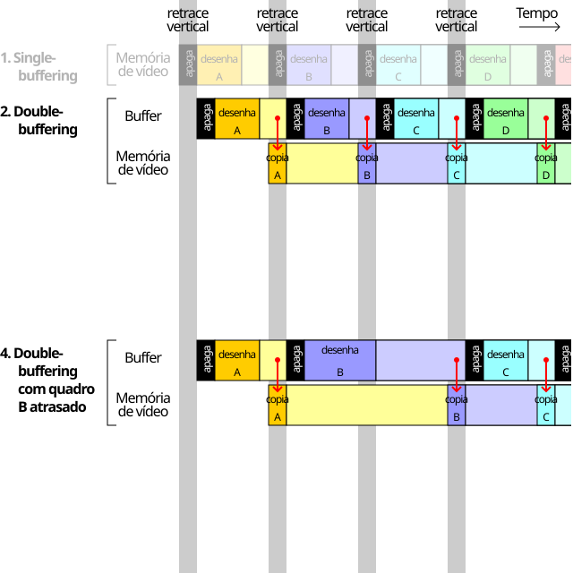
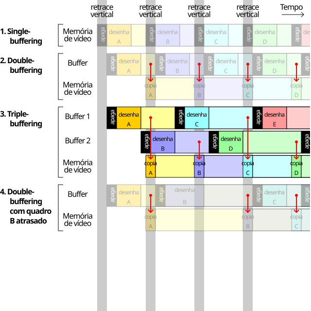
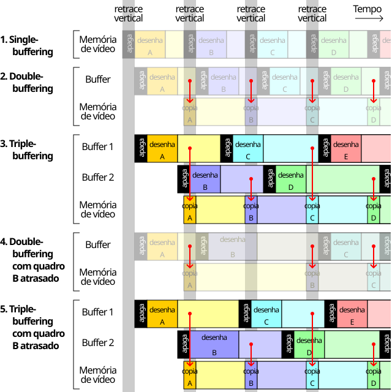
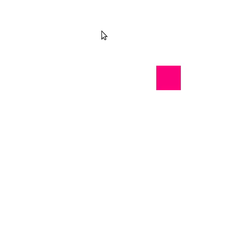

<!-- {"layout": "title"} -->
# Introdução a WebGL &nbsp; **_hands on_**
## parte 3

---
<!-- {"layout": "centered"} -->
# Roteiro

1. [Organizando o código][#organizando-o-codigo]
1. [Animação][#animacao]
1. [Redesenhando a tela][#redesenhando-a-tela]

---
<!-- {"layout": "section-header", "slideClass": "organizando-o-codigo", "hash": "organizando-o-codigo"} -->
# Organizando o Código

- Usando vários arquivos JavaScript
- Código _shader_ em arquivos `.glsl`
- Utilitários

---
<!-- {"layout": "regular", "slideClass": "compact-code-more"} -->
# Usando vários arquivos JS

- Programas maiores se beneficiam de modularização do código
- Em **JavaScript**, a abordagem moderna se chama **ES Modules**
  1. <!-- {ol:.no-bullet.layout-split-3.no-margin style="gap: 1rem"} -->
     `index.html`
     ```html
     <!DOCTYPE html>
     <html>
     <head>
       ...
       <script
          type="module" 
          src="main.js">
       </script>
     </head>
     ...
     ```
  1. `main.js`
     ```javascript
     import { PI, utilidade } from './util.js'
     
     console.log('Meu PI tem valor', PI)
     
     utilidade()
     ```
  1. `util.js`
     ```javascript
     export const PI = 3.14159

     export function utilidade() {
       // faz alguma coisa
     }
     ```

---
<!-- {"layout": "regular", "slideClass": "compact-code-more"} -->
# Código _shader_ em `.glsl`

- <!-- {ul:.layout-split-2 style="gap: 1rem;"} -->
  Há 3 lugares para escrever código GLSL:
  1. 👎 Dentro de string no código JavaScript <!-- {li:.bullet} -->
  1. No HTML `<script type="x-shader/x-vertex">aqui</script>` <!-- {li:.bullet} -->
     - Melhor, mas ainda assim não ideal
     - Ainda mistura responsabilidades
       ```javascript
       const vsCode = document.querySelector('[type$="x-vertex"]').innerText
       ```
  1. 👍 Em arquivos `.glsl` <!-- {li:.bullet} -->
     - Ideal, melhor reaproveitamento, _highlighting_ etc.
     - Cuidado: é assíncrono, precisa baixar o arquivo
       ```javascript
       const vsCode = await fetch('vs.glsl').then(r => r.text())
       ```
- <!-- {li:.no-bullet.bullet} -->
  ::: div .info.note width: 250px; font-size: 0.7em;
  **Código assíncrono**

  Algumas operações como 
  (a) baixar um _shader_ ou (b) baixar uma imagem
  são assíncronas.

  - Código recebe uma `Promise` <!-- {li:style="list-style-type: bullet"} -->
  - `await` aguarda o resultado  <!-- {li:style="list-style-type: bullet"} -->
  - `promise.then(...)` registra função para lidar com resultado <!-- {li:style="list-style-type: bullet"} -->

  Aula sobre [promessas][slide-promessas] e [async/await][slide-async-await].
  :::

[slide-promessas]: https://fegemo.github.io/cefet-web/classes/js7/#promessas
[slide-async-await]: https://fegemo.github.io/cefet-web/classes/js7/#async-await

---
<!-- {"layout": "regular"} -->
# Utilitários

...o que colocar aqui??
...cedo demais para twgl...
...talvez as questões sobre carregamento de shader com verificação de erros...

---
<!-- {"layout": "section-header", "slideClass": "animation", "hash": "animacao"} -->
# Criando uma pequena animação

- Usando freeglut, precisamos do evento _timer_ ou _idle_
  (`glutTimerFunc` ou `glutIdleFund`)
- A _callback_ deve alterar o estado da aplicação
- A função de desenho simplesmente desenha **o estado atual**

> **Animação** é alterar o valor de algo **ao longo do tempo**

---
<!-- {"layout": "regular", "slideClass": "compact-code-more"} -->
## setTimeout(funcao, tempo) [🌐](https://developer.mozilla.org/en-US/docs/Web/API/Window/setInterval)

- Podemos registrar uma _callback_ para **ser invocada daqui `x` ms**.
- Podemos usá-la p/ alterar parâmetros (cor, posição etc.) da cena <!-- {li:.bullet} -->
  ```javascript
  function atualizaCena() {
    // altera algo na cena
  }

  function desenhaCena(gl) {
    // desenha no estado atual
  }

  function loopPrincipal() {
    atualizaCena()
    desenhaCena(gl)
    setTimeout(loopPrincipal, 33)
  }
  // registra a cada 33ms
  setTimeout(loopPrincipal, 33); // por quê 33? 1000/33 = 30fps
  ```
  - Funciona, mas... dá pra fazer melhor <!-- {li:.bullet} -->

---
<!-- {"layout": "regular", "slideClass": "compact-code-more"} -->
## requestAnimationFrame(funcao) [🌐](https://developer.mozilla.org/en-US/docs/Web/API/Window/requestAnimationFrame)

- Similar à `setTimeout(funcao, tempo)`, mas a função é agendada para o próximo
  redesenho da tela... Da documentação:
  > [...] tells the browser **you wish to perform an animation.** <!-- {p:style="font-size: 1em"} --> 
  > It requests the browser to call a user-supplied callback 
  > function **before the next repaint**. <!-- {blockquote:style="margin-bottom: 1rem; max-width: 90%; margin-left: auto;"} -->
- <!-- {li:.two-column-code.no-bullet} -->
  ```javascript
  let antes = 0
  function loop(agora) {
    const qtoPassou = agora - antes
    antes = agora
    atualizaCena(qtoPassou)
    desenhaCena(gl)

    requestAnimationFrame(loop)
  }
  requestAnimationFrame(loop)
  // se quiser evitar a variável global 'antes':
  function loop(agora) {
    const qtoPassou = agora - (loop.antes ?? 0)
    loop.antes = agora
    atualizaCena(qtoPassou)
    desenhaCena(gl)

    requestAnimationFrame(loop)
  }
  requestAnimationFrame(loop)
  ```

---
<!-- {"layout": "3-column-content", "playMediaOnActivation": {"selector": "#color-animation" }, "slideClass": "compact-code-more"} -->
## Animando uma cor

- <video width="100%" preload="auto" controls loop src="../../videos/animacao-cor.mp4" id="color-animation" class="bordered subtly-round"></video>
  [Animação de cor](codeblocks:animacao-cor/CodeBlocks/animacao-cor.cbp) <!-- {ul:.no-bullet.no-margin.no-padding.center-aligned} -->

1. <!-- {ol:.no-margin.no-padding.no-bullet} -->
   ```javascript
   const cena = {
     vao: null,
     corLoc: null,
     cor: new Float32Array([
       0.5, 0.5, 0.5
     ])
   }
   const tom = 0.5
   const incremento = 1.0
   ```
1. <!-- {li:.bullet style="margin-top: 1rem;"} -->
   ```javascript
   function atualizaCena(dt) {
     // atualiza cor usando tempo
     tom += incremento * dt
     if (tom > 1.0 || tom < 0) {
       incremento *= -1
     }
     cena.cor = new Float32Array([
       // rgb mesmo valor 
       // --> tom de cinza
       tom, tom, tom
     ])
   }
   ```

- <!-- {ul:.no-margin.no-padding.no-bullet.bullet} -->
  ```javascript
  function desenhaCena(gl) {
    // redesenha, no estado atual
    gl.clear(gl.COLOR_BUFFER_BIT)

    // desenha o quadrado
    gl.bindVertexArray(cena.vao)
    gl.uniform3fv(cena.corLoc, 
      cena.cor) // ℹ️ atualiza
    gl.drawArrays(gl.TRIANGLE_FAN,
      0, 4)
  }
  ```
- <!-- {li:.bullet} -->
  ::: div .note.info font-size: 0.7em; margin-top: 1rem;
  Veja o exemplo [animando-cor][exemplo-animando-cor], que interpola 2 cores quaisquer
  :::

[exemplo-animando-cor]: https://fegemo.github.io/utf-cg-exemplos-webgl/animando-cor/


---
<!-- {"layout": "regular", "embeddedStyles": ".raf-vs-setinterval { table { font-size: 0.64em; margin: 0 auto; td, th { padding: 0.15em 0.25em; line-height: 1.5; } thead>tr { background: transparent; border-width: 0; } td,tr { border-width: 0; background: transparent; } td:first-child { font-weight: bold; text-align: right;} th { border-width: 0; background: transparent; } } table, tr, td { border-width: 0; } }"} -->
## setTimeout(func, ms) ou requestAnimationFrame(func)? <!-- {h2:style="font-size: 32px"} -->


::: div .note.info.raf-vs-setinterval margin-inline: auto;
|                          |`requestAnimationFrame`|`setTimeout`     |
|--------------------------|-----------------------|-----------------|
| Limita FPS?              | taxa do monitor       | 👍 ilimitado    |
| Quando GPU "engasga":    | FPS=Hz/2, /4, /8¹     | 👍 queda linear |
| Compatível com vSync:    | 👍 Sim                | Não             |
| Problemas de _tearing_:  | 👍 Não, se 2+ buffers | Sim             |
| Economiza processamento: | 👍 Sim                | Não             |
| Compatível com VRR:      | 👍 Sim                | Não             |
:::

¹Queda brusca de FPS: `requestAnimationFrame` com 2 buffers sofre, mas com 3 resolve <!-- {p:style="font-size: 0.7em; margin-bottom: 1rem; margin-inline: auto;"} -->

- Apesar de `setTimeout` ter pontos positivos, `requestAnimationFrame`
  é indicado
- Vamos entender a interação GPU / Monitor
  - O que é vSync?
  - O que é VRR (gSync, FreeSync)?

*[VRR]: Variable Refresh Rate

---
<!-- {"layout": "section-header", "slideClass": "redrawing", "hash": "redesenhando-a-tela"} -->
# **Re**-desenhando a Tela

- GPU vs Monitor
- Alterando o estado do programa
- Avisando o sistema de janelas

---
<!-- {"layout": "regular"} -->
# GPU vs Monitor

- <!-- {ul:.layout-split-2 style="gap: 3rem;"} -->
  A taxa de atualização do monitor é fixa (eg, 60Hz)
   <!-- {.full-width} -->
  - GPU pode levar mais ou menos tempo para desenhar cada quadro <!-- {li:.bullet} -->
  - **VBLANK**: momento perfeito para GPU enviar nova imagem <!-- {li:.bullet} -->
    - Também chamado **_retrace_ vertical**
- <!-- {li:.bullet} -->
  Se GPU submete novo quadro enquanto monitor atualiza...
   <!-- {.centered style="width: 340px"} -->
  - Pode ocorrer **_screen tearing_** 
  - Mas como evitar? <!-- {li:.bullet} -->

---
<!-- {"layout": "regular"} -->
## Usando **2 _frame buffers_**

- Quando estamos criando uma animação - **atualizando a tela várias
  vezes por segundo**, podemos ter um problema de
  **"imagens" estateladas** (_flickering_) <!-- {ul:.bulleted} -->
- Acontece quando escrevemos no `COLOR_BUFFER` ao mesmo tempo que
  ele "viaja" ao monitor
-  <!-- {.push-right.half-width} -->
  Para evitar, usamos um _**double buffer**_:
  1. _front-buffer_: sendo mostrado agora
  1. _back-buffer_: sendo "pintado" agora
- Após terminar o desenho no _back buffer_, invertemos quem é _front_ com o _back_
- Em WebGL, o navegador nos dá **_double buffer_** de graça 👍

---
<!-- {"layout": "regular"} -->
- <!-- {ul:.layout-split-2.no-margin.no-padding.no-bullet style="gap: 1rem;"} -->
  ::: figure ..picture-steps.clean.opacity-only width: 550px;
   <!-- {.bullet.figure-step} -->
   <!-- {.bullet.figure-step} -->
   <!-- {.bullet.figure-step} -->
   <!-- {.bullet.figure-step} -->
   <!-- {.bullet.figure-step} -->
   <!-- {.bullet.figure-step} -->
   <!-- {.bullet.figure-step} -->
  :::
- # _Single_ vs _Double_ vs _Triple Buffering_ <!-- {h1:style="font-size: 27px"} -->
  - Monitor atualiza a taxa constante
    ::: div .note.info font-size: 0.7em; max-width: 80%; margin-inline: auto;
    **vSync**: GPU aguarda o momento certo para trocar os buffers <!-- {p:.no-margin} --> 
    ::: 
  - **1 buffer**: _screen tearing_ frequente
  - **2 buffers+vsync**: resolve _tearing_
    - ⚠️ GPU fica a toa  <!-- {li:style="list-style-type: circle;"} -->
    - ⚠️ cai a FPS/2 se não desenha quadro a tempo <!-- {li:style="list-style-type: circle;"} -->
  - **3 buffers+vsync**: resolve _tearing_ e a queda brusca de FPS
    - ⚠️ FPS&gt;Hz: quadros podem precisar aguardar <!-- {li:.bullet style="list-style-type: circle;"} -->
    - ⚠️ FPS&lt;Hz: alguns quadros repetem, outro não <!-- {li:.bullet style="list-style-type: circle;"} -->

---
<!-- {"layout": "centered", "fullPageElement": "#vrr-video"} -->
<iframe id="vrr-video" width="560" height="315" src="https://www.youtube.com/embed/CQdo67SjIHk?si=dAyPzDNB4wfjynXj&amp;start=104" title="YouTube video player" frameborder="0" allow="accelerometer; autoplay; clipboard-write; encrypted-media; gyroscope; picture-in-picture; web-share" referrerpolicy="strict-origin-when-cross-origin" allowfullscreen></iframe>


---
<!-- {"layout": "centered-horizontal"} -->
## Outra animação: **segue o mouse**

 <!-- {.medium-width.centered.bordered.subtly-round} -->

Exemplo: [animacao-segue-mouse](codeblocks:animacao-segue-mouse/CodeBlocks/animacao-segue-mouse.cbp)


---
# Referências

- Documentação do OpenGL 2: https://www.opengl.org/sdk/docs/man2/
- Livro Vermelho: http://www.glprogramming.com/red/
