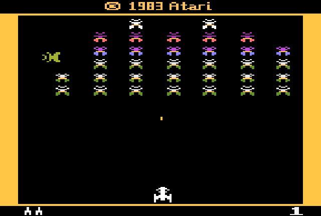

<!-- {"layout": "title"} -->
# Introdução a WebGL &nbsp; **_hands on_**
## parte 3

---
<!-- {"layout": "centered"} -->
# Roteiro

1. [Orientação dos polígonos](#orientacao-de-poligonos)
1. [Posicionamento de objetos](#posicionamento-de-objetos)
1. [Usando texturas](#usando-texturas)
1. **[Trabalho Prático 1](#tp1)**


---
<!-- { "layout": "section-header", "slideClass": "orientacao-de-poligonos", "hash": "orientacao-de-poligonos" } -->
# Orientação de Polígonos
## Lado da frente e de trás

---
<!-- { "layout": "regular" } -->
# Orientação

- Como estamos em 3D, **todo polígono possui um lado da frente e um lado de trás**
  - Quando falamos de objetos 3D, aí há coletivamente o lado de fora e o de dentro
- Em Computação Gráfica, é importante saber qual é o lado do polígono que
  estamos vendo por:
  - **Desempenho**: muitas vezes desenhamos só se estivermos vendo a frente
  - **Flexibilidade**: desenhar frente de um jeito, costas de outro
- O lado que estamos vendo é determinado pela **orientação do polígono**
- Em WebGL, definimos a orientação de forma implícita,
  **de acordo com a primitiva**...

---
<!-- { "layout": "regular" } -->
# Orientação no WebGL

- A frente do polígono em WebGL é dado 
  **<u>pela ordem</u> em que declaramos seus vértices**
  1. <!-- {ol:.full-width.no-bullet.no-padding style="padding-block: 2rem;"} -->
     <!-- {li:style="display: flex; justify-content: center; gap: 2rem;"} -->
      <!-- {style="width: 40%;"} -->
      <!-- {style="width: 27%;"} -->
- Se definido 🔄 (CCW), vemos o lado da frente
- Se definido 🔃 (CW), vemos o lado de trás

*[CCW]: Counterclockwise*
*[CW]: Clockwise*

---
<!-- {"layout": "2-column-content", "playMediaOnActivation": {"selector": "#color-animation" }, "slideClass": "compact-code-more"} -->
# Exemplo de Orientação


- <!-- {ul:.no-bullet.no-margin.no-padding.center-aligned} -->
  <video width="300" preload="auto" controls loop src="../../videos/orientacao-de-poligonos.mp4" id="color-animation" class="bordered subtly-round"></video>
  - [Orientação de Polígonos][exemplo-orientacao-poligonos] <!-- {ul^0:.no-padding} -->
    
1. É possível ativar o **descarte de faces de trás**
   <!-- {ol:.no-margin.no-padding.no-bullet} -->
   - Isso é um recurso de otimização <!-- {li:.bullet} -->
     ```javascript
     gl.enable(gl.CULL_FACE)
     gl.cullFace(gl.BACK)  // valor padrão
     gl.frontFace(gl.CCW)  // valor padrão
     ```
1. ::: div .note.warning font-size: 0.7em; margin-top: 1rem;
   **Note**: esse exemplo artificalmente desenhou um quadrado com apenas linhas 
   "nas costas" do outro. <!-- {p:.no-margin style="font-size: 1em;"} -->
   :::
1. ::: div .note.exercise font-size: 0.7em; margin-top: 1rem;
   **Exercício**: altere a primitiva usada para desenhar. Depois, altere a ordem
   em que os vértices estão definidos. <!-- {p:style="font-size: 1em;"} -->
   
   O que aconteceu? <span class="bullet">Repare que a **ordem dos vértices define a orientação**.</span>
   <!-- {p:.no-margin} -->
   :::

[exemplo-orientacao-poligonos]: https://fegemo.github.io/utf-cg-exemplos-webgl/orientacao-poligonos/

---
<!-- { "layout": "section-header", "slideClass": "posicionamento", "hash": "posicionamento-de-objetos" } -->
# Posicionamento de objetos

- O jeito ruim
- O jeito bão <sup>(c)</sup>

---
<!-- {"layout": "regular", "slideClass": "compact-code-more"} -->
# Posicionando Objetos - O Jeito Ruim <!-- {.bullet} -->

-  <!-- {.push-right.bullet style="max-height: 300px;"} -->
  A forma como temos posicionado objetos não é legal:
  ```javascript
  const esq = nave.x
  const dir = nave.x + nave.largura
  const bai = nave.y
  const cim = nave.y + nave.altura
  
  const vertices = new Float32Array([
    esq, bai, 0,  // ↙️
    dir, bai, 0,  // ↘️
    dir, cim, 0,  // ↗️
    esq, cim, 0   // ↖️
  ])
  ```
  - Problema: e se houver muito mais do que 4 vértices? *➡️*
  - Questão: não seria bem mais fácil definir as coordenadas se 
    **pudéssemos assumir que estamos <u>sempre na origem</u>?**

---
<!-- { "layout": "regular", "slideClass": "compact-code-more" } -->
# Posicionando Objetos - Do Jeito Bão <sup>(c)</sup> <small>(1/2)</small>

- Damos as coordenadas assumindo que estamos na origem, mas
  transladamos o objeto para onde queremos que ele realmente seja
  desenhado: <!-- {ul:.two-column-code} -->
  ```javascript
  import { translate } from './utils/math.js'

  // inicialização:
  const tamanhoNave = 20
  const metadeNave = tamanhoNave / 2
  let posicaoNave = [20, 30, 0]

  // assumir (0,0,0) no centro do objeto
  const vertices = new Float32Array([
    -metadeNave, -metadeNave, 0,  // ↙️
     metadeNave, -metadeNave, 0,  // ↘️
     metadeNave,  metadeNave, 0,  // ↗️
    -metadeNave,  metadeNave, 0   // ↖️
  ])


  // desenho:
  gl.uniformMatrix4fv(
    modelLoc, false, modelMatrixNave)
  gl.drawArrays(gl.TRIANGLE_FAN, 0, 4)

  // atualização:
  function keyPressed(e) {
    if (e.key === 'ArrowDown') {
      posicaoNave.y += 0.2
    }
    modelMatrixNave = translate(
      posicaoNave.x,
      posicaoNave.y,
      posicaoNave.z
    )
  }
  ```

---
<!-- { "layout": "regular", "slideClass": "compact-code-more" } -->
# Posicionando Objetos - Do Jeito Bão <sup>(c)</sup> <small>(2/2)</small>

...e no _vertex shader_, multiplicamos a coordenada pela matriz "model",
antes de projetar:
1. `vertex-shader.glsl`
   ```glsl
   #version 300 es

   in vec3 position;
   uniform mat4 projection;
   uniform mat4 model;

   void main() {
     // ℹ️ multiplica coords. pela matriz de modelo e projeção
     gl_Position = projection * model * vec4(position, 1.0);
   }
   ```
1. `utils/math.js`
   ```javascript
   export function translate(tx, ty, tz) {
     return new Float32Array([
        1,  0,  0,  0,
        0,  1,  0,  0,
        0,  0,  1,  0,
       tx, ty, tz,  1
     ])
   }
   ```
   <!-- {ol:.no-bullet.no-margin.no-padding.layout-split-2 style="gap: 1rem;"} -->
- Na aula sobre [transformações](../transforms/) veremos
  a geometria por trás disso

---
<!-- { "layout": "section-header", "slideClass": "usando-texturas", "hash": "usando-texturas" } -->
# Usando Texturas

---
<!-- { "layout": "regular" } -->
# Texturas

- <!-- {ul:.full-width} -->
  ::: figure .push-right.polaroid max-width: 250px; text-align: center;
   <!-- {.bordered style="border-radius: 8px; max-width: 250px;"} -->
  [Textura Simples][exemplo-textura-simples]
  :::
  Teremos uma [aula sobre texturas](../textures) mais a frente
- Contudo, vamos começar a aprender para já ir usando:
  - No _shader_: 
    1. **+atributo** de **coordenada de textura**
    1. **+_varying_** de coordenada de textura
    1. _fragment shader_ **amostra a textura** para "pintar"
  - Programa JS:
    1. **carregar arquivo** da textura <!-- {ol:start="4"} -->
       - **criar e configurar** textura WebGL
    1. **configurar atributo** de coordenadas de textura
    1. **configurar _blending_** para transparências

[exemplo-textura-simples]: https://fegemo.github.io/utf-cg-exemplos-webgl/textura-simples/

---
<!-- {"layout": "regular", "slideClass": "compact-code-more"} -->
# Textura no _Shader_

1. <!-- {ol:.layout-split-2.no-bullet style="gap: 1rem;"} -->
   `vertex.glsl`
   ```glsl
   #version 300 es

   in vec3 a_position;
   // ℹ️ novo atributo: coordenada de textura
   in vec2 a_texcoord;
   // ℹ️ nova varying: coord. text. interpolada
   out vec2 v_texcoord;

   void main() {
     gl_Position = vec4(a_position, 1.0);

     // ℹ️ repassa as coordenadas de textura 
     // para o fragment shader. Será interpolada
     // para cada fragmento (pixel) do polígono
     v_texcoord = a_texcoord;
   }
   ```
1. `fragment.glsl`
   ```glsl
   #version 300 es

   precision mediump float;

   // ℹ️ nova varying: coordenada de textura
   in vec2 v_texcoord;
   // ℹ️ nova uniform: a textura
   uniform sampler2D u_texture;

   out vec4 outColor;

   void main() {
     // ℹ️ agora pegamos a cor da textura
     outColor = texture(u_texture, v_texcoord);
   }
   ```

---
<!-- {"layout": "regular", "slideClass": "compact-code-more"} -->
# Textura: coordenadas de textura <small>(1/2)</small>
  
- Precisamos associar uma coordenada <span class="math">(s, t)\in[0,1]</span>
  para cada vértice
  - Chamamos de "mapear a textura" no polígono
    
 <!-- {style="max-width: 400px;"} -->

<!-- {p:.center-aligned.full-width} -->

---
<!-- {"layout": "regular", "slideClass": "compact-code vbo-coordenada-textura", "state": "show-active-slide-and-previous", "embeddedStyles": ".vbo-coordenada-textura > * { margin-left: 15%; }"} -->

- E configurar o novo **VBO de coordenadas de textura**:
  ```javascript
  // ℹ️ coordenadas de textura de cada vértice
  // a ordem deve ser a mesma dos vértices
  const texcoords = new Float32Array([
      0.0, 0.0, // do v0 ↙️
      1.0, 0.0, // do v1 ↘️
      1.0, 1.0, // do v2 ↗️
      0.0, 1.0  // do v3 ↖️
  ])

  // ℹ️ configura o atributo 'texcoord' 
  // ("in vec2 texcoord" do shader)
  const texcoordLoc = // ...
  // ...5 passos para configurar um VBO
  ```

---
<!-- {"layout": "regular", "slideClass": "compact-code-more"} -->
# Textura: carregando e configurando

1. <!-- {ol:.layout-split-2.bulleted.no-bullet.no-margin.no-padding style="gap: 1rem;"} -->
   ```javascript
   // (1) carrega a imagem
   const image = new Image()
   image.src = 'pusheen-noodles.png'

   // (2) cria e configura a textura
   // (2.1) cria e ativa
   const texture = gl.createTexture()
   gl.bindTexture(gl.TEXTURE_2D, texture)

   // (2.2) sobe os dados da imagem
   gl.texImage2D(gl.TEXTURE_2D, 0, gl.RGBA, gl.RGBA, gl.UNSIGNED_BYTE, image)

   // (2.3) configura filtros de redução/ampliação
   gl.generateMipmap(gl.TEXTURE_2D)
   gl.texParameteri(gl.TEXTURE_2D, gl.TEXTURE_MIN_FILTER, gl.LINEAR_MIPMAP_LINEAR)
   gl.texParameteri(gl.TEXTURE_2D, gl.TEXTURE_MAG_FILTER, gl.LINEAR)
   ```
1. ::: div .note.warning font-size: 0.7em;
   **Atenção**: carregar a imagem é um processo assíncrono. Pode (vai) acontecer
   do WebGL renderizar e a imagem ainda não está pronta. Mas não deve dar erro.

   **Como lidar bem**? (a) pré-carregar imagens ou (b) aguardar para renderizar
   a primeira vez (`async/await`). 
   
   Exemplo 
   [textura-simples][exemplo-textura-simples] **aguarda para renderizar**.
   :::

[exemplo-textura-simples]: https://fegemo.github.io/utf-cg-exemplos-webgl/textura-simples

---
<!-- {"layout": "regular", "slideClass": "compact-code-more"} -->
# Textura: configurando transparência

```javascript
// ℹ️ habilita o blending para lidar com transparências da textura (canal alpha)
gl.enable(gl.BLEND)
gl.blendFunc(gl.SRC_ALPHA, gl.ONE_MINUS_SRC_ALPHA)
```
...sem isso, pixels transparentes não se misturam corretamente com o que atrás.

---
<!-- { "layout": "centered", "hash": "tp1" } -->
# Trabalho Prático 1 \o/

_A wild TP1 appears..._

---
<!-- {"layout": "2-column-content"} -->
# TP1: **Galaxian**


> Um dos primeiros jogos que surgiu se chamava Galaxian.
> Nele, o jogador pilota uma nave que fica na parte de baixo
> da tela e, com ela, se defende de um ataque alienígena.


 <!-- {.push-right style="width: 210px; margin-left: 1em"} -->
- Enunciado no Moodle

---
# Referências

- Documentação do OpenGL 2: https://www.opengl.org/sdk/docs/man2/
- Livro Vermelho: http://www.glprogramming.com/red/
