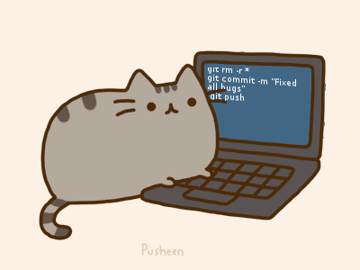
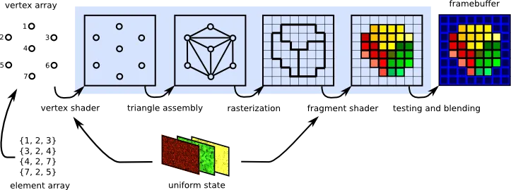
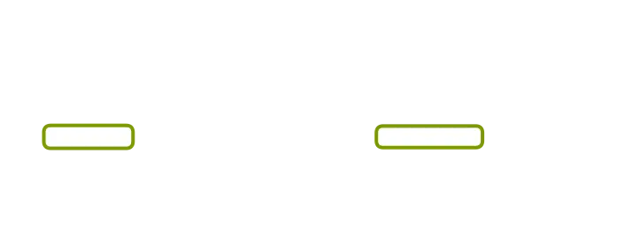
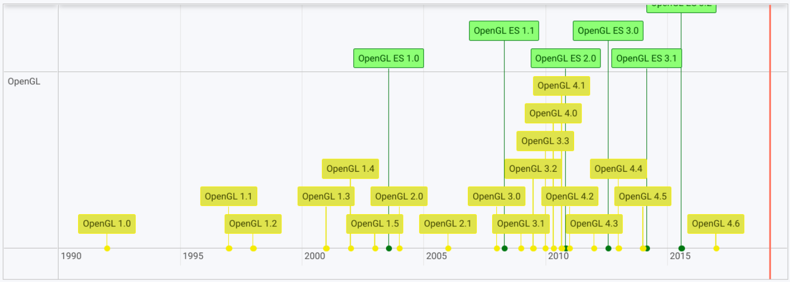
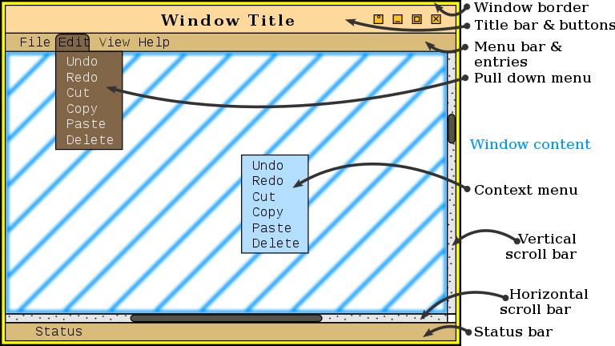
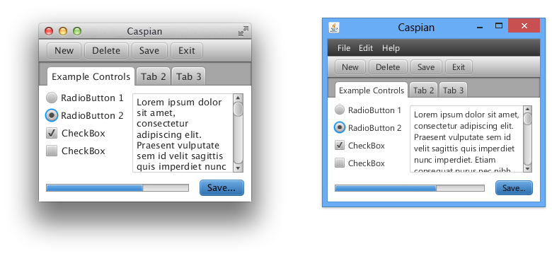

<!-- {"layout": "title"} -->
# Introdução ao&nbsp;~~OpenGL~~&nbsp;WebGL <!-- {s:style="opacity: 0.7; font-style: italic;"} -->
## e os Sistemas de Janelas

---
<!-- {"layout": "centered" -->
# Roteiro

1. Histórico do WebGL, OpenGL e amigos
1. _Hello World_ em WebGL
1. Sistemas de janelas
1. Programação orientada a eventos

---
<!-- {"layout": "section-header", "slideClass": "hello-world"} -->
# _Hello World_

1. Qual o menor programa em WebGL?
1. O que é WebGL?
1. WebGL vs OpenGL

---
<!-- {"layout": "3-column-element-with-titles-expansible", "slideClass": "hw compact-code-more", "embeddedStyles": ".hw > * {width: calc(50% - 1rem); margin-bottom: auto !important; height: auto!important;} .hw>:nth-child(2) { width: fit-content!important; } .hw>:nth-child(3) { transition: translate 200ms; } .hw>:nth-child(3):hover,.show-active-slide-and-previous .hw>:nth-child(3) { translate: -50% 0; width: fit-content;} .show-active-slide-and-previous .hw.bespoke-inactive { pointer-events: all; }"} -->
## 

```html
<!DOCTYPE html>
<html lang="pt-BR">
<head>
  <meta charset="UTF-8">
  <meta name="viewport" content="width=device-width, initial-scale=1.0">
  <title>Exemplo: Hello World (simples)</title>
  <link rel="stylesheet" href="../utils/styling/example.css">
</head>
<body>
  <h1>Hello World (simples)</h1>
  <p>Desenha um triângulo verde.</p>
  <canvas class="example-canvas" width="500" height="500"></canvas>
  <script>
    // código JavaScript aqui...
  </script>
</body>
</html>
```

```javascript
// inicializa o WebGL2
const canvas = document.querySelector('.example-canvas');
const gl = canvas.getContext('webgl2');

if (!gl) {
  console.error('WebGL2 não está disponível');
  throw new Error('WebGL2 não suportado');
}

// inicializa o shader de vértice e fragmento e em seguida os compila
// são programas executados pela GPU sempre que algo precisa ser desenhado
const vertexShaderCode = `#version 300 es
        in vec2 position;
        void main() {
            gl_Position = vec4(position, 0.0, 1.0);
        }
    `;

const fragmentShaderCode = `#version 300 es
        precision highp float;
        out vec4 outColor;
        void main() {
            outColor = vec4(0.0, 1.0, 0.0, 1.0); // verde
        }
    `;

const createShader = (type, source) => {
  const shader = gl.createShader(type);
  gl.shaderSource(shader, source);
  gl.compileShader(shader);
  return shader;
};

// finaliza a combinação (compila + link) dos shaders em um programa
const program = gl.createProgram();
gl.attachShader(program, createShader(gl.VERTEX_SHADER, vertexShaderCode));
gl.attachShader(program, createShader(gl.FRAGMENT_SHADER, fragmentShaderCode));
gl.linkProgram(program);
gl.useProgram(program);

// define os vértices de um triângulo
const vertices = new Float32Array([
  0.0,  0.5,   // topo
  -0.5, -0.5,  // esquerda
  0.5, -0.5    // direita
]);

// cria um VAO para as configurações do triângulo e um Buffer com vértices
// gl.bufferData(...): move os dados dos vértices: RAM -> VRAM (GPU)
const vao = gl.createVertexArray();
gl.bindVertexArray(vao);
const vbo = gl.createBuffer();
gl.bindBuffer(gl.ARRAY_BUFFER, vbo);
gl.bufferData(gl.ARRAY_BUFFER, vertices, gl.STATIC_DRAW);

// configura o atributo 'position' ("in vec2 position" do shader) para 
// receber os dados do buffer quando o programa (shaders) for executado
const positionAttributeLocation = gl.getAttribLocation(program, 'position');
gl.vertexAttribPointer(positionAttributeLocation, 2, gl.FLOAT, false, 0, 0);
gl.enableVertexAttribArray(positionAttributeLocation);

gl.clearColor(1.0, 1.0, 1.0, 1.0); // fundo branco
// --- fim do código de configuração ---


// --- início do código de renderização ---
// renderiza: desenha o VAO que estava ativado: o do triângulo
gl.clear(gl.COLOR_BUFFER_BIT);
gl.drawArrays(gl.TRIANGLES, 0, 3);
```


---
<!-- {"layout": "centered", "state": "show-active-slide-and-previous"} -->

 <!-- {.block style="margin-inline: auto 3.5rem; width: 60%; margin-top: 0.8rem;"} -->
<!-- {p:style="margin-top: 0;"} -->

---
<!-- {"layout": "regular", "state": "transition-put-next-below"} -->
# WebGL <small><i>(Web Graphics Library)</i> 1/3</small>

- API gráfica baseada no OpenGL ES <!-- {ul:.compact-code.push-code-right} -->
- Usa uma página _web_ como ambiente de execução: <!-- {li:style="opacity: 0.3;"} -->
  ```html
  ...
  <body>
    <canvas></canvas>
  </body>
  </html>
  ```
  - Página HTML possui um elemento `<canvas>` ➡️
  - Código JavaScript faz chamadas à API
  - Programa _shader_ GLSL é executado pela GPU quando há uma chamada de desenho
- Oferece chamadas de desenho aceleradas pelo _hardware_. Exemplo: <!-- {li:style="opacity: 0.3;"} -->
  1. **Chamadas de desenho** (_draw call_): `gl.drawArrays(), gl.drawElements()` <!-- {.push-right style="line-height: 1.15em"} -->
  1. Criação e _upload_ de _buffers_ para a VRAM: `gl.createBuffer(), gl.bufferData()` <!-- {.push-right style="line-height: 1.15em"} -->
  1. Alteração do estado: `gl.lineWidth(), gl.clearColor()` <!-- {.push-right style="line-height: 1.15em"} -->

*[API]: Application Programming Interface
*[OpenGL]: Open Graphics Library
*[ES]: Embedded Systems

---
<!-- {"layout": "centered-horizontal", "state": "transition-put-previous-above transition-put-next-above"} -->
## Definição de **interface**

> s.f., elemento que proporciona uma **ligação** física ou lógica<br>
> **entre dois sistemas ou partes** de um sistema que não poderiam ser<br>
> conectados diretamente.

<!-- {blockquote:.centered.bullet} -->

::: figure .bulleted max-height: 220px
- ## carro - motorista <!-- {ul:.card-list} -->
   <!-- {style="max-height: 180px"} -->
- ## usuário - computador
   <!-- {style="max-height: 180px"} -->
- ## programa - programa
   <!-- {style="max-height: 180px"} -->

---
<!-- {"layout": "regular", "state": "transition-put-previous-below"} -->
# WebGL <small><i>(Web Graphics Library)</i> 1/3</small>

- API gráfica baseada no OpenGL ES <!-- {ul:.compact-code.push-code-right} --> <!-- {li:style="opacity: 0.3;"} -->
- Usa uma página _web_ como ambiente de execução: <!-- {li:.bullet} -->
  ```html
  ...
  <body>
    <canvas></canvas>
  </body>
  </html>
  ```
  - Página HTML possui um elemento `<canvas>` ➡️
  - Código JavaScript faz chamadas à API
  - Programa _shader_ GLSL é executado pela GPU quando há uma chamada de desenho
- Oferece chamadas de desenho aceleradas pelo _hardware_. Exemplo: <!-- {li:.bullet} -->
  1. **Chamadas de desenho** (_draw call_): `gl.drawArrays(), gl.drawElements()` <!-- {.push-right style="line-height: 1.15em"} -->
  1. Criação e _upload_ de _buffers_ para a VRAM: `gl.createBuffer(), gl.bufferData()` <!-- {.push-right style="line-height: 1.15em"} -->
  1. Alteração do estado: `gl.lineWidth(), gl.clearColor()` <!-- {.push-right style="line-height: 1.15em"} -->

*[API]: Application Programming Interface
*[OpenGL]: Open Graphics Library
*[ES]: Embedded Systems


---
<!-- {"layout": "regular"} -->
# WebGL <small><i>(Web Graphics Library)</i> 2/3</small>

- Objetos são representados por primitivas geométricas: pontos, linhas, 
  **triângulos**
- Descrevemos objetos usando _buffers_, que podem armazenar:  <!-- {li:.bullet} -->
  - _Attributes_: atributos (propriedades) de cada vértice
    - coordenadas, cor, vetor normal, coordenadas de textura, etc.
  - _Uniforms_: valores constantes para um objeto inteiro
    - posição no mundo, tamanho, rotação, cor única etc.
- Modelo de **máquina de estados** com variáveis como: <!-- {li:.bullet} -->
  1. objeto atual
  1. buffer atual
  1. programa _shader_ atual
  1. textura atual
  1. espessura da linha atual: `gl.lineWidth(x)` <!-- {ol:.multi-column-list-2} -->
     - <p class="note info no-margin">Tudo desenhado usa o <code>GL_LINE_WIDTH</code> atual, até que se mude</p>

<!-- {ul:.no-margin.no-padding} -->
<!-- {li.no-bullet} -->

---
<!-- {"layout": "regular"} -->
# WebGL <small><i>(Web Graphics Library)</i> 3/3</small>

- Implementa um **_pipeline_ de rasterização** de primitivas geométricas <!-- {ul:style="margin-bottom: 0.25em;"} -->
  - Transforma vértices (pontos, linhas, triângulos) em uma imagem <!-- {li:.bullet} -->
    ::: figure .figure-slides.opacity-only width: fit-content; margin-inline: auto;
     <!-- {.figure-step style="width: 480px; will-change: transform;"} -->
     <!-- {.bullet.figure-step  style="width: 480px; z-index: -1;"} -->
    :::
  - Há etapas fixas e **programáveis** ⬆️ <!-- {.alternate-color} --> <!-- {li:.bullet} -->
- Escrevemos um **programa _shader_** <!-- {strong:.alternate-color} --> que executa a cada **chamada de desenho**, 
  contendo: <!-- {li:.bullet} -->
  
_vertex shader:&nbsp;_ <!-- {dl:.bullet.dl-grid.no-margin style="margin-inline: auto"} -->
  ~ executado 1x por vértice

_fragment shader:&nbsp;_
  ~ executado 1x por fragmento ("pixel") de cada objeto 

---
<!-- {"layout": "regular", "styles": "../../styles/classes/opengl-timeline.css"} -->
# Versões do WebGL e outras APIs gráficas 

[↪️ Versão expandida](timeline.html) <!-- {.badge.push-right target="_blank"} --> As APIs gráficas abertas evoluem e são geridas pelo [Khronos Group][khronos]. <!-- {p:style="width: 100%"} -->

::: vis timeline ./opengl-versions.json .timeline

:::

[khronos]: https://www.khronos.org/

---
<!-- {"layout": "regular"} -->
## APIs gráficas e o contexto da janela

-  <!-- {.push-right.small-width} -->
  A **API gráfica cuida apenas de gerar o "conteúdo" das janelas**, ele precisa
  de uma janela
- _Sistema de janelas_: componente do sistema operacional (SO) que
  lida com janelas:
  1. criar uma janela, maximizar, minimizar
  1. eventos de mouse, teclado etc.
- Exemplos: <!-- {ul:style="margin-bottom: 0.25em;"} -->

Linux
  ~ X.11

macOS
  ~ Quartz Compositor

Windows
  ~ Desktop Window Manager (DWM)

**Navegadores**
  ~ seu próprio motor (renderização e JavaScript)

<!-- {dl:.no-margin.dl-grid style="margin-inline: auto;"} -->

*[DWM]: desktop window management*

---
<!-- {"layout": "section-header", "slideClass": "window-system"} -->
# Sistemas de janelas

1. Por quê precisamos de um
1. O que muda na programação
1. Formas para desenhar na tela
1. Como suportar vários SOs?

*[SO]: sistema operacional*

---
<!-- {"layout": "regular"} -->
## Sistemas de janelas (**SJ**)

- Principal meio de interação homem/máquina
  - Baseado no conceito de
    <abbr title="Windows, Icons, Menus and Pointers">WIMP</abbr>
- **Tela é dividida em janelas** (eventualmente sobrepostas) **controladas por
  aplicações** que têm a incumbência de mantê-las sempre atualizadas
- **Cada sistema operacional tem o seu SJ** e o linux tem várias opções
  - X.11: `#include 'x.h'`
  - Quartz: `#include 'QuartzCore/QuartzCore.h'`
  - DWM: `#include 'windows.h'`
  - Navegador: é nativo 🎉
- Cada sistema de janelas possui uma <u>API distinta</u>
  - Ou seja, uma aplicação feita com `windows.h` não funciona no Linux

*[SJ]: sistema de janelas*
*[DWM]: desktop window management*

---
<!-- {"layout": "regular"} -->
## Como programar uma aplicação gráfica?

<!-- Utiliza o paradigma de **programação orientada a eventos** (PoE) -->

- Programação **tradicional** <!-- {ul^0:.layout-split-2.flex-equal.fold-2.no-bullet.compact-code} --> <!-- {strong:.alternate-color} --> <!-- {li:.bullet} -->
  ```py
  programa()
    le_entrada()
    processa()
    produz_saida()
  ```
  - Usuário não pode interagir durante o processamento
  -  <!-- {.push-left.half-width} -->
    Inadequado para aplicações **interativas**
- Programação orientada por **eventos** <!-- {li:.bullet} -->
  ```py
  teclaPress(qualTecla)
    if (qualTecla == 'k') //...

  programa()
    registra_evento("teclado", teclaPress)
    while (not termina_aplicacao)
      verifica_eventos()
  ```
  - A interação é comunicada via **eventos**, _eg_:  <!-- {li^1:style="margin-left: 1em"} -->
    - 💻 a tecla <kbd>k</kbd> foi pressionada
  - Eventos são "tratados" por **rotinas _callback_**
    - 🔃 redesenhar quando redimensionada
    - ⬆️ mover algo quando <kbd>W</kbd> pressionada

---
<!-- {"layout": "regular", "state": "show-active-slide-and-previous"} -->
### Fluxo de execução <!-- {style="width: 50%; align-self: flex-end;"} -->

1. O programa registra _callbacks_ para eventos <!-- {ol:style="width: 45%; align-self: flex-end; margin-right: 8em; margin-bottom: 1rem;"} -->
1. Fica em _loop_ até encerrar
   - Dentro do _loop_:
     1. Verifica se houve interação. Se sim, "dispara" **evento**
     1. Se existir uma **_callback_** registrada, executa

::: did-you-know .note.info width: 42%; align-self: flex-end; margin-right: 8em;
O SJ é responsável por identificar eventos e invocar as _callbacks_. <!-- {p:.smaller-text-80} -->
O programador apenas cria e registra _callbacks_.
:::

*[SJ]: sistema de janelas*

---
<!-- {"layout": "regular"} -->
# APIs de sistemas de janelas

As APIs expõem rotinas para, por exemplo:

::: figure .layout-split-2.bullet
1. **Criar uma janela**
1. **Reposicionar e desenhar** janela
1. **Registrar _callbacks_** para eventos
1. Desenhar botões, barras, menus (**_widgets_**) **➡️** <!-- {.push-right} -->

 <!-- {.rounded style="width: 390px"} -->
:::

- Com WebGL, na Web: <!-- {ul:.bullet.no-margin style="list-style-type: none"} -->
  1. **Tela de pintura**: via `<canvas>` no HTML
  1. **Conteúdo**: JavaScript executando comandos WebGL
  1. **_Callbacks_** para eventos: via eventos do DOM
  1. **_Widgets_**: "na raça" via WebGL ou sobrepondo HTML

*[DOM]: Document Object Model

---
<!-- {"layout": "centered-horizontal", "slideClass": "two-column-code compact-code-more"} -->
## Anatomia de um programa WebGL

```javascript
const gl = configuraTudo()
let logoAntes = 0

function loopPrincipal(agora) {
  // (0) descobre o tempo desde a última chamada
  const quantoPassou = (agora - logoAntes) / 1000
  logoAntes = agora
  
  // (1) atualiza a lógica do programa
  atualizaLogica(quantoPassou)

  // (2) desenha a cena no novo estado
  desenhaCena(gl)

  // registra a próxima chamada do loop
  requestAnimationFrame(loopPrincipal)
}

requestAnimationFrame(loopPrincipal)


function configuraTudo() {
  // 1. inicia contexto WebGL2
  // 2. registra callbacks para eventos de interesse
  // 3. cria, compila e linka programa shader
  // 4. especifica a cena
  // 5. inicia valores para variáveis de estado
}

function atualizaLogica(quantoTempo) {
  // altera o estado da aplicação, e.g.:
  // - movimenta inimigos, jogador, projéteis
  // - verificar estado do teclado, e.g.: 
  //        (↑ abaixada? andar pra frente)
  // - movimenta câmera
}

function desenhaCena(gl) {
  // - apaga a tela
  // - faz a chamada de desenho
}


// callbacks de eventos: mouse, teclado etc.
// -----------------------------------------
function teclaPressionada(evento) {
  // evento.key: string com "w", "W", "ArrowLeft", 
  //             "Space", "Tab" etc.
}

function mouseClicou(evento) {
  // evento.offset{X|Y}: (x,y) relat. ao elemento
  // evento.client{X|Y}: ----------- à janela
  // evento.page{X|Y}: ------------- à página

  // evento.button: botão pressionado 
  //                (0: esq., 1: meio, 2: dir., etc.)
}

function mouseMexeu(evento) {
  // idem
}


```

---
<!-- {"layout": "2-column-content", "slideClass": "compact-code-more", 
"embeddedStyles": ".raf-vs-setinterval { table { font-size: 0.64em; margin: 0 auto; td, th { padding: 0.15em 0.25em; line-height: 1.5; } thead>tr { background: transparent; border-width: 0; } td,tr { border-width: 0; background: transparent; } td:first-child { font-weight: bold; text-align: right;} th { border-width: 0; background: transparent; } } table, tr, td { border-width: 0; } }"} -->
## _Loop_ Principal

```js
const gl = configuraTudo()
let logoAntes = 0

function loopPrincipal(agora) {
  // (0) descobre o tempo desde a última chamada
  const quantoPassou = (agora - logoAntes) / 1000
  logoAntes = agora
  
  // (1) atualiza a lógica do programa
  atualizaLogica(quantoPassou)

  // (2) desenha a cena no novo estado
  desenhaCena(gl)

  // registra a próxima chamada do loop
  requestAnimationFrame(loopPrincipal)
}

requestAnimationFrame(loopPrincipal)
```

- `requestAnimationFrame` consecutivos chamam a função várias vezes/segundo
  - `configuraTudo()`: inicializa e carrega
  - `quantoPassou`: tempo desde a última
  - `atualizaLogica(qtoPss)`: altera o estado
  - `desenhaCena(gl)`: desenha novo estado
- <!-- {li:.no-bullet.raf-vs-setinterval} -->
  ::: div .note.info width: 100%; margin-top: 1rem;
  |             |`requestAnimationFrame`|`setInterval`    |
  |-------------|-----------------------|-----------------|
  | vSync:      | 👍 Sim                | Não             |
  | Economia:   | 👍 Sim                | Não             |
  | FPS máx:    | taxa do monitor       | 👍 ilimitado    |
  | Redução FPS:| monitor/2, /4, /8     | 👍 queda linear |
  :::

*[rAF]: requestAnimationFrame

---
<!-- {"layout": "2-column-content", "slideClass": "compact-code-more"} -->
## Configuração Inicial <small>(1/4)</small>

```javascript
function configuraTudo() {
  // 1. inicia contexto WebGL2
  const canvas = document.querySelector('canvas')
  const gl = canvas.getContext('webgl2')

  // 2. registra callbacks p/ eventos de interesse
  canvas.addEventListener('mousemove', mouseMexeu)
  canvas.addEventListener('click', mouseClicou)
  document.addEventListener('keydown', 
                                 teclaPressionada)
  
  // 3. cria, compila e linka programa shader
  // 4. especifica a cena
  
  // 5. inicia valores para variáveis de estado
  gl.clearColor(1, 1, 1, 1) // cor borracha: branco
  gl.useProgram(programa)   // shader: que criamos

  return gl
}
```

- Muita coisa é feita na inicialização:
  1. **iniciar contexto** <!-- {ol:.multi-column-list-2} -->
  1. **registr. _callbacks_**
  1. criar _shaders_
  1. especificar cena
  1. **inicializar estado**
- Na hora de desenhar, enviamos o comando 
  _"desenha tudo que taí na VRAM"_
  - _loading_ lento, renderização rápida 👍 
- Vejamos como fazer as outras partes...

---
<!-- {"layout": "2-column-content", "slideClass": "compact-code-more", 
"state": "transition-put-next-below"} -->
## Configuração Inicial <small>(2/4)</small>

- **Programa _shader:_** compilar e "linkar" GLSL em tempo de inicialização ↘️
- Detectando erros de compilação e ligação:
  ```javascript
            // ou gl.getShaderParameter
  const sucesso = gl.getProgramParameter(
            // ou  {vs|fs}, gl.COMPILE_STATUS  
                      program, gl.LINK_STATUS)
  if (!sucesso) {  
          // ou gl.getShaderInfoLog({vs|fs})
    const log = gl.getProgramInfoLog(program)
    console.error('Erro no shader:', log)
  }
  ```
  ::: div .note.info width: 100%; margin-top: 1rem;
  **Boa prática**: (a) armazenar o código GLSL em 
  `<script type="x-shader/x-vertex">...</script>` (e `/x-fragment`), ou então
  (b) fazer uma requisição para baixar aquivos `.glsl`. <!-- {p:style=" font-size: 0.64em;"} --> 
  :::

```javascript
function configuraTudo() {
  // ...
  // 3. cria, compila e linka programa shader
  // 3.1 cria e compila o vertex shader
  const vsCode = `#version 300 es...`
  const vs = gl.createShader(gl.VERTEX_SHADER)
  gl.shaderSource(vs, vsCode)
  gl.compileShader(vs)

  // 3.2 cria e compila o fragment shader
  const fsCode = `#version 300 es...`
  const fs = gl.createShader(gl.FRAGMENT_SHADER)
  gl.shaderSource(fs, fsCode)
  gl.compileShader(fs)

  // 3.3 cria o programa, associa vs/fs e linka
  const programa = gl.createProgram()
  gl.attachShader(programa, vs)
  gl.attachShader(programa, fs)
  gl.linkProgram(programa)
  // ...
}
```

*[GLSL]: Graphics Library Shading Language

---
<!-- {"layout": "regular", "state": "transition-put-previous-above"} -->
## Programa _Shader_

- ::: figure .figure-slides.opacity-only.push-right max-width: 360px; margin: 0;
   <!-- {style="width: 360px"} -->
   <!-- {.figure-step style="width: 360px;z-index: -1;"} -->
  :::
  Executado em certas etapas do _pipeline_ ➡️
- Disparado por uma _draw call_, como `gl.drawArrays()`
- Executa na GPU de forma bem paralelizada
  - _Vertex shader_ <!-- {ul^0:.layout-split-2} -->
    - executa **para cada vértice** <!-- {style="color: black"} -->
    - **deve** calcular a posição final do vértice
    - **recebe** _attributes_ de vértices
    - **pode** <!-- {.alternate-color} --> calcular iluminação por vértice
    - **pode** <!-- {.alternate-color} --> calcular animação com deformação, etc.
  - _Fragment shader_
    - executa por **fragmento de objeto** <!-- {style="color: black"} -->
    - **deve** calcular a cor final do fragmento
    - **recebe** _varyings_ para o fragmento
    - **pode** <!-- {.alternate-color} --> aplicar uma textura
    - **pode** <!-- {.alternate-color} --> calcular a iluminação por fragmento, etc.

*[GLSL]: Graphics Library Shading Language

---
<!-- {"layout": "regular", "slideClass": "compact-code-more", 
"state": "transition-put-next-above"} -->
## Os _shaders_ mais simples

- _Vertex shader:_ <!-- {ul:.layout-split-2 style="gap: 1rem;"} -->
  ```glsl
  #version 300 es
                    // um único attribute:
  in vec2 posicao;  // - a posição (x,y) deste vértice

  void main() {     //   (x, y, 0.0, 1.0)
    gl_Position = vec4(posicao, 0.0, 1.0);
  }
  ```
  - Responsabilidade: **posição do vértice**
  - `in vec2 posicao` é um atributo do vértice
  - `gl_Position` é uma variável `vec4` preexistente especial que indica 
     a posição final do vértice
  - Aqui, só repassamos a `posicao` adiante
- _Fragment shader:_
  ```glsl
  #version 300 es
  precision mediump float;

  out vec4 corFragmento;  // cor deste frag.
  void main() {
    corFragmento = vec4(0.0, 1.0, 0.0, 1.0);
  }
  ```
  - Respons.: **cor do fragmento**
  - `out vec4 color` é a cor de saída, a variável pode ter qualquer nome
    - Primeira `out vec4` vira a saída
  - Aqui, todo fragmento será verde 

---
<!-- {"layout": "2-column-content", "slideClass": "compact-code-more", 
"state": "transition-put-previous-below"} -->
## Configuração Inicial <small>(2/4)</small>

- **Programa _shader_**: compilar e "linkar" GLSL em tempo de inicialização ↘️
- Detectando erros de compilação e ligação:
  ```javascript
            // ou gl.getShaderParameter
  const sucesso = gl.getProgramParameter(
            // ou  {vs|fs}, gl.COMPILE_STATUS  
                      program, gl.LINK_STATUS)
  if (!sucesso) {  
          // ou gl.getShaderInfoLog({vs|fs})
    const log = gl.getProgramInfoLog(program)
    console.error('Erro no shader:', log)
  }
  ```
  ::: div .note.info width: 100%; margin-top: 1rem;
  **Boa prática**: (a) armazenar o código GLSL em 
  `<script type="x-shader/x-vertex">...</script>` (e `/x-fragment`), ou então
  (b) fazer uma requisição para baixar aquivos `.glsl`. <!-- {p:style=" font-size: 0.64em;"} --> 
  :::

```javascript
function configuraTudo() {
  // ...
  // 3. cria, compila e linka programa shader
  // 3.1 cria e compila o vertex shader
  const vsCode = `#version 300 es...`
  const vs = gl.createShader(gl.VERTEX_SHADER)
  gl.shaderSource(vs, vsCode)
  gl.compileShader(vs)

  // 3.2 cria e compila o fragment shader
  const fsCode = `#version 300 es...`
  const fs = gl.createShader(gl.FRAGMENT_SHADER)
  gl.shaderSource(fs, fsCode)
  gl.compileShader(fs)

  // 3.3 cria o programa, associa vs/fs e linka
  const programa = gl.createProgram()
  gl.attachShader(programa, vs)
  gl.attachShader(programa, fs)
  gl.linkProgram(programa)
  // ...
}
```

*[GLSL]: Graphics Library Shading Language

---
<!-- {"layout": "2-column-content", "slideClass": "compact-code-more", "embeddedStyles": ".no-p-margin p { margin: 0; }", "state": "transition-put-next-below"} -->
## Configuração Inicial <small>(3/4)</small>

```javascript
function configuraTudo() { 
  // 4. especifica a cena
  // 4.1 vértices de um triângulo em um 1D-array
  const vertices = new Float32Array([
    0.0,  0.5,   // topo
    -0.5, -0.5,  // esquerda
    0.5, -0.5    // direita
  ])

  // 4.2 cria um VAO para o triângulo
  const vao = gl.createVertexArray()
  gl.bindVertexArray(vao)
  
  // 4.3 cria um VBO (buffer) com vértices
  const vbo = gl.createBuffer()             // (a)
  gl.bindBuffer(gl.ARRAY_BUFFER, vbo)       // (b)
  gl.bufferData(gl.ARRAY_BUFFER, vertices,  // (c) 
                                    gl.STATIC_DRAW)
  // (d) instruir a busca e (e) ativar o atributo
  // ...nos próximos slides... 
```

- Por ora, vamos ignorar `4.2 cria um VAO`
- Descrevemos os vértices dos objetos usando um **VBO** para cada coisa:
  - ↙️ **Posição**
  - Cor do vértice <!-- {ul^0:.multi-column-list-2} -->
  - Coord. textura
  - Vetor normal, etc.
- Para cada **VBO**:
  1. Criar com `gl.createBuffer()` <!-- {ol:style="list-style-type: lower-alpha"} -->
  1. Ativar com `gl.bindBuffer(target, buf)`
  1. Popular `gl.bufferData(t, buf, hint)`
  1. Instruir `gl.vertexAttribPointer(...)` <!-- {li:style="opacity: 0.3"} -->
  1. Ativar `gl.enableVertexAttribArray(pos)` <!-- {li:style="opacity: 0.3"} -->

*[VBO]: Vertex Buffer Object
*[VBOs]: Vertex Buffer Objects

---
<!-- {"layout": "centered-horizontal", "slideClass": "compact-code-more", "state": "transition-put-previous-above transition-put-next-above"} -->
## **VBOs**: _vertex buffer objects_ <small>(1/2)</small>

-  <!-- {.push-right.bullet style="margin-bottom: 1rem;"} -->
   <!-- {.push-right.clear-both.bullet style="width: 300px"} -->
  Cada aplicação pode querer atribuir diferentes propriedades a cada vértice,
  mas a **posição** é o básico:
  1. Cria um _buffer_, solicitando espaço na VRAM <!-- {ol:.bullet style="list-style-type: lower-alpha"} -->
     ```javascript
     const vbo = gl.createBuffer()
     ```
  1. (Ativa ou) vincula ao `ARRAY_BUFFER`: <!-- {li:.bullet} -->
     ```javascript
     gl.bindBuffer(gl.ARRAY_BUFFER, vbo)
     ```
     - Dizemos que o _buffer_ agora é um VBO
  1. Faz _upload_ de `vertices` para VRAM:  <!-- {li:.bullet} -->
     ```javascript
     gl.bufferData(gl.ARRAY_BUFFER, vertices, gl.STATIC_DRAW)
     ```
     - A _hint_ indica que vértices não serão alterados

*[VBOs]: Vertex Buffer Objects

---
<!-- {"layout": "2-column-content", "slideClass": "compact-code-more", "embeddedStyles": ".no-p-margin p { margin: 0; }", "state": "transition-put-previous-below"} -->
## Configuração Inicial <small>(3/4)</small>

```javascript
function configuraTudo() { 
  // 4. especifica a cena
  // 4.1 vértices de um triângulo em um 1D-array
  const vertices = new Float32Array([
    0.0,  0.5,   // topo
    -0.5, -0.5,  // esquerda
    0.5, -0.5    // direita
  ])

  // 4.2 cria um VAO para o triângulo
  const vao = gl.createVertexArray()
  gl.bindVertexArray(vao)
  
  // 4.3 cria um VBO (buffer) com vértices
  const vbo = gl.createBuffer()             // (a)
  gl.bindBuffer(gl.ARRAY_BUFFER, vbo)       // (b)
  gl.bufferData(gl.ARRAY_BUFFER, vertices,  // (c) 
                                    gl.STATIC_DRAW)
  // (d) instruir a busca e (e) ativar o atributo
  // ...nos próximos slides... 
```

- Por ora, vamos ignorar `4.2 cria um VAO`
- Descrevemos os vértices dos objetos usando um **VBO** para cada coisa:
  - ↙️ **Posição**
  - Cor do vértice <!-- {ul^0:.multi-column-list-2} -->
  - Coord. textura
  - Vetor normal, etc.
- Para cada **VBO**:
  1. Criar com `gl.createBuffer()` <!-- {ol:style="list-style-type: lower-alpha"} -->
  1. Ativar com `gl.bindBuffer(target, buf)`
  1. Popular `gl.bufferData(t, buf, hint)`
  1. Instruir `gl.vertexAttribPointer(...)` <!-- {li:style="opacity: 0.3"} -->
  1. Ativar `gl.enableVertexAttribArray(pos)` <!-- {li:style="opacity: 0.3"} -->

*[VBO]: Vertex Buffer Object
*[VBOs]: Vertex Buffer Objects

---
<!-- {"layout": "2-column-content", "slideClass": "compact-code-more", "embeddedStyles": ".no-p-margin p { margin: 0; }", "state": "transition-put-next-below"} -->
## Configuração Inicial <small>(4/4)</small>

```javascript
function configuraTudo() { 
  // 4. especifica a cena
  // ...
  // 4.3 cria um VBO (buffer) com vértices
  // (a) cria o buffer
  // (b) ativa o buffer como VBO
  // (c) faz upload RAM -> VRAM
  
  // acha o slot do atributo dentro do shader
  const posicaoLoc = gl.getAttribLocation(
                              programa, 'posicao')

  // (d) instrui GPU onde e como buscar
  //     o atributo 'posicao' deste VBO
  gl.vertexAttribPointer(
   // index, size, type, normalize, stride, offset
      posicaoLoc, 2, gl.FLOAT, false, 0, 0)

  // (e) ativa o atributo (senão mesmo
  //     valor para todos vértices)
  gl.enableVertexAttribArray(posicaoLoc)
```

- Por ora, vamos ignorar `4.2 cria um VAO` <!-- {li:.faded} -->
- Descrevemos os vértices dos objetos usando um **VBO** para cada coisa: <!-- {li:.faded} -->
  - ↙️ **Posição**
  - Cor do vértice <!-- {ul^0:.multi-column-list-2} -->
  - Coord. textura
  - Vetor normal, etc.
- Para cada **VBO**:
  1. Criar com `gl.createBuffer()` <!-- {ol:style="list-style-type: lower-alpha"} --> <!-- {li:.faded} -->
  1. Ativar com `gl.bindBuffer(target, buf)` <!-- {li:.faded} -->
  1. Popular `gl.bufferData(t, buf, hint)` <!-- {li:.faded} -->
  1. Instruir `gl.vertexAttribPointer(...)` 
  1. Ativar `gl.enableVertexAttribArray(pos)`

*[VBO]: Vertex Buffer Object
*[VBOs]: Vertex Buffer Objects

---
<!-- {"layout": "centered-horizontal", "slideClass": "compact-code-more", "state": "transition-put-previous-above transition-put-next-above"} -->
## **VBOs**: _vertex buffer objects_ <small>(2/2)</small>

-  <!-- {.push-right} -->
  Precisamos conectar os atributos (variáveis `in`) do _vertex shader_ aos
  VBOs (no caso, atributo **'posicao'** ⬅️ este VBO)
- Acha em qual _slot_ do _shader_ está `posicao`
     ```javascript  
     const posicaoLoc = gl.getAttribLocation(programa, 'posicao') // quase certo será slot 0, pq só tem 1 atributo
     ```
  5. Instrui o _vertex processor_ onde e como preencher `posicao`  <!-- {ol:style="list-style-type: lower-alpha"} -->
     ```javascript
     gl.vertexAttribPointer(posicaoLoc, // em qual slot 
       2,           // size: qtos valores por vértice ∈ {1, 2, 3, 4}
       gl.FLOAT,    // type: tipo de dados ∈ {FLOAT, HALF_FLOAT, INT, UNSIGNED_INT, BYTE etc.}
       false,       // normalize? muda amplitude para [0,1] ou [-1,1] de acordo com type (exceto p/ FLOATS)
       0,           // stride: qtos valores saltar por vértice, a mais que size, EM BYTES
       0)           // offset: qtos valores saltar inicialmente, EM BYTES
     ```
  6. Ativa o atributo para que ele seja efetivamente buscado
     ```javascript
     gl.enableVertexAttribArray(posicaoLoc)   // senão, usa um valor constante para todo vértice 🤷‍♂️
     ```

*[VBO]: Vertex Buffer Object
*[VBOs]: Vertex Buffer Objects

---
<!-- {"layout": "regular", "slideClass": "compact-code-more", "embeddedStyles": ".no-p-margin p { margin: 0; }", "state": "transition-put-previous-below"} -->
## Configuração Inicial <small>(especifica a cena)</small>

```javascript
function configuraTudo() {
  // ...
  // 4. especifica a cena
  // 4.1 vértices de um triângulo em um 1D-array
  const vertices = new Float32Array([0.0, 0.5,   -0.5, -0.5,   0.5, -0.5 ])
                                    // topo       esquerda       direita

  // 4.2 cria um VAO para o triângulo (e isso aqui??)
  const vao = gl.createVertexArray()
  gl.bindVertexArray(vao)
  
  // 4.3 cria um buffer para armazenar um atributo de vértice (ie, um VBO)
  const vbo = gl.createBuffer()                                           // a. cria um buffer genérico
  gl.bindBuffer(gl.ARRAY_BUFFER, vbo)                                     // b. vincula ele ao ARRAY_BUFFER
  gl.bufferData(gl.ARRAY_BUFFER, vertices, gl.STATIC_DRAW)                // c. upload dos dados RAM->VRAM
  const posicaoLoc = gl.getAttribLocation(programa, 'posicao')
  gl.vertexAttribPointer(// index, size, type, normalize, stride, offset     d. instrui shader onde e como
                            posicaoLoc, 2, gl.FLOAT, false, 0, 0)         //    buscar os dados do atributo
  gl.enableVertexAttribArray(posicaoLoc)                                  // e. habilita o atributo
  // ...
```

---
<!-- {"layout": "centered-horizontal", "slideClass": "compact-code-more"} -->
## Desenhando 🎉

```javascript
function desenhaCena(gl) {
  // 1. apaga a tela com a cor da borracha
  //    definida com gl.clearColor(1, 1, 1, 1)
  //    na função configuraTudo()
  gl.clear(gl.COLOR_BUFFER_BIT)

  // 2. desenha o VAO atual usando o shader atual
  // VAO atual: vértices de um triângulo
  gl.drawArrays(gl.TRIANGLES, 0, 3)
}
```
- `gl.clear()` pode apagar mais de uma coisa...
  - veremos outro dia
- E o que é esse **VAO**? <!-- {strong:.alternate-color} -->

---
<!-- {"layout": "regular", "slideClass": "compact-code-more"} -->
## Definindo Objetos com **VBOs** e **VAOs** <small>(1/3)</small> <!-- {strong:.alternate-color} -->

-  <!-- {.push-right style="width: 250px"} --> <!-- {ul:.full-width} -->
  ::: div .note.info.push-right.clear-both width: 250px; margin-top: 1rem;
  **VAOs** <!-- {strong:.alternate-color} --> chegaram no WebGL2 👍 e são uma ótima prática para reduzir o número de chamadas. <!-- {p:.no-margin.smaller-text-70} -->
  :::
  Algumas aplicações descrevem objetos usando vários **VBOs**
- Vários objetos, vários **VBOs** descrevendo cada um. Ao desenhar:
  ```javascript
  function desenha(gl) {                // 👎 NÃO FAÇA ASSIM... USE VAOs ;)
    // objeto 1, vbo posição
    gl.bindBuffer(vbo1)
    gl.vertexAttribPointer(posAttr1, /*...*/)
    gl.enableVertexAttribArray(posAttr1)
    // objeto 1, vbo de cor
    gl.bindBuffer(vbo2)
    // ........
    gl.drawArrays(/*...*/) // finalmente, desenha objeto 1
    
    // objeto 2
  }
  ```
- Um **VAO** <!-- {strong:.alternate-color} --> salva a configuração de 
  cada **VBO**
- Podemos usar um **VAO** para cada objeto <!-- {strong:.alternate-color} --> (próximo slide)

*[VBO]: Vertex Buffer Object
*[VBOs]: Vertex Buffer Objects
*[VAO]: Vertex Array Object
*[VAOs]: Vertex Array Objects

---
<!-- {"layout": "regular", "slideClass": "compact-code-more", "embeddedStyles": ".vao-code pre { max-height: 53vh; overflow-y: auto;}"} -->
## Definindo Objetos com **VBOs** e **VAO** <small>(2/3)</small> <!-- {strong:.alternate-color} -->

- Cena com 4 **VBOs**  <!-- {ul:.vao-code.layout-split-3 style="gap: 1rem;"} -->
   <!-- {style="width: 250px"} -->
- Apenas com **VBOs**:
  ```javascript
  function configuraTudo() {
    // 4.3 configura a cena
    // 4.3.1 cria vbo para posição
    vboPosicao = gl.createBuffer() 
    gl.bindBuffer(...)
    gl.bufferData(...)

    // 4.3.2 cria vbo para cor 
    // 4.3.3 cria vbo para normal 
    // 4.3.4 cria vbo para c. textura
  }

  function desenha() {
    // configura vbo posição
    gl.bindBuffer(vboPosicao)
    gl.vertexAttribPointer(/*...*/)
    gl.enableVertexAttribArray(...)

    // configura vbo cor
    // configura vbo normal
    // configura vbo c. textura
    gl.drawArrays(...)

    // se houver outro objeto,
    // faz tudo de novo 👎
  }
  ```
- Usando um **VAO** por objeto: 👍 <!-- {strong:.alternate-color} -->
  ```javascript
  function configuraTudo() {
    // 4.3 configura a cena
    // 4.3.0 cria um VAO e ativa
    vao = gl.createVertexArray()
    gl.bindVertexArray(vao)

    // 4.3.1 configura vbo posição
    vboPosicao = gl.createBuffer() 
    gl.bindBuffer(...)
    gl.bufferData(...)
    gl.vertexAttribPointer(/*...*/)
    gl.enableVertexAttribArray(...)
    
    // 4.3.2 configura vbo cor
    // 4.3.3 configura vbo normal
    // 4.3.4 configura vbo c. textura
  }
  function desenha() {
    // 🎉 ativa o VAO e desenha
    gl.bindVertexArray(vaoTriangulo)
    gl.drawArrays(...)

    // se houver outro objeto, 
    // ativa seu VAO e desenha
    // ...
  }
  ```

*[VBO]: Vertex Buffer Object
*[VBOs]: Vertex Buffer Objects
*[VAO]: Vertex Array Object
*[VAOs]: Vertex Array Objects


---
<!-- {"layout": "regular"} -->
## Definindo Objetos com **VBOs** e **VAO** <small>(3/3)</small> <!-- {strong:.alternate-color} -->

> Então quer dizer que o **VAO** salva todos os dados do objeto juntos?? <!-- {strong:.alternate-color} -->

- Não, quem armazena ainda são os **VBOs**
- O **VAO** <!-- {strong:.alternate-color} --> (_vertex array object_) é levinho, salva apenas as "instruções"<!-- {li:.bullet} --> 
  - Usamos VAO para "memorizar" a configuração de cada objeto
  - Salva quais atritubos de vértice estão ligados e como buscá-los
  - Basicamente, ele guarda todos:
    1. `gl.vertexAttribPointer()` <!-- {ol:.multi-column-list-2} -->
    1. `gl.enableVertexAttribArray()`
  - Daí, ao desenhar, ativamos o **VAO** <!-- {strong:.alternate-color} --> e invocamos a _draw call_

---
## Visualizando a Máquina de Estados do WebGL2  [↪️ Versão expandida][state-diagram] <!-- {.badge.push-right target="_blank"} -->

<iframe width="100%" height="480"
  src="https://webgl2fundamentals.org/webgl/lessons/resources/webgl-state-diagram.html?exampleId=triangle#no-help"></iframe>

[state-diagram]: https://webgl2fundamentals.org/webgl/lessons/resources/webgl-state-diagram.html?exampleId=triangle#no-help

---
<!-- {"layout": "centered-horizontal"} -->
## Para onde vamos?

- Nas próximas aulas, vamos entender:
  - Os sistemas de coordenadas envolvidos
  - Diferentes primitivas geométricas
  - Programando aplicações interativas
  - Programando animações
  - Entendendo _shaders_
    - Atributos
    - _Varyings_
    - _Uniforms_ etc.

